Explore KC 2016 Market Value Analysis (MVA)
================

``` r
library(sf)
```

    ## Linking to GEOS 3.7.2, GDAL 2.4.2, PROJ 5.2.0

``` r
library(tmap)
library(tidyverse)
```

    ## ── Attaching packages ───────────────────────────────────────────────────────────────────────────────────────────── tidyverse 1.3.0 ──

    ## ✓ ggplot2 3.3.2     ✓ purrr   0.3.4
    ## ✓ tibble  3.0.1     ✓ dplyr   1.0.0
    ## ✓ tidyr   1.0.2     ✓ stringr 1.4.0
    ## ✓ readr   1.3.1     ✓ forcats 0.4.0

    ## ── Conflicts ──────────────────────────────────────────────────────────────────────────────────────────────── tidyverse_conflicts() ──
    ## x dplyr::filter() masks stats::filter()
    ## x dplyr::lag()    masks stats::lag()

Load Data
---------

``` r
# read shape file for
kcmo_mva_sf <- st_read("Data/2016 Market Value Analysis (MVA)/geo_export_8a3f2884-9896-4c60-ba20-c985177b689a.shp")
```

    ## Reading layer `geo_export_8a3f2884-9896-4c60-ba20-c985177b689a' from data source `/Users/Sara/Documents/DS/BIA6313-Spatial-GIS/Assignments/Project/Data/2016 Market Value Analysis (MVA)/geo_export_8a3f2884-9896-4c60-ba20-c985177b689a.shp' using driver `ESRI Shapefile'
    ## Simple feature collection with 441 features and 26 fields
    ## geometry type:  POLYGON
    ## dimension:      XY
    ## bbox:           xmin: -94.78056 ymin: 38.82762 xmax: -94.37249 ymax: 39.40155
    ## epsg (SRID):    4326
    ## proj4string:    +proj=longlat +ellps=WGS84 +no_defs

``` r
# CRS 4326 - unprojected (geo with lon/lat)
```

``` r
colnames(kcmo_mva_sf)
```

    ##  [1] "cdemo_hh_1" "cdng_b_141" "clstr_fina" "cspall_141" "csplb_1416"
    ##  [6] "cspn_lb_14" "cvac_prop_" "esri_oid"   "geo_id"     "hhdense"   
    ## [11] "invst_2_in" "invst_buye" "mspall_141" "mspn_lb_14" "pbank_parc"
    ## [16] "phhsub_ne"  "phuoo"      "pmviol_141" "pncnst_121" "pperm_1_k_"
    ## [21] "prhu_sf"    "psdist_141" "pvac_any_1" "split"      "vspall_141"
    ## [26] "vspn_lb_14" "geometry"

``` r
head(kcmo_mva_sf)
```

    ## Simple feature collection with 6 features and 26 fields
    ## geometry type:  POLYGON
    ## dimension:      XY
    ## bbox:           xmin: -94.57172 ymin: 39.05575 xmax: -94.50082 ymax: 39.10553
    ## epsg (SRID):    4326
    ## proj4string:    +proj=longlat +ellps=WGS84 +no_defs
    ##   cdemo_hh_1 cdng_b_141 clstr_fina cspall_141 csplb_1416 cspn_lb_14 cvac_prop_
    ## 1          0          1          I         10          1          9          1
    ## 2          4         18          I         37          3         34          8
    ## 3          2          3          I         15          5         10          6
    ## 4          3          4          F         15          0         15          1
    ## 5          1          5          G         31          6         25          3
    ## 6          8         11          H         32          5         27          6
    ##   esri_oid       geo_id  hhdense invst_2_in invst_buye mspall_141 mspn_lb_14
    ## 1        1 290950019001 7.615903 0.50000000 0.30000000       6250       6250
    ## 2        2 290950021003 4.394521 0.44736842 0.21052632       6250       6250
    ## 3        3 290950022001 6.011104 0.06666667 0.33333333       3900       9000
    ## 4        4 290950052002 7.044597 0.80000000 0.06666667      95631      95631
    ## 5        5 290950053001 4.151752 0.38709677 0.09677419      15625      27500
    ## 6        6 290950054001 4.936689 0.60606061 0.18181818       7500      18462
    ##   pbank_parc  phhsub_ne     phuoo pmviol_141 pncnst_121 pperm_1_k_   prhu_sf
    ## 1 0.02790698 0.01630592 0.6388889  0.1465116 0.00000000 0.03255814 0.8307692
    ## 2 0.07734057 0.07114263 0.4838710  0.1438263 0.00000000 0.01085482 1.0000000
    ## 3 0.06809339 0.34494114 0.4080718  0.1284047 0.00000000 0.00972763 0.5681818
    ## 4 0.01530612 1.00000000 0.1269841  0.1683673 0.00000000 0.02040816 0.5090909
    ## 5 0.08705882 0.09307447 0.4433497  0.2000000 0.00235294 0.03764706 0.7699115
    ## 6 0.10925926 0.67806268 0.4985755  0.1796296 0.00000000 0.02592593 0.2386364
    ##   psdist_141 pvac_any_1 split vspall_141 vspn_lb_14
    ## 1 0.40000000 0.08980583     0  1.3604711  1.2688822
    ## 2 0.40540541 0.13063063     0  1.2493763  1.1848861
    ## 3 0.80000000 0.11373391     0  1.3962587  1.1516120
    ## 4 0.06666667 0.09243697     0  0.5481061  0.5481061
    ## 5 0.38709677 0.21725240     0  1.1057323  0.9169837
    ## 6 0.40625000 0.23243243     0  1.7069402  1.5466966
    ##                         geometry
    ## 1 POLYGON ((-94.51433 39.1050...
    ## 2 POLYGON ((-94.50094 39.0945...
    ## 3 POLYGON ((-94.51471 39.0949...
    ## 4 POLYGON ((-94.56683 39.0703...
    ## 5 POLYGON ((-94.56625 39.0558...
    ## 6 POLYGON ((-94.56049 39.0701...

Explore Interesting Variables with Choropleth Maps
==================================================

MVA Category
------------

``` r
#tmap_mode("view")
tm_shape(kcmo_mva_sf) +
  tm_polygons(col="clstr_fina", alpha=0.5)
```

    ## Some legend labels were too wide. These labels have been resized to 0.31, 0.29. Increase legend.width (argument of tm_layout) to make the legend wider and therefore the labels larger.

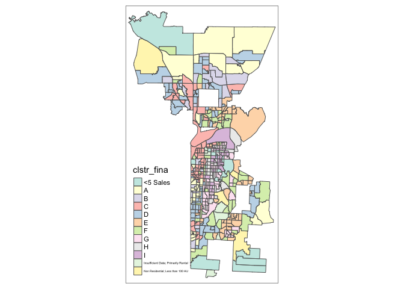

``` r
#tmap_mode("plot")
```

What are the values from MVA Category? Some label are difficult to read on the map.

``` r
unique(kcmo_mva_sf$clstr_fina)
```

    ##  [1] I                                   F                                  
    ##  [3] G                                   H                                  
    ##  [5] <5 Sales                            B                                  
    ##  [7] A                                   D                                  
    ##  [9] E                                   Non Residential; Less than 100 HU  
    ## [11] C                                   Insufficient Data; Primarily Rental
    ## 12 Levels: <5 Sales A B C D E F G H I ... Non Residential; Less than 100 HU

### Zoom In on Different MVA Cateogories

For example, Top Categories are A, B, C. Bottom Categories are G, H, I.

``` r
tmap_mode(tmap_interactive_viewing_mode)
```

    ## tmap mode set to plotting

``` r
  kcmo_mva_sf %>% 
    filter(clstr_fina %in% c("A", "B", "C")) %>% 
    
    tm_shape(bbox=kcmo_mva_sf) +
      tm_polygons(col="clstr_fina", alpha=0.5)
```

    ## Some legend labels were too wide. These labels have been resized to 0.31, 0.29. Increase legend.width (argument of tm_layout) to make the legend wider and therefore the labels larger.

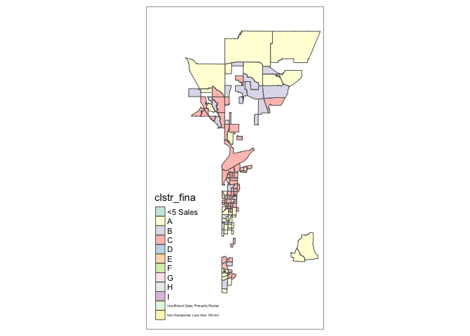

``` r
tmap_mode("plot")
```

    ## tmap mode set to plotting

Median sales price
------------------

... of residential properties sold between 2014 and 2016q2

``` r
# summary(kcmo_mva_sf$mspn_lb_14)
   # Min. 1st Qu.  Median    Mean 3rd Qu.    Max. 
   #    0   32500   99343  118454  170226  862500 

tm_shape(kcmo_mva_sf) +
  tm_polygons(col="mspn_lb_14", title="Median Sales Price", palette="GnBu",
              n=10,
              legend.hist=TRUE) +
  tm_layout(legend.outside=TRUE)
```

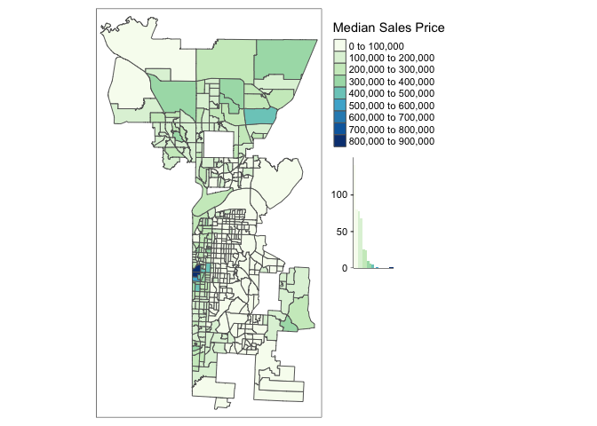

#### Variation sales price

... of residential properties sold between 2014 and 2016q2

How is percent represented? 0.5 would typically be 50%. Most under 50% variation in sales price, but also 1.0, 1.5. 2.0 (variation = 2x 200% ??)

*Hmmm, there is a wide range in variation in the sales price of residential properties.*

``` r
# summary(kcmo_mva_sf$vspn_lb_14)
   #   Min. 1st Qu.  Median    Mean 3rd Qu.    Max.
   # 0.0000  0.3030  0.4505  0.5599  0.7351  2.2277

tm_shape(kcmo_mva_sf) +
  tm_polygons(col="vspn_lb_14", title="Var. Sales Price (%)", palette="GnBu",
              #n=10,
              legend.hist=TRUE) +
  tm_layout(legend.outside=TRUE)
```

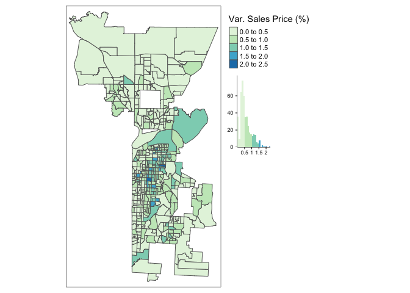

Percentage of residential parcels with a new construction permit
----------------------------------------------------------------

... issued between 2014 and 2015

This variable seems to be a good indication of areas of growth, new development ...

The vast majority of KC has little if any new construction (3rd quartile &lt; 0.2% (2/10th of 1%)). The map below filters out block groups with &lt; 1% so it is easier to see areas where there is new construction (1% to max. of almost 50%)

``` r
# summary(kcmo_mva_sf$pncnst_121)
  #     Min.  1st Qu.   Median     Mean  3rd Qu.     Max. 
  # 0.000000 0.000000 0.000000 0.014647 0.002604 0.497207 

kcmo_mva_sf %>% 
   filter(pncnst_121 >= 0.01) %>%                    # > 1% of parcels
  
tm_shape(bbox=kcmo_mva_sf) +
  tm_polygons(col="pncnst_121", title="% New Const. Permit", palette="GnBu",
              #n=10,
              legend.hist=TRUE) +
  tm_layout(legend.outside=TRUE)
```

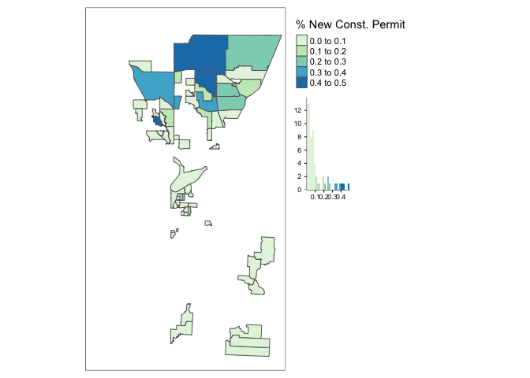

Percent of residential properties with permits for new construction or improvements
-----------------------------------------------------------------------------------

... valued over $1k, excluding demolitions

Two areas &gt; 1.0 (or &gt; 100% of residential properties). Data error?

Below displays block groups in the top quartile - where &gt; 6.78% of residential properties have permits for new construction or improvement over $1K.

``` r
# summary(kcmo_mva_sf$pperm_1_k_)
  #    Min. 1st Qu.  Median    Mean 3rd Qu.    Max. 
  # 0.00000 0.02558 0.03761 0.06824 0.06775 1.57143

boxplot(kcmo_mva_sf$pperm_1_k_, horizontal=TRUE)
```

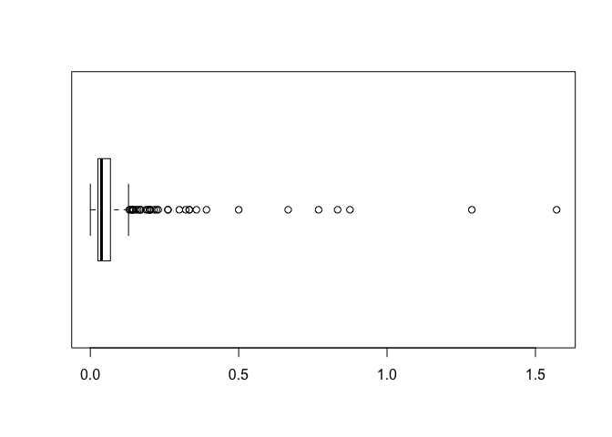

``` r
kcmo_mva_sf %>% 
   filter(pperm_1_k_ > 0.06775) %>%                    # Top Quartile
tm_shape(bbox=kcmo_mva_sf) +
  tm_polygons(col="pperm_1_k_", title="% $1k+ Improvement", palette="GnBu",
              n=10,
              legend.hist=TRUE) +
  tm_layout(legend.outside = TRUE)
```

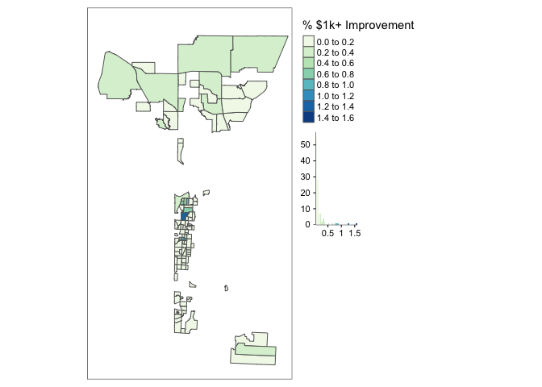

Households per acre
-------------------

High density areas are Downtown, Crown Center (?Westport), the Plaza.

The map below displays the top quartile - block groups with the highest households per acre. For reference, an acre is about 3/4 of a football field. The 3rd quartile is 6.7 hh/acre, so 75% of the census block groups are &lt; 7 households per acre.

``` r
# summary(kcmo_mva_sf$hhdense)
  #  Min. 1st Qu.  Median    Mean 3rd Qu.    Max. 
  # 0.000   2.882   4.435   7.959   6.784 182.855 

tmap_mode(tmap_interactive_viewing_mode)
```

    ## tmap mode set to plotting

``` r
  kcmo_mva_sf %>% 
    filter(hhdense > 7) %>%                    # most dense 25%
  tm_shape(bbox=kcmo_mva_sf) +
    tm_polygons(col="hhdense", title="HH / acre", palette="GnBu",
                n=10,
                alpha=0.5,
                legend.hist=TRUE) +
    tm_layout(legend.outside = TRUE)
```

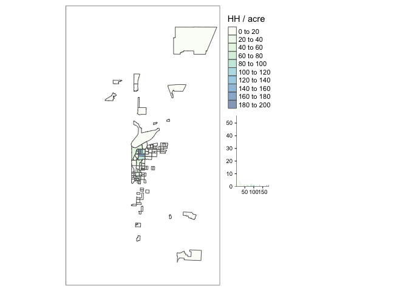

``` r
tmap_mode("plot")
```

    ## tmap mode set to plotting

Percent of Households that are owner occupied
---------------------------------------------

So ... Own vs. Rent??

Interesting, this is the first variable with a more even distribution throughout the city (vs. highly skewed)

``` r
#summary(kcmo_mva_sf$phuoo)
 #   Min. 1st Qu.  Median    Mean 3rd Qu.    Max. 
 # 0.0000  0.3516  0.5658  0.5533  0.7932  1.0000 

tm_shape(kcmo_mva_sf) +
  tm_polygons(col="phuoo", title="% Owner Occupied", palette="GnBu",
              #n=10,
              legend.hist=TRUE) +
  tm_layout(legend.outside = TRUE)
```

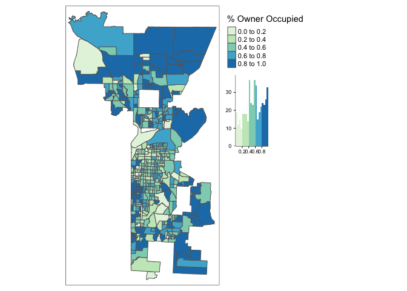

Percent of residential properties with maintenance violations issued in 2014 and 2015
-------------------------------------------------------------------------------------

Might want to target areas with low violation &lt; 75%

The map below displays the top quartile - block groups with the highest % of maintenance violations (&gt; 19%).

``` r
#summary(kcmo_mva_sf$pmviol_141)
  #    Min. 1st Qu.  Median    Mean 3rd Qu.    Max. 
  # 0.00000 0.05556 0.12230 0.13461 0.19559 0.53778 

kcmo_mva_sf %>% 
  filter(pmviol_141 > 0.196) %>%                    # top 25%
tm_shape(bbox=kcmo_mva_sf) +
  tm_polygons(col="pmviol_141", title="% Maintenance Violation", palette="GnBu",
              #n=10,
              legend.hist=TRUE) +
  tm_layout(legend.outside = TRUE)
```

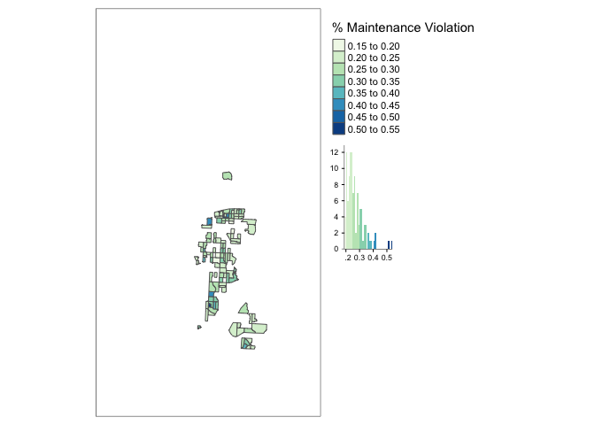

Percent of residential properties on the vacant property registry,
------------------------------------------------------------------

... owned by a bank, with a vacant property violation, on the city's dangerous buildings list, or with a demolition permit issued in 2014 or 2015\*

What's up with northern most block group? It had a lot of new construction - so is a lot still owned by a bank, vacant (not sold to homeowner yet), or had some kind of demolition permit prior to new construction??

``` r
#summary(kcmo_mva_sf$pvac_any_1)
  #     Min.  1st Qu.   Median     Mean  3rd Qu.     Max. 
  # 0.000000 0.008602 0.029963 0.071619 0.093313 0.553684 

kcmo_mva_sf %>%
   filter(pvac_any_1 > 0.10) %>%                    # > 10%
tm_shape(bbox=kcmo_mva_sf) +
  tm_polygons(col="pvac_any_1", title="% Vacant", palette="GnBu",
              #n=10,
              legend.hist=TRUE) +
  tm_layout(legend.outside = TRUE)
```

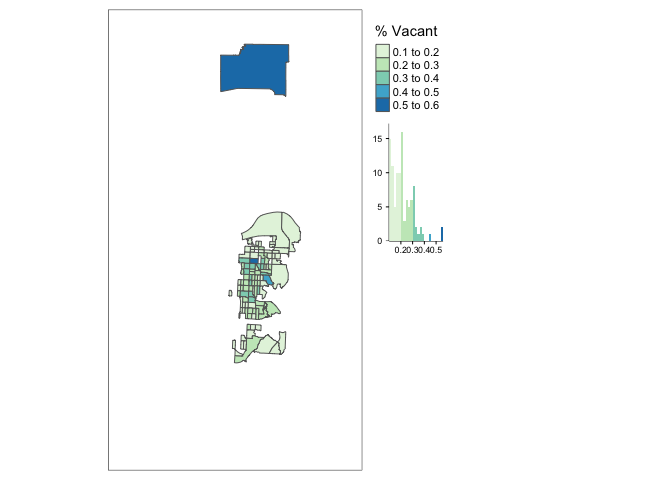

------------------------------------------------------------------------

Explore Data Structure
======================

Documentation mentions "split" blocks. The MVA was generally at the level of Census Block Groups but a couple groups were split.

``` r
nrow(kcmo_mva_sf)
```

    ## [1] 441

``` r
# Yes, geo id is unique - split block groups have letter appended to the end.
nrow(kcmo_mva_sf %>% 
  group_by(geo_id) %>% 
  count() %>% 
  filter(n == 1))
```

    ## [1] 441

FYI: Where are the split blocks?

``` r
kcmo_mva_sf %>% 
  filter(split == 1) %>% 

tm_shape(bbox=kcmo_mva_sf) +
  tm_polygons(col="pink") +
  
  tm_shape(kcmo_mva_sf) +
    tm_borders()
```

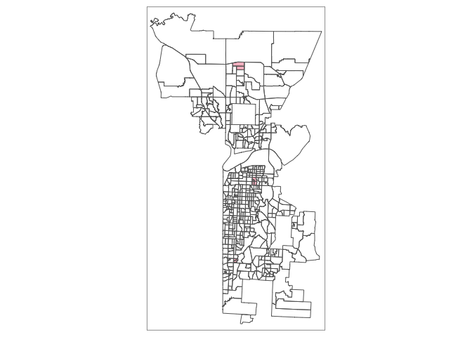
