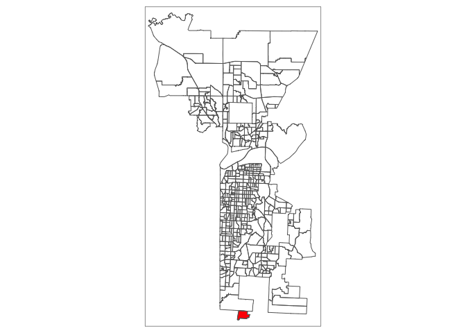
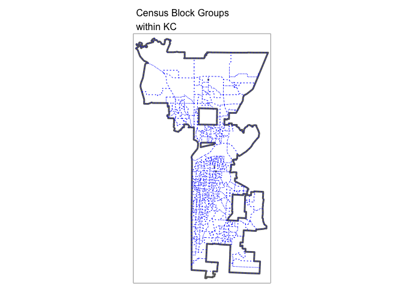
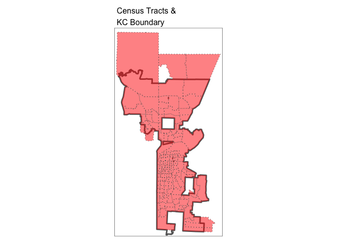
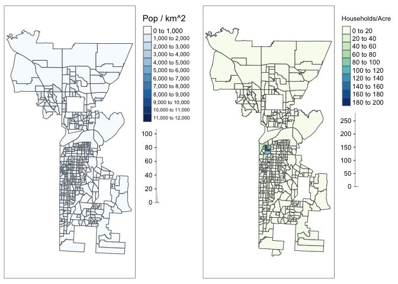
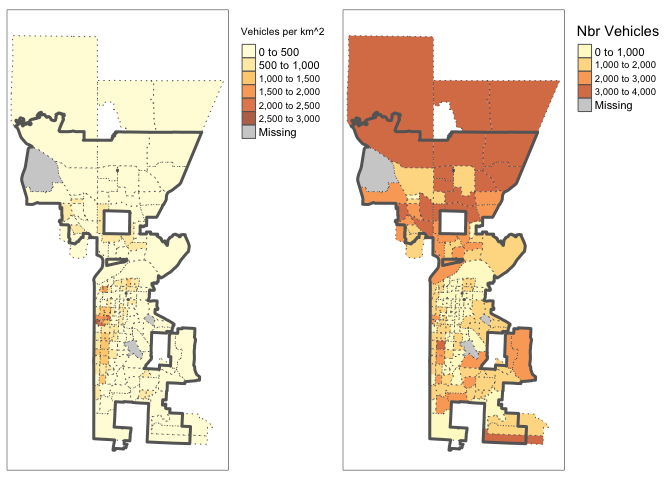

Process Census Data
================

``` r
library(tidyverse)
```

    ## ── Attaching packages ───────────────────────────────────────────────────────────────────────────────────────────── tidyverse 1.3.0 ──

    ## ✓ ggplot2 3.3.2     ✓ purrr   0.3.4
    ## ✓ tibble  3.0.1     ✓ dplyr   1.0.0
    ## ✓ tidyr   1.0.2     ✓ stringr 1.4.0
    ## ✓ readr   1.3.1     ✓ forcats 0.4.0

    ## ── Conflicts ──────────────────────────────────────────────────────────────────────────────────────────────── tidyverse_conflicts() ──
    ## x dplyr::filter() masks stats::filter()
    ## x dplyr::lag()    masks stats::lag()

``` r
library(sf)
```

    ## Linking to GEOS 3.7.2, GDAL 2.4.2, PROJ 5.2.0

``` r
library(tmap)
```

Load Data
=========

KC MVA Study Data
-----------------

``` r
# read shape file for KC MVA study
kcmo_mva_sf <- st_read("Data/2016 Market Value Analysis (MVA)/geo_export_8a3f2884-9896-4c60-ba20-c985177b689a.shp")
```

    ## Reading layer `geo_export_8a3f2884-9896-4c60-ba20-c985177b689a' from data source `/Users/Sara/Documents/DS/BIA6313-Spatial-GIS/Assignments/Project/Data/2016 Market Value Analysis (MVA)/geo_export_8a3f2884-9896-4c60-ba20-c985177b689a.shp' using driver `ESRI Shapefile'
    ## Simple feature collection with 441 features and 26 fields
    ## geometry type:  POLYGON
    ## dimension:      XY
    ## bbox:           xmin: -94.78056 ymin: 38.82762 xmax: -94.37249 ymax: 39.40155
    ## epsg (SRID):    4326
    ## proj4string:    +proj=longlat +ellps=WGS84 +no_defs

``` r
# its CRS = 4326 - unprojected (geo with lon/lat)

# Create boundary for KCMO as a whole and transform to a projected CRS
# EPSG:2817 = https://spatialreference.org/ref/epsg/nad83harn-missouri-west/

kc_boundary_sf   <- st_union(kcmo_mva_sf)
kc_boundary_prjd <- st_transform(kc_boundary_sf, crs=2817) 

rm(kc_boundary_sf)
```

Census Data at Block Group Level
--------------------------------

``` r
# read in Census data gather a block group level
census_blkgrp_sf <- st_read("Data/census_blkgrp.shp")
```

    ## Reading layer `census_blkgrp' from data source `/Users/Sara/Documents/DS/BIA6313-Spatial-GIS/Assignments/Project/Data/census_blkgrp.shp' using driver `ESRI Shapefile'
    ## Simple feature collection with 763 features and 18 fields
    ## geometry type:  MULTIPOLYGON
    ## dimension:      XY
    ## bbox:           xmin: -95.10289 ymin: 38.83301 xmax: -94.10482 ymax: 39.53335
    ## epsg (SRID):    NA
    ## proj4string:    +proj=longlat +ellps=GRS80 +no_defs

``` r
# CRS = geographic lon/lat
# proj4string:    +proj=longlat +ellps=GRS80 +no_def

# rename columns
census_blkgrp_sf <- census_blkgrp_sf %>% 
  rename(
    population        = popltnE,
    median_income     = mdn_ncE, 
    median_age        = medn_gE,
    towrk_total       = twrk_ttE, 
    towrk_car         = twrk_cE,
    towrk_public      = twrk_pE,
    towrk_taxi        = twrk_txE,
    towrk_mcycle      = twrk_mE,
    
    # measure of estimate (MOE)
    MOE_population    = popltnM,
    MOE_median_income = mdn_ncM,   
    MOE_median_age    = medn_gM,   
    MOE_towrk_total   = twrk_ttM, 
    MOE_towrk_car     = twrk_cM,
    MOE_towrk_public  = twrk_pM,
    MOE_towrk_taxi    = twrk_txM,
    MOE_towrk_mcycle= twrk_mM
  )

# transform to projected CRS
census_blkgrp_prjd <- st_transform(census_blkgrp_sf, crs=2817) 


rm(census_blkgrp_sf)
```

Census Data at Tract Level
--------------------------

``` r
census_tract_sf <- st_read("Data/census_tract.shp")
```

    ## Reading layer `census_tract' from data source `/Users/Sara/Documents/DS/BIA6313-Spatial-GIS/Assignments/Project/Data/census_tract.shp' using driver `ESRI Shapefile'
    ## Simple feature collection with 263 features and 4 fields
    ## geometry type:  MULTIPOLYGON
    ## dimension:      XY
    ## bbox:           xmin: -95.10289 ymin: 38.83301 xmax: -94.10482 ymax: 39.53335
    ## epsg (SRID):    NA
    ## proj4string:    +proj=longlat +ellps=GRS80 +no_defs

``` r
# CRS = geo-long
# proj4string:    +proj=longlat +ellps=GRS80 +no_def

census_tract_sf <- census_tract_sf %>% 
  rename(
    agg_vehicles      = agg_vhE,
    # measure of estimate (MOE)
    MOE_agg_vehicles  = agg_vhM
  )

census_tract_prjd <- st_transform(census_tract_sf, crs=2817) 

rm(census_tract_sf)
```

Process to Remove Data Outside the KC MVA Study Boundary
========================================================

Keep Census Block Groups within KC MVA Study Boundary
-----------------------------------------------------

``` r
# Drop the a/b (last character) designator on split block groups and
# Collect a unique list of block groups used by the KC MVA study

kcmo_mva_blkgrps <- kcmo_mva_sf %>% 
  st_drop_geometry() %>% 
  select(geo_id) %>% 
  mutate(geo_id = str_sub(as.character(geo_id), 1, 12)) %>% 
  distinct()

# keep all census_blkgrp_prjd that matches blkgrp geo_id in the list from KC MVA study (semi_join(x, y))
# basically, exclude the blkgrp from Jackson, Clay & Platte counties that are outside the KC MVA study boundary

kcmva_blkgrp_prjd <- census_blkgrp_prjd %>% 
  mutate(GEOID_chr = as.character(GEOID)) %>% 
  semi_join(kcmo_mva_blkgrps, by=c("GEOID_chr" = "geo_id")) %>% 
  select(-GEOID_chr)

# kcmo_mva_sf has 441 rows (includes 4 split block groups with 2 entries per census block group)
# kcmo_mva_blkgrps (unique block group geo_ids) has 437 rows - makes sense -4 the split blocks have the same geo_id
# 
# kcmva_blkgrp_prjd - has 436 rows (1 less, hmmm?)
```

### Research: Why do we have 1 less in kcmva\_blkgrp\_prjd (436 vs. 437)?

That block group actually falls in Cass county (north of Belton & to the east of Loch Lloyd). I didn't extract data from the Census on Cass county.

There is not a lot of data on that block group in the MVA study. The final cluster (MVA category) is noted as a exception condition. So it is OK I don't have any census data for this block group.

``` r
# anti_join() = drop all obs/rows in x that have a match in y
anti_join(kcmo_mva_blkgrps, census_blkgrp_prjd, by=c("geo_id"="GEOID")) 
```

    ##         geo_id
    ## 1 290370601001

``` r
# missing geo_id = 290370601001

# review data attributes
# clstr_fina = Insufficient Data; Primarily Rental
kcmo_mva_sf %>% filter(geo_id =="290370601001")
```

    ## Simple feature collection with 1 feature and 26 fields
    ## geometry type:  POLYGON
    ## dimension:      XY
    ## bbox:           xmin: -94.56604 ymin: 38.82762 xmax: -94.53552 ymax: 38.84501
    ## epsg (SRID):    4326
    ## proj4string:    +proj=longlat +ellps=WGS84 +no_defs
    ##   cdemo_hh_1 cdng_b_141                          clstr_fina cspall_141
    ## 1          0          0 Insufficient Data; Primarily Rental          0
    ##   csplb_1416 cspn_lb_14 cvac_prop_ esri_oid       geo_id hhdense invst_2_in
    ## 1          0          0          0      124 290370601001       0          0
    ##   invst_buye mspall_141 mspn_lb_14 pbank_parc  phhsub_ne phuoo pmviol_141
    ## 1          0          0          0          0 0.08490566     0          0
    ##   pncnst_121 pperm_1_k_   prhu_sf psdist_141 pvac_any_1 split vspall_141
    ## 1          0          0 0.7924528          0          0     0          0
    ##   vspn_lb_14                       geometry
    ## 1          0 POLYGON ((-94.55908 38.8307...

``` r
# tmap_mode("view")
kcmo_mva_sf %>% filter(geo_id =="290370601001") %>% 
tm_shape(bbox=kcmo_mva_sf) +
  tm_polygons(col="red") +          # fill in the location of the missing block group (had no data from census)
  
  tm_shape(kcmo_mva_sf) +
    tm_borders()
```



``` r
# tmap_mode("plot")
```

### Quick Map

Visually confirm the block groups are within overall KC MVA boundary.

``` r
tm_shape(kc_boundary_prjd) +
  tm_borders(lwd=3) +
  
  tm_shape(kcmva_blkgrp_prjd) +
    tm_borders(col="blue", lty = 3) +

  tm_layout(main.title = "Census Block Groups\nwithin KC", main.title.size = 1)
```



Keep Census Tracts within KC MVA Study Boundary
-----------------------------------------------

Note: Some of the Census Tracts extend to areas beyond the the KC MVA Study Boundary. I'll have to be careful about how I use data in Tracts that cross the boundary.

``` r
# Collect a unique list of the Census Tracts "NAME" used by the KC MVA study

# I am dropping off "Block Group X, " portion of the Block Group name,
# which leaves me with the Tract and County Names to join on.
kcmo_mva_tracts <- kcmva_blkgrp_prjd %>% 
  st_drop_geometry() %>% 
  mutate(blkgrp_name = as.character(NAME),
         len         = str_length(blkgrp_name),
         tract_name  = str_sub(blkgrp_name, 16, len)) %>%
  select(tract_name) %>% 
  distinct()

# keep all census_tract_prjd that matches tract NAME in the list from KC MVA study (semi_join(x, y))
# basically, exclude the tracts from Jackson, Clay & Platte counties that are outside the KC MVA study boundary

kcmva_tract_prjd <- census_tract_prjd %>%
  mutate(NAME_chr = as.character(NAME)) %>%
  semi_join(kcmo_mva_tracts, by=c("NAME_chr" = "tract_name")) %>% 
  select(-NAME_chr)

# visualize ...
#tmap_mode("view")
tm_shape(kc_boundary_prjd, bbox=kcmva_tract_prjd) +
  tm_borders(lwd=3) +
  
  tm_shape(kcmva_tract_prjd) +
    tm_polygons(col="red", alpha=0.5, lty = 3) +
  
  tm_layout(main.title = "Census Tracts &\nKC Boundary", main.title.size = 1)
```



``` r
#tmap_mode("plot")
```

Create Calculated Columns
=========================

... For Block Group Level Data
==============================

-   area\_km - area of census tract in km^2
-   pop\_density - population per km^2
-   pct\_fueled - fueled means of transportation to work as percentage/share of all transportation mode (car/van/truck & motorcycle). This excludes public transportation, taxis, walk, bicycle and other.

``` r
kcmva_blkgrp_prjd <- kcmva_blkgrp_prjd %>% 
  mutate(
    area_km     = units::set_units(st_area(.), km^2),
    pop_density = population / area_km,
    pct_fueled  = (towrk_car + towrk_mcycle) / towrk_total
  )
```

**Population Density (Census) vs. Households Density (MVA)**

``` r
p1 <- tm_shape(kcmva_blkgrp_prjd) +
  tm_polygons(col="pop_density", title="Pop / km^2",
              n=10, 
              palette="Blues",
              legend.hist=TRUE) +
  tm_layout(legend.outside = TRUE)

p2 <- tm_shape(kcmo_mva_sf) +
  tm_polygons(col="hhdense", title="Households/Acre",
              n=10,
              palette="GnBu",
              legend.hist=TRUE) +
  tm_layout(legend.outside = TRUE)

tmap_arrange(p1, p2)
```

    ## Some legend labels were too wide. These labels have been resized to 0.59, 0.59, 0.59, 0.59, 0.59, 0.59, 0.59, 0.59, 0.55, 0.51, 0.51. Increase legend.width (argument of tm_layout) to make the legend wider and therefore the labels larger.



... For Tract Level Data
------------------------

-   area\_km - area of census tract in km^2
-   vehicle\_density - vehicles per km^2

``` r
kcmva_tract_prjd <- kcmva_tract_prjd %>% 
  mutate(
    area_km          = units::set_units(st_area(.), km^2),
    vehicle_density  = agg_vehicles / area_km
  ) 
```

**Vehicle Density vs. Vehicles**

``` r
#legend_title = expression("Vehicles per km"^2*"")
#legend_title = expression("Vehicle Density (km" ^2* ")")

legend_title = "Vehicles per km^2"

#tmap_mode("view")

p1 <- tm_shape(kcmva_tract_prjd) +
  tm_polygons(col    = "vehicle_density", title=legend_title,
              alpha=0.75, lty = 3) +
  tm_shape(kc_boundary_prjd) +
    tm_borders(lwd=3) +
  tm_layout(legend.outside = TRUE)

p2 <- tm_shape(kcmva_tract_prjd) +
  tm_polygons(col    = "agg_vehicles", title="Nbr Vehicles",
              alpha=0.75, lty = 3) +
  tm_shape(kc_boundary_prjd) +
    tm_borders(lwd=3) +
  tm_layout(legend.outside = TRUE)

tmap_arrange(p1, p2)
```

    ## Some legend labels were too wide. These labels have been resized to 0.59, 0.59, 0.59, 0.59. Increase legend.width (argument of tm_layout) to make the legend wider and therefore the labels larger.

    ## Some legend labels were too wide. These labels have been resized to 0.59, 0.59, 0.59. Increase legend.width (argument of tm_layout) to make the legend wider and therefore the labels larger.



``` r
#tmap_mode("plot")
```

Save Data to Files
==================

``` r
# save data to a file with st_write()
kcmva_blkgrp_prjd %>% 
  rename(
    popultation_MOE   = MOE_population,
    median_income_MOE = MOE_median_income,
    median_age_MOE    = MOE_median_age,
    wrk_total_MOE     = MOE_towrk_total,
    wrk_car_MOE       = MOE_towrk_car,
    wrk_public_MOE    = MOE_towrk_public,
    wrk_taxi_MOE      = MOE_towrk_taxi,
    wrk_mcycle_MOE    = MOE_towrk_mcycle
  ) %>% 
st_write("Data/kcmva_blkgrp.shp", 
         layer ="kcmva_blkgrp.shp", driver = "ESRI Shapefile",
         delete_layer = TRUE)
```

    ## Warning in abbreviate_shapefile_names(obj): Field names abbreviated for ESRI
    ## Shapefile driver

    ## Deleting layer `kcmva_blkgrp' using driver `ESRI Shapefile'
    ## Writing layer `kcmva_blkgrp' to data source `Data/kcmva_blkgrp.shp' using driver `ESRI Shapefile'
    ## Writing 436 features with 21 fields and geometry type Multi Polygon.

``` r
# example of read file back in
kcmva_blkgrp_prjd.in <- st_read("Data/kcmva_blkgrp.shp")
```

    ## Reading layer `kcmva_blkgrp' from data source `/Users/Sara/Documents/DS/BIA6313-Spatial-GIS/Assignments/Project/Data/kcmva_blkgrp.shp' using driver `ESRI Shapefile'
    ## Simple feature collection with 436 features and 21 fields
    ## geometry type:  POLYGON
    ## dimension:      XY
    ## bbox:           xmin: 825827.6 ymin: 296560.8 xmax: 860987.6 ymax: 359050.3
    ## epsg (SRID):    NA
    ## proj4string:    +proj=tmerc +lat_0=36.16666666666666 +lon_0=-94.5 +k=0.999941177 +x_0=850000 +y_0=0 +ellps=GRS80 +units=m +no_defs

``` r
colnames(kcmva_blkgrp_prjd.in)
```

    ##  [1] "GEOID"      "NAME"       "popultn"    "ppl_MOE"    "mdn_ncm"   
    ##  [6] "mdn_n_MOE"  "medin_g"    "mdn_g_MOE"  "twrk_tt"    "wrk_tt_MOE"
    ## [11] "twrk_cr"    "wrk_c_MOE"  "twrk_pb"    "wrk_p_MOE"  "twrk_tx"   
    ## [16] "wrk_tx_MOE" "twrk_mc"    "wrk_m_MOE"  "area_km"    "pp_dnst"   
    ## [21] "pct_fld"    "geometry"

``` r
# save data to a file with st_write()
st_write(kcmva_tract_prjd, "Data/kcmva_tract.shp", 
         layer ="kcmva_tract.shp", driver = "ESRI Shapefile",
         delete_layer = TRUE)
```

    ## Warning in abbreviate_shapefile_names(obj): Field names abbreviated for ESRI
    ## Shapefile driver

    ## Deleting layer `kcmva_tract' using driver `ESRI Shapefile'
    ## Writing layer `kcmva_tract' to data source `Data/kcmva_tract.shp' using driver `ESRI Shapefile'
    ## Writing 158 features with 6 fields and geometry type Multi Polygon.

``` r
# example of read file back in
kcmva_tract_prjd.in <- st_read("Data/kcmva_tract.shp")
```

    ## Reading layer `kcmva_tract' from data source `/Users/Sara/Documents/DS/BIA6313-Spatial-GIS/Assignments/Project/Data/kcmva_tract.shp' using driver `ESRI Shapefile'
    ## Simple feature collection with 158 features and 6 fields
    ## geometry type:  POLYGON
    ## dimension:      XY
    ## bbox:           xmin: 825043.8 ymin: 296431.1 xmax: 865197 ymax: 373518.9
    ## epsg (SRID):    NA
    ## proj4string:    +proj=tmerc +lat_0=36.16666666666666 +lon_0=-94.5 +k=0.999941177 +x_0=850000 +y_0=0 +ellps=GRS80 +units=m +no_defs

``` r
colnames(kcmva_tract_prjd.in)
```

    ## [1] "GEOID"    "NAME"     "agg_vhc"  "MOE_gg_"  "area_km"  "vhcl_dn"  "geometry"
