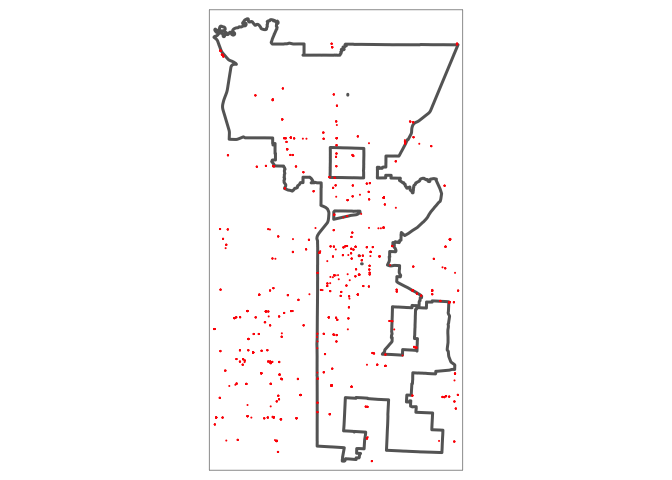
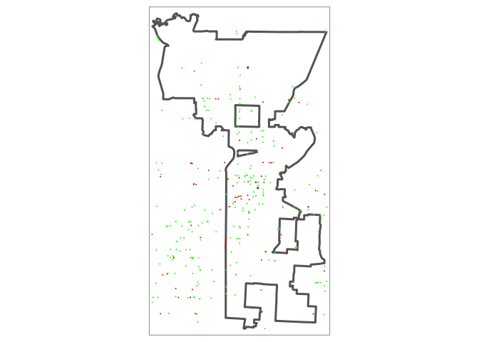
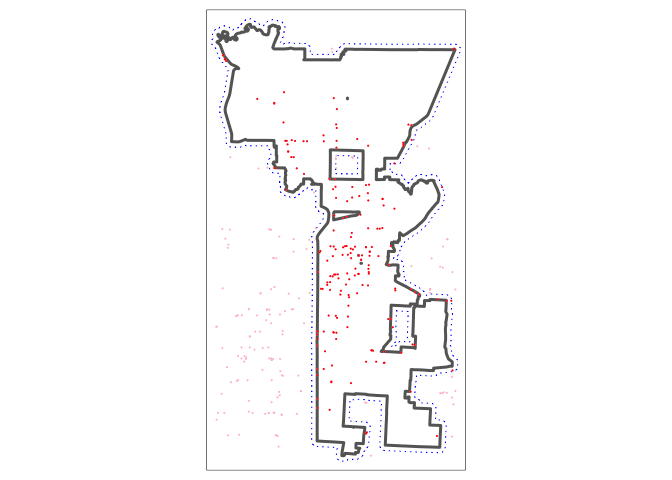

Explore Points of Interest - OSM
================

``` r
library(osmdata)
```

    ## Data (c) OpenStreetMap contributors, ODbL 1.0. https://www.openstreetmap.org/copyright

``` r
library(sf)
```

    ## Linking to GEOS 3.7.2, GDAL 2.4.2, PROJ 5.2.0

``` r
library(tidyverse)
```

    ## ── Attaching packages ───────────────────────────────────────────────────────────────────────────────────────────── tidyverse 1.3.0 ──

    ## ✓ ggplot2 3.3.2     ✓ purrr   0.3.4
    ## ✓ tibble  3.0.1     ✓ dplyr   1.0.0
    ## ✓ tidyr   1.0.2     ✓ stringr 1.4.0
    ## ✓ readr   1.3.1     ✓ forcats 0.4.0

    ## ── Conflicts ──────────────────────────────────────────────────────────────────────────────────────────────── tidyverse_conflicts() ──
    ## x dplyr::filter() masks stats::filter()
    ## x dplyr::lag()    masks stats::lag()

``` r
library(tmap)
```

Load Data
---------

Shape file from 2016 Market Value Analysis

``` r
# read shape file of KC from MVA study
kcmo_mva_sf <- st_read("Data/2016 Market Value Analysis (MVA)/geo_export_8a3f2884-9896-4c60-ba20-c985177b689a.shp")
```

    ## Reading layer `geo_export_8a3f2884-9896-4c60-ba20-c985177b689a' from data source `/Users/Sara/Documents/DS/BIA6313-Spatial-GIS/Assignments/Project/Data/2016 Market Value Analysis (MVA)/geo_export_8a3f2884-9896-4c60-ba20-c985177b689a.shp' using driver `ESRI Shapefile'
    ## Simple feature collection with 441 features and 26 fields
    ## geometry type:  POLYGON
    ## dimension:      XY
    ## bbox:           xmin: -94.78056 ymin: 38.82762 xmax: -94.37249 ymax: 39.40155
    ## epsg (SRID):    4326
    ## proj4string:    +proj=longlat +ellps=WGS84 +no_defs

``` r
# its CRS = 4326 - unprojected (geo with lon/lat)
```

``` r
# Create boundary for KCMO as a whole and transform to a projected CRS
# At this point, I don't care about Census Block Groups
# 
# EPSG:2817 = https://spatialreference.org/ref/epsg/nad83harn-missouri-west/

kc_boundary_sf   <- st_union(kcmo_mva_sf)
kc_boundary_prjd <- st_transform(kc_boundary_sf, crs=2817) 
```

Get Data from OSM on Fuel Stations
----------------------------------

Provide the bounding box that matches the area of the MVA study rather accept the bounding box generated by OSM for Kansas City.

``` r
# get bounding box for MVA study, turn it into a matrix in format OSM accepts
kc_bbox_matrix <- matrix(st_bbox(kcmo_mva_sf), ncol=2, byrow=FALSE)
row.names(kc_bbox_matrix) <- c("x","y")
colnames(kc_bbox_matrix)  <- c("min","max")

# get bounding box OSM would generate for KC, Mo as 'place_name')
osm_metro_bbox_matrix <- getbb("Kansas City, Missouri")

# MVA's KC ... starts a touch further W and extends a bit more E, starts about the same on S but extends more N
kc_bbox_matrix
```

    ##         min       max
    ## x -94.78056 -94.37249
    ## y  38.82762  39.40155

``` r
osm_metro_bbox_matrix
```

    ##         min       max
    ## x -94.76592 -94.38552
    ## y  38.82718  39.35666

Get fuel stations in Kansas City from OSM

``` r
# fuel_df <- opq(getbb("Kansas City, Missouri")) %>%       # get bounding box for city

fuel_df <- kc_bbox_matrix %>% opq() %>%                  # use kc bbox from MVA study area
  add_osm_feature(key="amenity", value="fuel") %>%       # search for fuel amenities
  osmdata_sf()      
```

Review data returned by OSM

``` r
# Data Retrieved on ...
fuel_df$meta$timestamp
```

    ## [1] "[ Wed 4 Apr 2021 15:52:10 ]"

``` r
# Nbr of Points
nrow(fuel_df$osm_points)
```

    ## [1] 1489

``` r
# Nbr of Polygons
nrow(fuel_df$osm_polygons)
```

    ## [1] 267

Returns entries as both points and polygons.

### Explore Points returned by OSM

``` r
# select point data from download OSM data (only keep name & brand attributes provide by OSM)

fuel_pts <- fuel_df$osm_points %>%
  dplyr::select(name, brand, geometry)

head(fuel_pts)
```

    ## Simple feature collection with 6 features and 2 fields
    ## geometry type:  POINT
    ## dimension:      XY
    ## bbox:           xmin: -94.76962 ymin: 38.88589 xmax: -94.52473 ymax: 39.0502
    ## epsg (SRID):    4326
    ## proj4string:    +proj=longlat +datum=WGS84 +no_defs
    ##                   name       brand                   geometry
    ## 1032600624 Phillips 66 Phillips 66 POINT (-94.52473 38.95274)
    ## 1160917442        <NA>        <NA>  POINT (-94.76955 39.0502)
    ## 1160917568        <NA>        <NA> POINT (-94.76955 39.05015)
    ## 1160917606        <NA>        <NA> POINT (-94.76962 39.05016)
    ## 1160917635        <NA>        <NA>  POINT (-94.76961 39.0502)
    ## 1185494067        <NA>        <NA> POINT (-94.72444 38.88589)

``` r
# transform to a projected CRS
fuel_pts_prjd <- st_transform(fuel_pts, crs=2817) 
```

#### Plot Points

``` r
tmap_mode(tmap_interactive_viewing_mode) 
```

    ## tmap mode set to plotting

``` r
tm_shape(kc_boundary_sf) +
  tm_borders(lwd=3) +
  
tm_shape(fuel_pts) +
  tm_dots(col="red")
```


``` r
tmap_mode("plot")
```

    ## tmap mode set to plotting

### Explore Polygons returned by OSM

``` r
# select polygon data from download OSM data (only keep name & brand attributes provide by OSM)
fuel_polys <- fuel_df$osm_polygons %>%
  dplyr::select(name, brand, geometry)

head(fuel_polys)
```

    ## Simple feature collection with 6 features and 2 fields
    ## geometry type:  POLYGON
    ## dimension:      XY
    ## bbox:           xmin: -94.76962 ymin: 38.88586 xmax: -94.58011 ymax: 39.30349
    ## epsg (SRID):    4326
    ## proj4string:    +proj=longlat +datum=WGS84 +no_defs
    ##                            name                 brand
    ## 100418844                  <NA>                  <NA>
    ## 102647024             minitmart                  <NA>
    ## 114440687 Casey's General Store Casey's General Store
    ## 119098620           Phillips 66           Phillips 66
    ## 123959778       Costco Gasoline                  <NA>
    ## 128365054              QuikTrip              QuikTrip
    ##                                 geometry
    ## 100418844 POLYGON ((-94.76961 39.0502...
    ## 102647024 POLYGON ((-94.72456 38.8858...
    ## 114440687 POLYGON ((-94.58034 39.3033...
    ## 119098620 POLYGON ((-94.65216 39.2476...
    ## 123959778 POLYGON ((-94.67183 38.9078...
    ## 128365054 POLYGON ((-94.60188 39.0497...

``` r
# transform to a projected CRS
fuel_polys_prjd <- st_transform(fuel_polys, crs=2817)
```

#### Plot Points & Polygons

If you zoom in enough, many of the points are corners of the polygons - not really a gas station itself.

``` r
tmap_mode(tmap_interactive_viewing_mode) 
```

    ## tmap mode set to plotting

``` r
tm_shape(kc_boundary_sf) +
  tm_borders(lwd=3) +

tm_shape(fuel_polys) +
  tm_polygons(col="green") +

# tm_shape(st_centroid(fuel_polys)) +
#   tm_dots(col="green") +
  
tm_shape(fuel_pts) +
  tm_dots(col="red")
```



``` r
tmap_mode("plot")
```

    ## tmap mode set to plotting

``` r
# 1341 - if points are corners of polys they would touch
sum(st_touches(fuel_pts_prjd, fuel_polys_prjd, sparse=FALSE))
```

    ## [1] 1417

``` r
# 4
sum(st_within(fuel_pts_prjd, fuel_polys_prjd, sparse=FALSE))
```

    ## [1] 3

``` r
# 1345 (1341 touches + 4 points contained ... polygons)
sum(st_intersects(fuel_pts_prjd, fuel_polys_prjd, sparse=FALSE))
```

    ## [1] 1420

``` r
# Find the points that do NOT intersect the polygons - points that are truly a fuel station not represented as a polygon

# retain the original points in another variable and so we can reuse the current variable for the valid points
# 1421 points
fuel_pts_prjd_original <- fuel_pts_prjd

# 78 of 1421 are points not associated with a polygon
fuel_pts_prjd <- fuel_pts_prjd_original[lengths(st_intersects(fuel_pts_prjd_original, fuel_polys_prjd))==0, ]

# head(fuel_pts_prjd)
```

#### Plot Points & Polygons, Again

Plot the centroid of the polygon as a green point and the red points are the points returned by OSM data did not overlap a polygon.

Note: The polygons are really small compared to the default size of a dot, hence plotting the centroid is more helpful.

``` r
tmap_mode(tmap_interactive_viewing_mode) 
```

    ## tmap mode set to plotting

``` r
tm_shape(kc_boundary_prjd) +
  tm_borders(lwd=3) +

# tm_shape(fuel_polys_prjd) +
#   tm_polygons(col="green") +

tm_shape(st_centroid(fuel_polys_prjd)) +
   tm_dots(col="green") +
  
tm_shape(fuel_pts_prjd) +
  tm_dots(col="red")
```

    ## Warning in st_centroid.sf(fuel_polys_prjd): st_centroid assumes attributes are
    ## constant over geometries of x



``` r
tmap_mode("plot")
```

    ## tmap mode set to plotting

### Represent all the fuel stations as points (rather than points and polygons)

-   Convert fuel polygons to a point (use centroid of poly)
-   Consolidate the centroid point of polys to the fuel stations returned as points
-   Add a 1/2 mile buffer around KC
-   Only keep the fuel stations with KCMO (vs. the whole metro area)

``` r
kc_metro_fuel_pts_prjd <- rbind(fuel_pts_prjd, st_centroid(fuel_polys_prjd))
```

    ## Warning in st_centroid.sf(fuel_polys_prjd): st_centroid assumes attributes are
    ## constant over geometries of x

``` r
# keep points with KCMO (vs. whole metro area)

# add 0.5 mile buffer around KCMO's border (0.5 mile ~ 805 meters)
kc_boundary_buffer_prjd <- st_buffer(kc_boundary_prjd, dist=805)

# Select/keep the points with the KCMO (+buffer) boundary
logical_win_boundary <- lengths(st_within(kc_metro_fuel_pts_prjd, kc_boundary_buffer_prjd)) > 0

kcmo_fuel_pts_prjd <- kc_metro_fuel_pts_prjd[logical_win_boundary, ]
```

#### Visualize ...

KC boundary and 1/2 mile buffer zone, included fuel stations in red, excluded in pink.

``` r
tmap_mode(tmap_interactive_viewing_mode) 
```

    ## tmap mode set to plotting

``` r
tm_shape(kc_boundary_buffer_prjd) +
  tm_borders(lwd=1, lty=3, col="blue") +
  
tm_shape(kc_boundary_prjd) +
  tm_borders(lwd=3) +

tm_shape(kc_metro_fuel_pts_prjd) +
  tm_dots(col="pink") +

tm_shape(kcmo_fuel_pts_prjd) +
  tm_dots(col="red")
```



``` r
tmap_mode("plot")
```

    ## tmap mode set to plotting

### Clean up names associated with Fuel Stations

``` r
kcmo_fuel_pts_prjd %>%
  group_by(name) %>%
  count() %>%
  arrange(desc(n))
```

    ## # A tibble: 30 x 3
    ## # Groups:   name [30]
    ##    name                n                                                geometry
    ##    <chr>           <int>                                        <MULTIPOINT [m]>
    ##  1 <NA>               44 ((826752.2 354496.6), (826766.6 354434.5), (826966.7 3…
    ##  2 Phillips 66        32 ((827166.5 353635.4), (831776.5 348021.3), (834306.7 3…
    ##  3 QuikTrip           28 ((834443.7 337802.2), (835917.8 341837.1), (840692.3 3…
    ##  4 BP                 25 ((834279.9 347333), (836323 340244.4), (840653.6 31159…
    ##  5 Conoco             12 ((836366.3 340256), (843346.6 325813.2), (845791.7 333…
    ##  6 Shell              12 ((836250.9 341309.3), (837613.2 337768.8), (842129.1 3…
    ##  7 Sinclair            6 ((837160.6 339421.5), (840675.5 313646.1), (842942.1 3…
    ##  8 7-Eleven            5 ((841777.8 310747.7), (843133.6 322083.2), (844741 326…
    ##  9 Hy-Vee Gas          3 ((837354 341815.5), (843199.3 336133.3), (854582.7 341…
    ## 10 Casey's Genera…     2              ((843080.4 348137.1), (843535.3 346516.8))
    ## # … with 20 more rows

``` r
# clean up names, at bit
kcmo_fuel_pts_prjd <- kcmo_fuel_pts_prjd %>% 
  mutate(brandname = ifelse(!is.na(name), name, ifelse(!is.na(brand), brand, "Unknown"))) %>% 
  mutate(brandname = ifelse(brandname=="Conoco Oil", "Conoco", brandname)) %>% 
  mutate(brandname = ifelse(brandname=="Fleming / Conoco", "Conoco", brandname)) %>% 
  mutate(brandname = ifelse(brandname=="Costco Gas Station", "Costco Gasoline", brandname)) %>% 
  mutate(brandname = ifelse(brandname=="Pilot Gas", "Pilot", brandname)) %>% 
  mutate(brandname = ifelse(brandname=="Pilot Truck Stop", "Pilot", brandname)) %>%  
  mutate(brandname = ifelse(brandname=="QuikTrip Gas & Convenience Store", "QuikTrip", brandname)) %>% 
  mutate(brandname = ifelse(brandname=="HyVee", "Hy-Vee Gas", brandname)) %>% 
  mutate(brandname = ifelse(brandname=="Sam's Club Gas Station", "Sam's Club Gas", brandname)) 
```

### Save Fuel Stations to a SHP file

``` r
# write with st_write
kcmo_fuel_pts_prjd %>% 
  select(brandname) %>% 
  st_write("Data/kcmo_fuelstations.shp", 
         layer ="kcmo_fuelstations.shp", driver = "ESRI Shapefile",
         delete_layer = TRUE)
```

    ## Deleting layer `kcmo_fuelstations' using driver `ESRI Shapefile'
    ## Writing layer `kcmo_fuelstations' to data source `Data/kcmo_fuelstations.shp' using driver `ESRI Shapefile'
    ## Writing 191 features with 1 fields and geometry type Point.

``` r
# example of read file back in
# fuel_stations <- st_read("Data/kcmo_fuelstations.shp")
```
