Geomarket Analysis of KC for Location of Gas Stations
================

### Load Packages

``` r
library(sf)
```

    ## Linking to GEOS 3.7.2, GDAL 2.4.2, PROJ 5.2.0

``` r
library(raster)
```

    ## Loading required package: sp

``` r
library(tidyverse)
```

    ## ── Attaching packages ───────────────────────────────────────────────────────────────────────────────────────────── tidyverse 1.3.0 ──

    ## ✓ ggplot2 3.3.2     ✓ purrr   0.3.4
    ## ✓ tibble  3.0.1     ✓ dplyr   1.0.0
    ## ✓ tidyr   1.0.2     ✓ stringr 1.4.0
    ## ✓ readr   1.3.1     ✓ forcats 0.4.0

    ## ── Conflicts ──────────────────────────────────────────────────────────────────────────────────────────────── tidyverse_conflicts() ──
    ## x tidyr::extract() masks raster::extract()
    ## x dplyr::filter()  masks stats::filter()
    ## x dplyr::lag()     masks stats::lag()
    ## x dplyr::select()  masks raster::select()

``` r
library(tmap)
```

Load Data
=========

-   KC MVA Study
-   Census Data at Block Group Level
-   Census Data at Tract Level
-   Location of Fuel Stations (from OSM)

``` r
#------------------------------------------------------------------------------
# KC MVA Study
#------------------------------------------------------------------------------
kcmo_mva_sf <- st_read("Data/2016 Market Value Analysis (MVA)/geo_export_8a3f2884-9896-4c60-ba20-c985177b689a.shp")
```

    ## Reading layer `geo_export_8a3f2884-9896-4c60-ba20-c985177b689a' from data source `/Users/Sara/Documents/DS/BIA6313-Spatial-GIS/Assignments/Project/Data/2016 Market Value Analysis (MVA)/geo_export_8a3f2884-9896-4c60-ba20-c985177b689a.shp' using driver `ESRI Shapefile'
    ## Simple feature collection with 441 features and 26 fields
    ## geometry type:  POLYGON
    ## dimension:      XY
    ## bbox:           xmin: -94.78056 ymin: 38.82762 xmax: -94.37249 ymax: 39.40155
    ## epsg (SRID):    4326
    ## proj4string:    +proj=longlat +ellps=WGS84 +no_defs

``` r
# its CRS = 4326 - unprojected (geo with lon/lat)
# transform to  EPSG:2817 = https://spatialreference.org/ref/epsg/nad83harn-missouri-west/
kcmo_mva_prjd <- st_transform(kcmo_mva_sf, crs=2817) 

# Create boundary for KCMO MVA Study Area as a whole
kc_boundary_prjd <- st_transform(st_union(kcmo_mva_sf), crs=2817)
# or ...
# kc_boundary_prjd <- st_union(kcmo_mva_prjd)

rm(kcmo_mva_sf)

#------------------------------------------------------------------------------
# Census Data at Block Group Level for KC MVA Study Area
#------------------------------------------------------------------------------
kcmva_blkgrp_prjd <- st_read("Data/kcmva_blkgrp.shp") %>% 
  rename(
    population        = popultn,
    median_income     = mdn_ncm,
    median_age        = medin_g,
    pop_density       = pp_dnst,
    pct_fueled        = pct_fld,
    
    # area_km           = area_km,
    towrk_total       = twrk_tt, 
    towrk_car         = twrk_cr,
    towrk_public      = twrk_pb,
    towrk_taxi        = twrk_tx,
    towrk_mcycle      = twrk_mc,
    
    # measure of estimate (MOE)
    MOE_population    = ppl_MOE,
    MOE_median_income = mdn_n_MOE,   
    MOE_median_age    = mdn_g_MOE,   
    MOE_towrk_total   = wrk_tt_MOE, 
    MOE_towrk_car     = wrk_c_MOE,
    MOE_towrk_public  = wrk_p_MOE,
    MOE_towrk_taxi    = wrk_tx_MOE,
    MOE_towrk_mcycle  = wrk_m_MOE
  )
```

    ## Reading layer `kcmva_blkgrp' from data source `/Users/Sara/Documents/DS/BIA6313-Spatial-GIS/Assignments/Project/Data/kcmva_blkgrp.shp' using driver `ESRI Shapefile'
    ## Simple feature collection with 436 features and 21 fields
    ## geometry type:  POLYGON
    ## dimension:      XY
    ## bbox:           xmin: 825827.6 ymin: 296560.8 xmax: 860987.6 ymax: 359050.3
    ## epsg (SRID):    NA
    ## proj4string:    +proj=tmerc +lat_0=36.16666666666666 +lon_0=-94.5 +k=0.999941177 +x_0=850000 +y_0=0 +ellps=GRS80 +units=m +no_defs

``` r
#  [1] "GEOID"      "NAME"       "popultn"    "ppl_MOE"    "mdn_ncm"    "mdn_n_MOE"  "medin_g"    "mdn_g_MOE" 
#  [9] "twrk_tt"    "wrk_tt_MOE" "twrk_cr"    "wrk_c_MOE"  "twrk_pb"    "wrk_p_MOE"  "twrk_tx"    "wrk_tx_MOE"
# [17] "twrk_mc"    "wrk_m_MOE"  "area_km"    "pp_dnst"    "pct_fld"    "geometry"  

#------------------------------------------------------------------------------
# Census Data at Tract Level for KC MVA Study Area
#------------------------------------------------------------------------------
# AGGREGATE NUMBER OF VEHICLES (CAR, TRUCK, OR VAN) USED IN COMMUTING BY WORKERS 16 YEARS 
#   ... AND OVER BY SEX
# B08015_001    Estimate!!Aggregate number of vehicles (car, truck, or van) used in commuting

kcmva_tract_prjd <- st_read("Data/kcmva_tract.shp") %>% 
  rename(
    # area_km          = area_km,
    vehicle_density  = vhcl_dn,
    
    agg_vehicles      = agg_vhc,
    # measure of estimate (MOE)
    MOE_agg_vehicles  = MOE_gg_
  )
```

    ## Reading layer `kcmva_tract' from data source `/Users/Sara/Documents/DS/BIA6313-Spatial-GIS/Assignments/Project/Data/kcmva_tract.shp' using driver `ESRI Shapefile'
    ## Simple feature collection with 158 features and 6 fields
    ## geometry type:  POLYGON
    ## dimension:      XY
    ## bbox:           xmin: 825043.8 ymin: 296431.1 xmax: 865197 ymax: 373518.9
    ## epsg (SRID):    NA
    ## proj4string:    +proj=tmerc +lat_0=36.16666666666666 +lon_0=-94.5 +k=0.999941177 +x_0=850000 +y_0=0 +ellps=GRS80 +units=m +no_defs

``` r
# [1] "GEOID"    "NAME"     "agg_vhc"  "MOE_gg_"  "area_km"  "vhcl_dn"  "geometry"

#------------------------------------------------------------------------------
# Location of Fuel Stations
#------------------------------------------------------------------------------
fuel_stations_prjd <- st_read("Data/kcmo_fuelstations.shp")
```

    ## Reading layer `kcmo_fuelstations' from data source `/Users/Sara/Documents/DS/BIA6313-Spatial-GIS/Assignments/Project/Data/kcmo_fuelstations.shp' using driver `ESRI Shapefile'
    ## Simple feature collection with 191 features and 1 field
    ## geometry type:  POINT
    ## dimension:      XY
    ## bbox:           xmin: 826752.2 ymin: 298235 xmax: 860848.8 ymax: 355460
    ## epsg (SRID):    NA
    ## proj4string:    +proj=tmerc +lat_0=36.16666666666666 +lon_0=-94.5 +k=0.999941177 +x_0=850000 +y_0=0 +ellps=GRS80 +units=m +no_defs

### Setup Rasters

``` r
kcmo_raster_template <- raster(extent(kcmo_mva_prjd),
                               resolution=1000,         # 1 km cells ... larger value =  more coarse
                               crs = st_crs(kcmo_mva_prjd)$proj4string)

kcmo_raster_template
```

    ## class      : RasterLayer 
    ## dimensions : 64, 35, 2240  (nrow, ncol, ncell)
    ## resolution : 1000, 1000  (x, y)
    ## extent     : 825827.6, 860827.6, 295050.5, 359050.5  (xmin, xmax, ymin, ymax)
    ## crs        : +proj=tmerc +lat_0=36.16666666666666 +lon_0=-94.5 +k=0.999941177 +x_0=850000 +y_0=0 +ellps=GRS80 +towgs84=0,0,0,0,0,0,0 +units=m +no_defs

``` r
ras_blank <- rasterize(kcmo_mva_prjd, kcmo_raster_template, field=0)
tm_shape(ras_blank) +
  tm_raster(legend.show = FALSE)
```

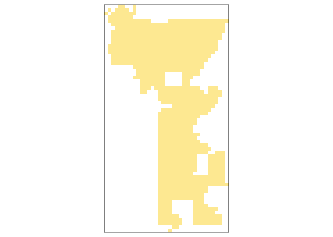

Variables to Consider in Selecting a Location for a new Gas Station
===================================================================

-   Where are Vehicles located in KC?
-   Where is KC Growing?
-   Where are existing Gas Stations located?
-   What is the Socioeconomics status across KC?

Where are Vehicles located in KC?
=================================

Vehicle Density (kcmva\_tract\_prjd$vehicle\_density)

-   from Census variable (B08015\_001)
-   AGGREGATE NUMBER OF VEHICLES (CAR, TRUCK, OR VAN) USED IN COMMUTING BY WORKERS 16 YEARS AND OVER
-   per km^2

### Choropleth Map

``` r
legend_title = "Vehicles / sq km"

  #legend_title = expression("Vehicles per km"^2*"")
  #legend_title = expression("Vehicle Density (km" ^2* ")")

tm_shape(kcmva_tract_prjd) +
  tm_polygons(col="vehicle_density", title=legend_title, palette="GnBu",
              n=5,
              lty=3,
              legend.hist=TRUE) +
  tm_shape(kc_boundary_prjd) +
    tm_borders(lwd=3) +
  tm_layout(main.title = "Vehicle Density by Census Tract", 
            legend.outside = TRUE)
```

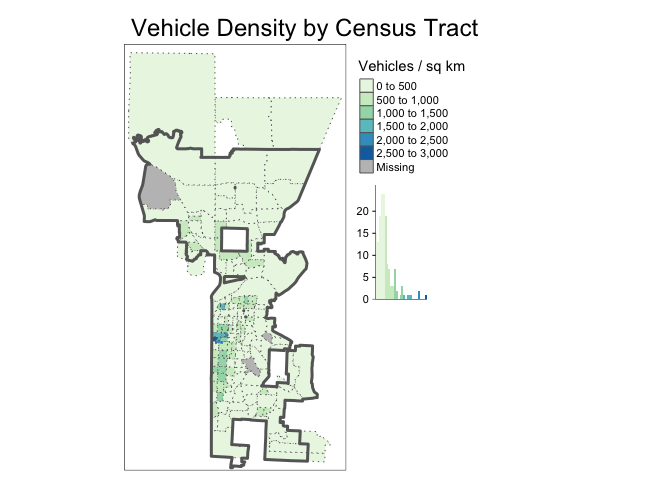

FYI: How does Vehicle Density compare with Household/Population Density?

*Note: I am only displaying the top quartile to help focus on the more interesting areas*

``` r
# household & population density .... display top quartile

# #summary(kcmo_mva_prjd$hhdense)
#   #  Min. 1st Qu.  Median    Mean 3rd Qu.    Max. 
#   # 0.000   2.882   4.435   7.959   6.784 182.855

p1 <- kcmo_mva_prjd %>% 
  filter(hhdense > 6.7849) %>% 
tm_shape(bbox=kc_boundary_prjd) +
# tm_shape(kcmo_mva_prjd, bbox=kc_boundary_prjd) +
  tm_polygons(col="hhdense", title="Households / Arce",
              n=5,
              lty=3,
              palette="GnBu",
              legend.hist=TRUE
              ) +
  tm_shape(kc_boundary_prjd) +
    tm_borders(lwd=3) +
  tm_layout(legend.outside = TRUE,
            main.title = "Household Density by Census Track")

# summary(kcmva_blkgrp_prjd$pop_density)
#    # Min. 1st Qu.  Median    Mean 3rd Qu.    Max. 
#    #  0.0   732.5  1324.2  1533.7  2034.4 11940.0 

p2 <- kcmva_blkgrp_prjd %>% 
  filter(pop_density > 2034.49) %>% 
  mutate(pop_density = pop_density / 1000) %>% 
tm_shape(bbox=kc_boundary_prjd) +
# tm_shape(kcmva_blkgrp_prjd, bbox=kc_boundary_prjd) +
  tm_polygons(col="pop_density", title="Population (K) / sq km",
              #n=10,
              lty=3,
              palette="GnBu",
              legend.hist=TRUE
              ) +
  tm_shape(kc_boundary_prjd) +
    tm_borders(lwd=3) +
  tm_layout(legend.outside = TRUE,
            main.title = "Population Density by Census Track")

tmap_arrange(p1, p2)
```

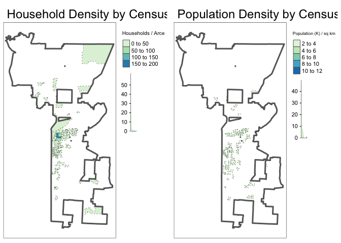

### Convert Vehicle Density to Raster and Plot

``` r
ras_vehicle_density <- rasterize(kcmva_tract_prjd, 
                                 kcmo_raster_template, 
                                 field="vehicle_density", fun="mean",
                                 na.rm=TRUE)

names(ras_vehicle_density) = "vehicle_density"
# ras_vehicle_density

# "mask" out area outside KC MVA Study Area (e.g., large census tract to the north)
ras_vehicle_density <- mask(ras_vehicle_density, ras_blank)

tm_shape(ras_vehicle_density, bbox=kc_boundary_prjd) +
  tm_raster(title=legend_title, palette="GnBu",
            n=10) +
  tm_shape(kc_boundary_prjd) +
    tm_borders(lwd=2) +
  tm_layout(main.title="Vehicle Density", frame=FALSE, 
            legend.outside = TRUE)  
```

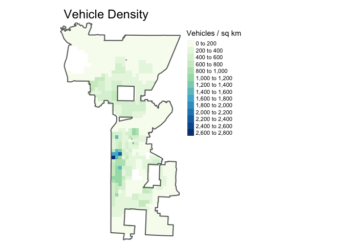

#### Explore distribution to determine appropriate values for a "Location Score"

... of Vehicle Density

``` r
par(mfrow=c(2,1))
hist(kcmva_tract_prjd$vehicle_density, breaks=10,  
     main="", xlab="Vehicles per km^2", ylab="# Census Tracts", las=1)
boxplot(kcmva_tract_prjd$vehicle_density, horizontal = TRUE)
```

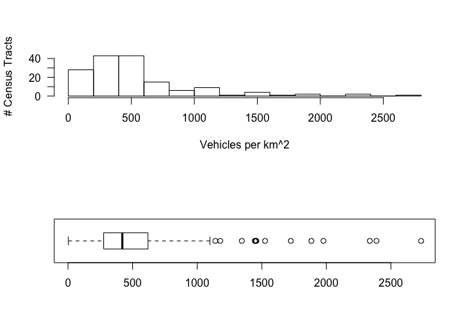

``` r
# summary(kcmva_tract_prjd$vehicle_density)
# boxplot(kcmva_tract_prjd$vehicle_density, plot=FALSE)$stats
# 
# #     Min.  1st Qu.   Median     Mean  3rd Qu.     Max.     NA's 
# #    1.956  275.718  420.141  534.784  618.876 2733.877        3 
# #             [,1]
# # [1,]    1.956386     = Lower Whisker
# # [2,]  275.717731     = 1st Qu
# # [3,]  420.140612     = Median
# # [4,]  618.876006     = 3rd Qu
# # [5,] 1098.942288     = Upper Whisker

# Min       Max          Score  Description
#    0.000 -  275.7179     0    [Min,     1st Qu)
#  275.718 -  420.1409     1    [1st Qu,  Median) 
#  420.141 -  618.8759     3    [Median,  3rd Qu)
#  618.876 - 1098.9429     5    [3rd Qu,  Up. Whisker)      
# 1098.943 - 2800.0        8    [U.Wskr,  Max]   
```

#### Reclassify Vehicle Density value to a Location Score

``` r
rcl_mat  <-  matrix(c(   0.000,  275.7179, 0,  
                       275.718,  420.1409, 1,
                       420.141,  618.8759, 3,
                       618.876, 1098.9429, 5,
                      1098.943, 2800.0000, 8),
                    ncol=3, byrow=TRUE)

ras_vehicle_density_rcl <- reclassify(ras_vehicle_density, rcl=rcl_mat, right=FALSE) # [ , ) = right=FALSE (open on right)
#ras_vehicle_density_rcl
```

Accumulate & Plot Location Score
--------------------------------

Setup reusable code for Location Score Plots

``` r
score_breaks = c(-Inf, -3, 0, 3, 5, 7, Inf)
score_labels = c("Least", "", "", "", "", "Most")
score_title  = "Location Suitability"

plot_location_score <- function(ras_score){
  
p_score <- tm_shape(ras_score, bbox=kc_boundary_prjd) +
  tm_raster(title="Favorable", breaks=score_breaks, labels=score_labels, 
            palette="RdYlGn",
            midpoint=NA) +
  tm_shape(kc_boundary_prjd) +
    tm_borders(lwd=2) +
  tm_layout(main.title=score_title, frame=FALSE, main.title.position="center",
            legend.position = c(0.25, 0.0))
  
  return( p_score )
}
```

Accumulate Score across Variables (raster layers).

*Note: At this point, I only have one raster layer, but stay tuned more to come.*

``` r
ras_score <- ras_vehicle_density_rcl
names(ras_score) = "score"

p_score <- plot_location_score (ras_score)
p_score
```

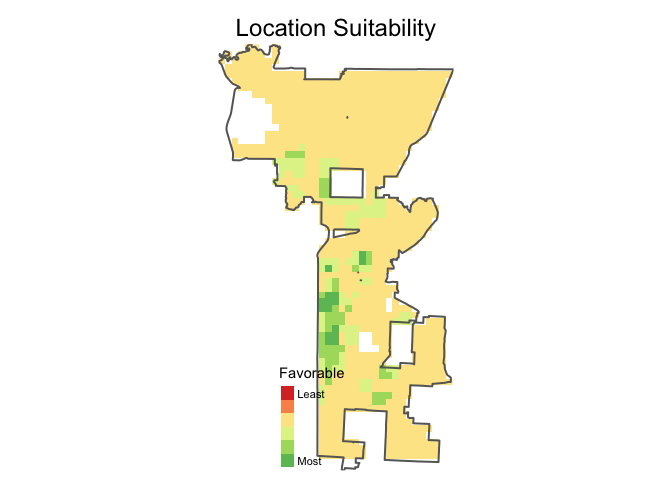

### Side-by-Side Plot of Original Variable & How it Adjusts the Location Score

``` r
p_choro <- tm_shape(kcmva_tract_prjd, bbox=kc_boundary_prjd) +
  tm_polygons(col = "vehicle_density", title="Vehicles / sq km", palette="GnBu",
              n=8,
              lty=3) +
  tm_shape(kc_boundary_prjd) +
    tm_borders(lwd=3) +
  tm_layout(main.title = "Vehicle Density", main.title.position="center",
            frame = FALSE,
            legend.position=c("left", "bottom"))

#png("Images/1_SbyS_VehicleDensity.png", width=1200, height=900)
tmap_arrange(p_choro, p_score)
```

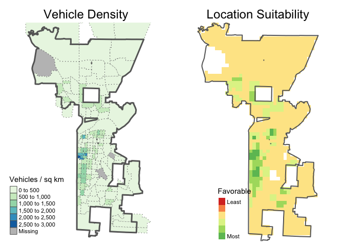

``` r
#dev.off()

# tmap_mode("view")
# p_choro
# tmap_mode("plot")
```

Where is KC growing?
====================

From KC MVA Study, I used percentage of residential parcels with a new construction permit issued between 2014 and 2015

### Choropleth Map

``` r
tm_shape(kcmo_mva_prjd) +
  tm_polygons(col = "pncnst_121", title="% Residential Parcels", palette="GnBu",
              n=10,
              lty=3,
              legend.hist=TRUE) +
  tm_shape(kc_boundary_prjd) +
    tm_borders(lwd=3) +
  tm_layout(main.title = "New Construction Permits", 
            legend.outside = TRUE)
```

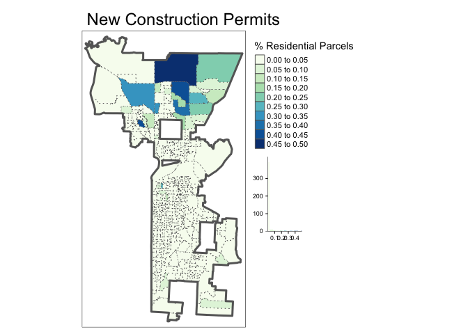

### Convert Variable to Raster and Plot

Percentage of residential parcels with a new construction permit

``` r
ras_newconst <- rasterize(kcmo_mva_prjd, 
                          kcmo_raster_template, 
                          field="pncnst_121", fun="mean")
names(ras_newconst) = "pct_newconst"
#ras_newconst

tm_shape(ras_newconst) +
  tm_raster(title="% Residential Parcels", palette="GnBu",
              n=10) +
  tm_shape(kc_boundary_prjd) +
    tm_borders(lwd=2) +
  tm_layout(main.title="New Construction Permits", frame=FALSE, 
            legend.outside = TRUE)  
```

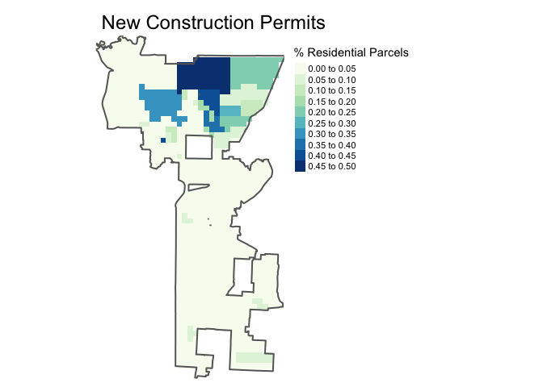

#### Explore distribution to determine appropriate values for a "Location Score"

... of Percent of Residential Parcel with New Construction Permit

``` r
par(mfrow=c(2,1))
hist(kcmo_mva_prjd$pncnst_121, breaks=10,  
     main="", xlab="% Parcels NC Permit", ylab="# Census BlkGrps", las=1)
boxplot(kcmo_mva_prjd$pncnst_121, horizontal = TRUE)
```

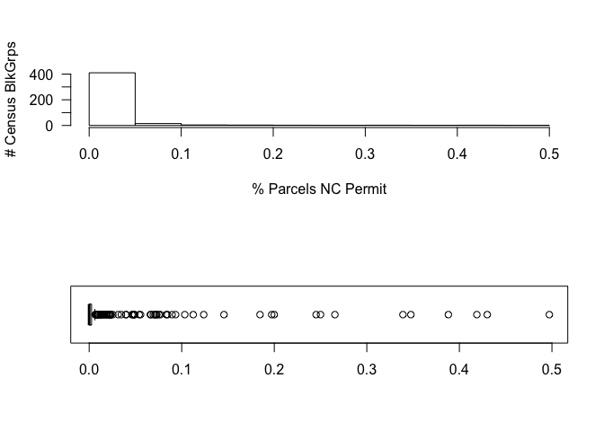

``` r
# summary(kcmo_mva_prjd$pncnst_121)
# boxplot(kcmo_mva_prjd$pncnst_121, plot=FALSE)$stats
# 
# #     Min.  1st Qu.   Median     Mean  3rd Qu.     Max. 
# # 0.000000 0.000000 0.000000 0.014647 0.002604 0.497207 
# #            [,1]
# # [1,] 0.00000000
# # [2,] 0.00000000
# # [3,] 0.00000000
# # [4,] 0.00260417
# # [5,] 0.00625000

# Min       Max          Score  Description
#    0.000 -    0.0999     0    <  10% 
#   0.1000 -    0.2499     1    10-25%
#   0.2500 -    0.3499     3    25-35%
#   0.3500 -    1.0000     5    >  35%
```

#### Reclassify Variable value to a Location Score

``` r
rcl_mat  <-  matrix(c(0.0000,  0.0999,  0,  
                      0.1000,  0.2499,  1,
                      0.2500,  0.3499,  3,
                      0.3500,  1.0000,  5),
                    ncol=3, byrow=TRUE)

ras_newconst_rcl <- reclassify(ras_newconst, rcl=rcl_mat, right=FALSE) # [ , )
# ras_newconst_rcl
```

Accumulate & Plot Location Score
--------------------------------

Accumulate Score across Variables (raster layers).

``` r
ras_score <- sum(stack(ras_vehicle_density_rcl, 
                       ras_newconst_rcl))
names(ras_score) = "score"

p_score <- plot_location_score (ras_score)
p_score
```

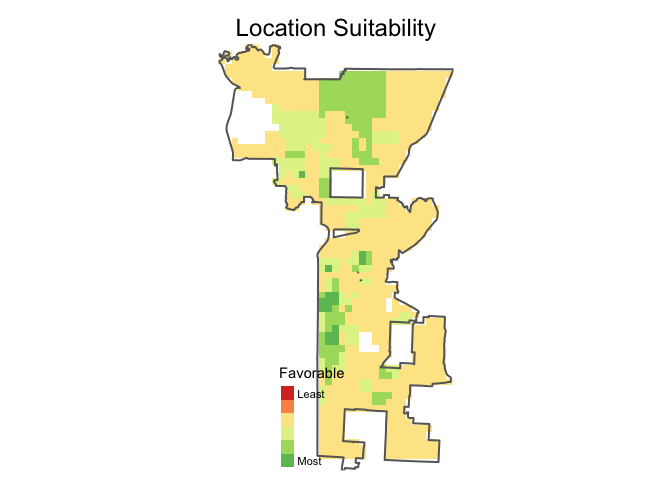

### Side-by-Side Plot of Original Variable & How it Adjusts the Location Score

``` r
p_choro <- tm_shape(kcmo_mva_prjd, bbox=kc_boundary_prjd) +
  tm_polygons(col = "pncnst_121", title="% Reside. Parcels", palette="GnBu",
              n=10,
              lty=3) +
  tm_shape(kc_boundary_prjd) +
    tm_borders(lwd=3) +
  tm_layout(main.title="New Construction Permits", main.title.position="center",
            frame=FALSE,
            legend.position=c("left", "bottom"))

#png("Images/2_SbyS_NewConstruction.png", width=1200, height=900)
tmap_arrange(p_choro, p_score)
```

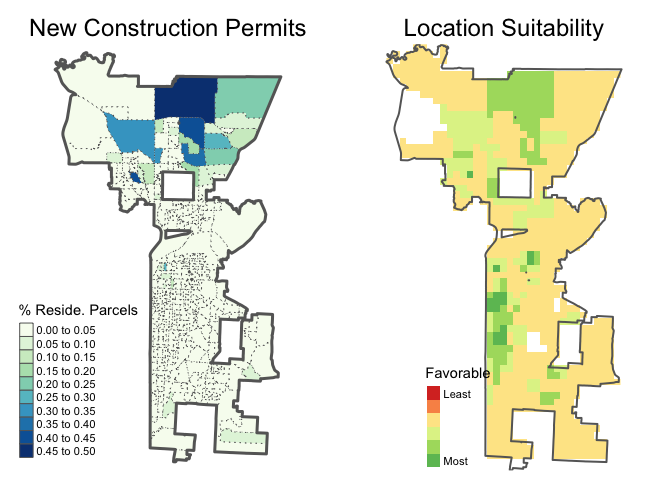

``` r
#dev.off()
```

Where are existing Gas Stations located?
========================================

### Pin/Dot Map of the Location of Gas Stations

``` r
tm_shape(kc_boundary_prjd) +
  tm_borders(lwd=2) +
  
  tm_shape(kcmo_mva_prjd) +
  tm_borders(lty=3) + 
  
  tm_layout(frame = FALSE, main.title = "Fuel Stations")  +
# stations location as dots  ...
  
  tm_shape(fuel_stations_prjd) +
    tm_dots(col="red", size=0.08)
```


### Convert Number of Stations to Raster and Plot

``` r
# create raster for density of gas stations for each 2 sq km (2 km is about 1.24 miles)
# (1 km seem too small)

# rasterize ... count fuel station in each 1 km square
ras_fuelstations = rasterize(fuel_stations_prjd, kcmo_raster_template, 
                             field=seq(1,nrow(fuel_stations_prjd)), 
                             fun="count",
                             background=0)

# mask out cells out size of KC MVA Study boundary
ras_fuelstations <- mask(ras_fuelstations, ras_blank)

# aggregate count of Fuel Station within 2 square km
#   - disaggregate to project value back to 1 km cells, then realign back to same extent/resolution
ras_fuelstations <- aggregate(   ras_fuelstations, fact=2, fun=sum)

ras_fuelstations <- disaggregate(ras_fuelstations, fact=2)
ras_fuelstations <- crop(ras_fuelstations, extent(ras_fuelstations,1,64,1,35))
ras_fuelstations <- mask(ras_fuelstations, ras_blank)

names(ras_fuelstations) = "fuel_stations"
```

Plot and include location of stations as well.

``` r
tm_shape(ras_fuelstations, bbox=kc_boundary_prjd) +
  tm_raster(title="Nbr of Stations", palette="GnBu",
              n=7) +
  tm_shape(kc_boundary_prjd) +
    tm_borders(lwd=2) +
  tm_layout(main.title="Fuel Stations per 2 sq km", frame=FALSE,
            legend.outside = TRUE)  +
# stations location as dots  ...
  tm_shape(fuel_stations_prjd) +
    tm_dots(col="red", size=0.04)
```

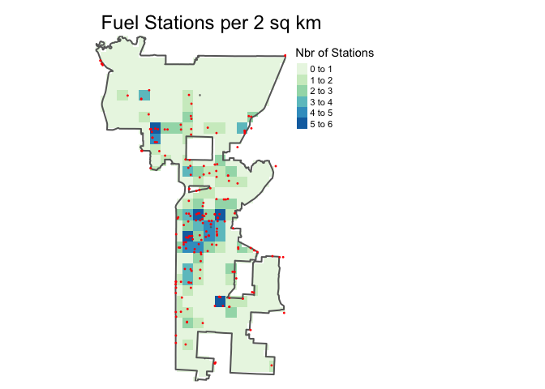

#### Reclassify Variable value to a Location Score

``` r
rcl_mat  <-  matrix(c(0,  0,   0,  
                      1,  1,  -1,
                      2,  2,  -2,
                      3,  3,  -3,
                      4,  4,  -4,
                      5,  5,  -5,
                      6,  6,  -6
                      ),
                    ncol=3, byrow=TRUE)

ras_fuelstations_rcl <- reclassify(ras_fuelstations, rcl=rcl_mat, right=NA) # [ , )
# ras_fuelstations_rcl
```

Accumulate & Plot Location Score
--------------------------------

``` r
ras_score <- sum(stack(ras_vehicle_density_rcl, 
                       ras_newconst_rcl,
                       ras_fuelstations_rcl))
names(ras_score) = "score"

p_score <- plot_location_score (ras_score)
p_score
```

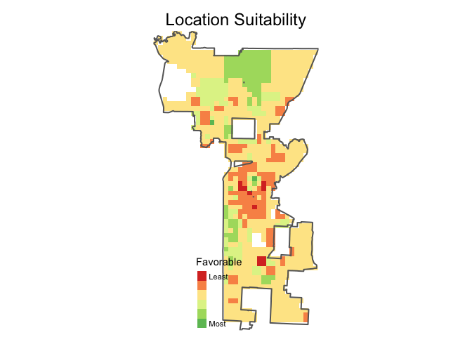

### Side-by-Side Plot of Original Variable & How it Adjusts the Location Score

``` r
p_pin <- tm_shape(kc_boundary_prjd) +
  tm_borders(lwd=2) +
  
  tm_shape(kcmo_mva_prjd) +
  tm_borders(lty=3, lwd=0.75) + 
  
    # stations location as dots  ...
  tm_shape(fuel_stations_prjd) +
    tm_dots(col="red", size=0.12) +
  
  tm_layout(main.title = "Fuel Stations", main.title.position = "center", 
            frame=FALSE)
  

#png("Images/3_SbyS_FuelStations.png", width=1200, height=900)
tmap_arrange(p_pin, p_score)
```

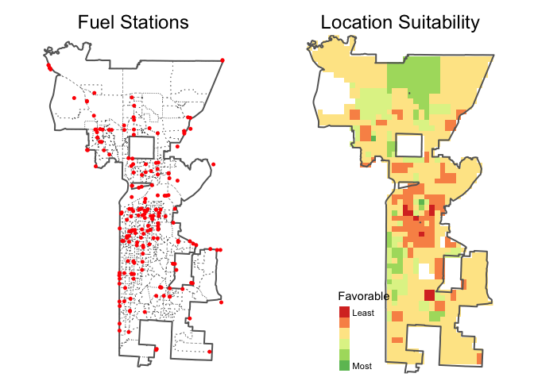

``` r
#dev.off()
```

What is the Socioeconomics status across KC?
============================================

Consider Median Income and/or Median Sales Price of Homes in Area

### Choropleth Map

FYI: How does Median Income compare with Median Sales Price?

I decided to go with Median Income -- it seems more reliable view of economic class of neighborhood/area.

Median Sales Price had more missing values and the housing market goes up and down based on a variety of factors. It represents recent sales not necessarily existing home values.

``` r
# summary(kcmva_blkgrp_prjd$median_income)
#    # Min. 1st Qu.  Median    Mean 3rd Qu.    Max.    NA's 
#    # 8140   34028   50167   56487   69496  247574      13 

p1 <- kcmva_blkgrp_prjd %>% 
  filter(median_income >= 0) %>% 
  mutate(median_income = median_income / 1000) %>% 
tm_shape(bbox=kc_boundary_prjd) +
  tm_polygons(col = "median_income", title="Income ($K)",
              n=8,
              lty=3,
              palette="GnBu",
              legend.hist=TRUE) +
  tm_shape(kc_boundary_prjd) +
    tm_borders(lwd=3) +
  tm_layout(legend.outside = TRUE,
            main.title = "Median Income")

# summary(kcmo_mva_prjd$mspn_lb_14)
#    # Min. 1st Qu.  Median    Mean 3rd Qu.    Max. 
#    #    0   32500   99343  118454  170226  862500 

p2 <- kcmo_mva_prjd %>% 
  filter(mspn_lb_14 > 6.7849) %>% 
  mutate(mspn_lb_14 = mspn_lb_14 / 1000) %>% 
tm_shape(bbox=kc_boundary_prjd) +
  tm_polygons(col = "mspn_lb_14", title="Sale Price ($K)",
              n=10,
              lty=3,
              palette="GnBu",
              legend.hist=TRUE) +
  tm_shape(kc_boundary_prjd) +
    tm_borders(lwd=3) +
  tm_layout(legend.outside = TRUE,
            main.title = "Median Sales Price")

tmap_arrange(p1, p2)
```

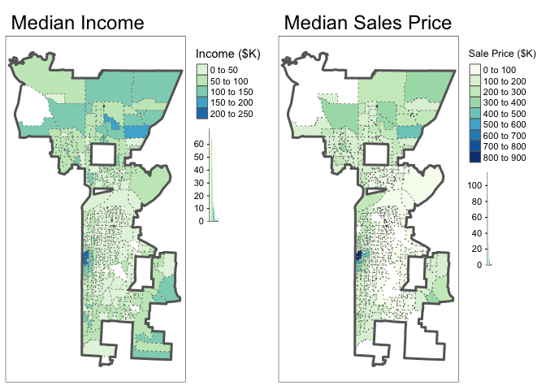

### Convert Median Income to Raster and Plot

``` r
ras_median_income <- rasterize(kcmva_blkgrp_prjd, 
                               kcmo_raster_template, 
                               field="median_income", fun="mean",
                               na.rm=TRUE)

names(ras_median_income) = "median_income"
#ras_median_income

(ras_median_income / 1000) %>% 
tm_shape(.) +
  tm_raster(title="Income ($K)", palette="GnBu", 
            n=10) +
  tm_shape(kc_boundary_prjd) +
    tm_borders(lwd=2) +
  tm_layout(main.title="Median Income", main.title.position="center",
            frame=FALSE, legend.outside=TRUE)
```

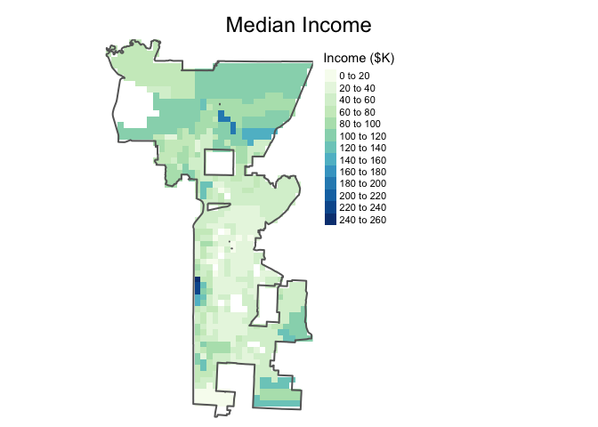

#### Explore distribution to determine appropriate values for a "Location Score"

... of Median Income

``` r
par(mfrow=c(2,1))
hist(kcmva_blkgrp_prjd$median_income, breaks=10,  
     main="", xlab="Income", ylab="# Census BlkGrps", las=1)
boxplot(kcmva_blkgrp_prjd$median_income, horizontal = TRUE)
```

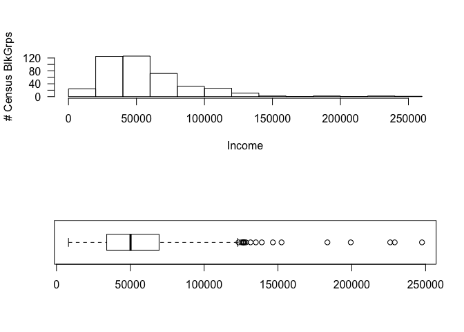

``` r
# summary(kcmva_blkgrp_prjd$median_income)
# boxplot(kcmva_blkgrp_prjd$median_income, plot=FALSE)$stats
# #    Min. 1st Qu.  Median    Mean 3rd Qu.    Max.    NA's 
# #    8140   34028   50167   56487   69496  247574      13 
# #          [,1]
# # [1,]   8140.0
# # [2,]  34028.0
# # [3,]  50167.0
# # [4,]  69496.5
# # [5,] 122679.0

# Min       Max       Score  Description
#      0 -   34027     -1    [Min,     1st Qu]         slight penalty
#  34028 -   69495      0    [1st Qu,  3rd Qu]         within IQR - no adjustment
#  69496 -  122679      1    [3rd Qu,  Up. Whisker]    slight bonus
# 122680 -  250000      2    [U.Wskr,  Max]            more   bonus
```

Reclassify Median Income value to a Location Score

``` r
rcl_mat  <-  matrix(c(      0,  34027, -1,  
                        34028,  69495,  0,
                        69496, 122679,  1,
                       122680, 250000,  2),
                    ncol=3, byrow=TRUE)
ras_median_income_rcl <- reclassify(ras_median_income, rcl=rcl_mat, right=NA) # [ , ] = right=NA
#ras_median_income_rcl
```

Accumulate & Plot Location Score
================================

``` r
ras_score <- sum(stack(ras_vehicle_density_rcl,
                       ras_newconst_rcl,
                       ras_fuelstations_rcl,
                       ras_median_income_rcl))
names(ras_score) = "score"

p_score <- plot_location_score (ras_score)
p_score
```

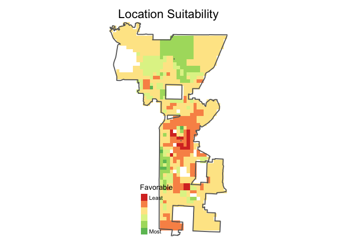

### Side-by-Side Plot of Original Variable & How it Adjusts the Location Score

``` r
p_choro <- kcmva_blkgrp_prjd %>% 
  mutate(median_income = median_income / 1000) %>% 
tm_shape(bbox=kc_boundary_prjd) +
  tm_polygons(col = "median_income", title="Income ($K)", palette="GnBu",
              n=8,
              lty=3) +
  tm_shape(kc_boundary_prjd) +
    tm_borders(lwd=3) +
  tm_layout(main.title="Median Income", main.title.position="center",
            frame=FALSE,
            legend.position=c("left", "bottom"))

#png("Images/4_SbyS_MedIncome.png", width=1200, height=900)
tmap_arrange(p_choro, p_score)
```

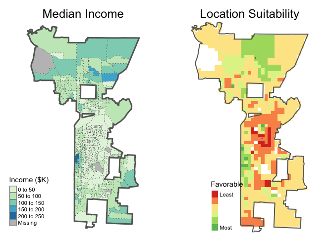

``` r
#dev.off()
```

FYI: Consolidated Map (Score + Fuel Stations)

``` r
p_score_stations <- 
  p_score + 
  
  # stations location as dots  ...
  tm_shape(fuel_stations_prjd) +
    tm_dots(col="blue", size=0.08)

p_score_stations
```

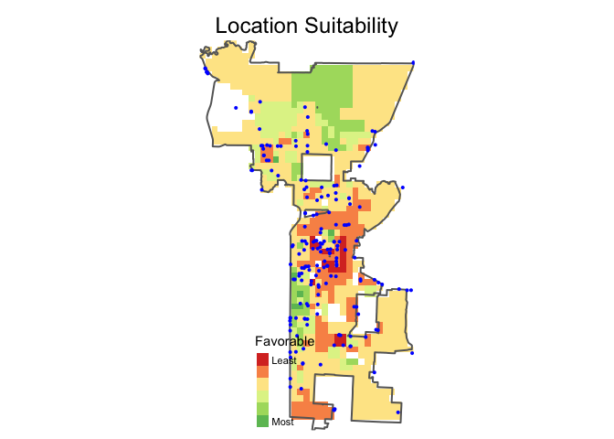

Zoom In on Top Locations
========================

``` r
select_top_locations <- ras_score >= 5

ras_top_locations <- ras_score[select_top_locations, drop=FALSE]
```

``` r
p_top <- tm_shape(ras_top_locations, bbox=kc_boundary_prjd) +
  tm_raster(breaks=score_breaks, palette="RdYlGn",
            #midpoint=NA,
            legend.show=FALSE) +

  tm_shape(kcmo_mva_prjd) +
    tm_borders(col="gray70", lty=3, lwd=0.75) +

  tm_shape(kc_boundary_prjd) +
    tm_borders(lwd=2) +

  tm_layout(main.title="Top Locations", main.title.position="center", frame=FALSE)

p_top
```

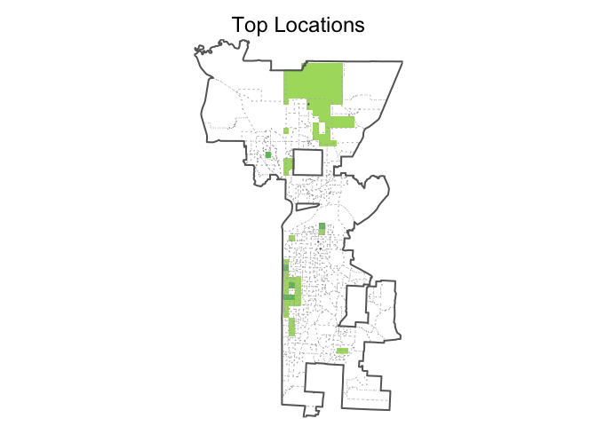

Create polygons around top locations.

``` r
# library(igraph)

top_loc_polys <- ras_top_locations %>% 
  clump() %>% 
  rasterToPolygons() %>% 
  st_as_sf()
```

    ## Loading required namespace: igraph

``` r
top_loc_clumps <- top_loc_polys %>% 
  group_by(clumps) %>% 
  summarise()
```

    ## `summarise()` ungrouping output (override with `.groups` argument)

Plot Top Locations on Background Map for Context
------------------------------------------------

``` r
tmap_mode(tmap_interactive_viewing_mode)
```

    ## tmap mode set to plotting

``` r
tm_shape(ras_top_locations, bbox=kc_boundary_prjd) +
  tm_raster(breaks=score_breaks, 
            palette="RdYlGn", alpha = 0.75,
            legend.show=FALSE) +
  
  tm_shape(top_loc_clumps) +
    tm_borders(col="red", lwd=2.5, lty=3) +

  tm_shape(kc_boundary_prjd) +
    tm_borders(col="blue", lwd=3) 
```

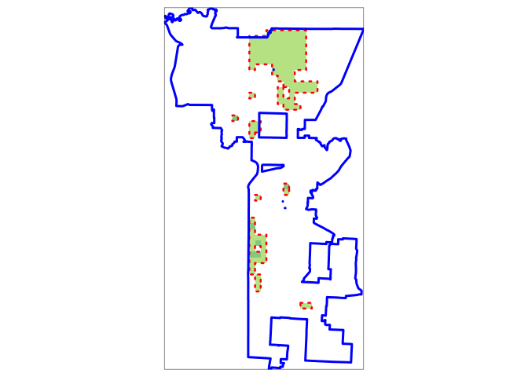

``` r
tmap_mode("plot")
```

    ## tmap mode set to plotting

Competition at Top Locations
----------------------------

``` r
stations_in_clumps = lengths(st_intersects(fuel_stations_prjd, top_loc_clumps)) > 0
top_loc_clump_feul_stations <- fuel_stations_prjd[stations_in_clumps, ]


p_top_with_stations <- p_top +
  tm_shape(top_loc_clump_feul_stations) +
    tm_dots(col="blue", size=0.06) +
    tm_text(text="brandname", size=0.675, auto.placement=TRUE) 


#png("Images/5_TopWithStations.png", width=600, height=900)
p_top_with_stations
```

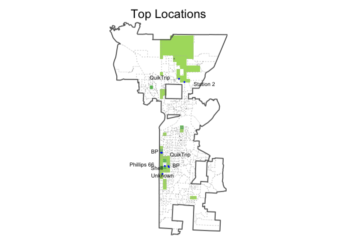

``` r
#dev.off()
```

Median Income at Top Locations
------------------------------

``` r
top_loc_ras_median_income <- ras_median_income[select_top_locations, drop=FALSE]

p_top_with_med_inc <- (top_loc_ras_median_income / 1000) %>% 
tm_shape(bbox=kc_boundary_prjd) +
  tm_raster(title="Income ($K)", palette="GnBu",
            n=5) +
  
  tm_shape(kcmo_mva_prjd) +
    tm_borders(col="gray70", lty=3, lwd=0.75) +
  
  tm_shape(top_loc_clumps) +
    tm_borders(col="darkgreen", lwd=0.75) +

  tm_shape(kc_boundary_prjd) +
    tm_borders(lwd=2) +
  
  tm_layout(main.title="Median Income", main.title.position="center",
            frame=FALSE, 
            legend.outside=TRUE)


#png("Images/6_TopWithMedIncome.png", width=600, height=900)
p_top_with_med_inc
```

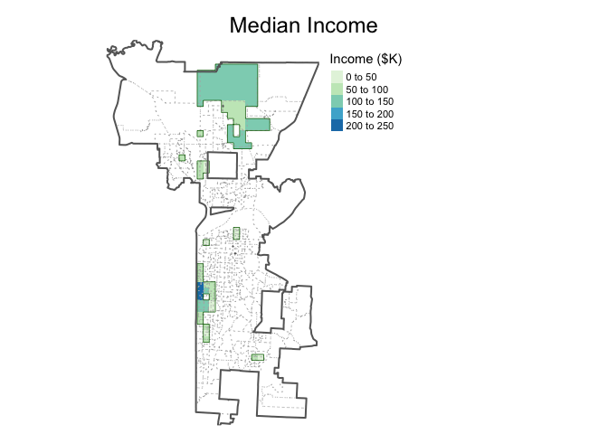

``` r
#dev.off()
```
