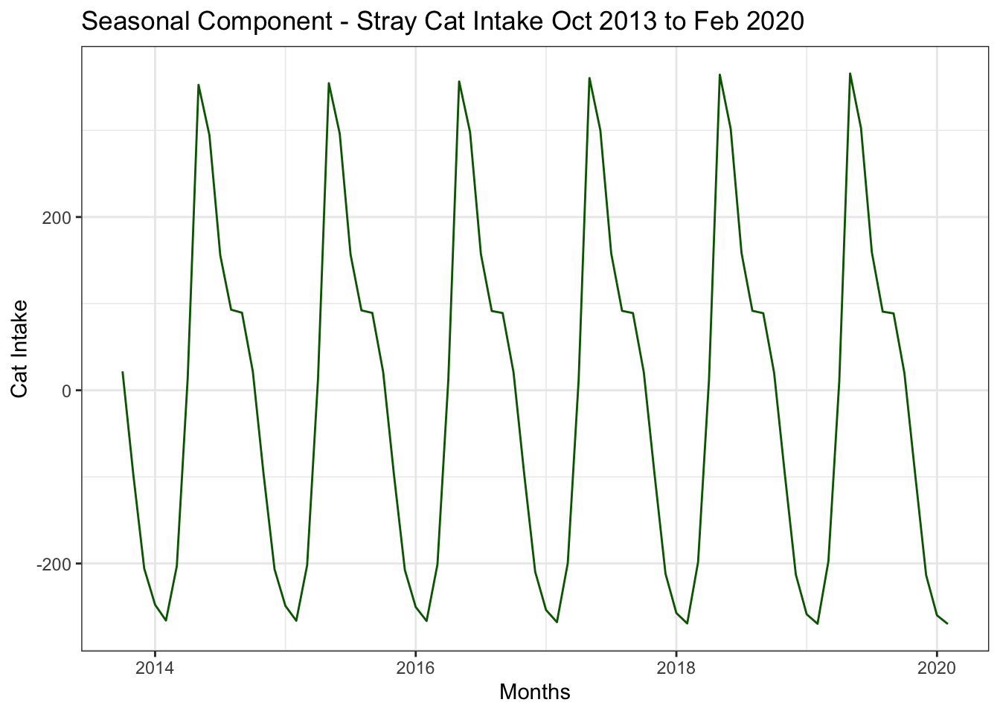

Explore Monthly Stray Animal Intake
================

-   [Introduction](#introduction)
    -   [Data Source & Description](#data-source-description)
-   [Setup](#setup)
    -   [Load Packages](#load-packages)
    -   [Load Data](#load-data)
-   [Initial Exploration of Data](#initial-exploration-of-data)
    -   [Subset Data](#subset-data)
    -   [Descriptive Statistics](#descriptive-statistics)
-   [Explore Time Series Components for Cats](#explore-time-series-components-for-cats)
    -   [Decomposition](#decomposition)
        -   [Seasonal and Trend decomposition using Loess (STL)](#seasonal-and-trend-decomposition-using-loess-stl)
        -   [Measuring the Strength of Trend and Seasonality](#measuring-the-strength-of-trend-and-seasonality)
        -   [Other Decompositions](#other-decompositions)
-   [Explore Time Series Components for Dogs](#explore-time-series-components-for-dogs)
    -   [Decomposition](#decomposition-1)
        -   [Seasonal and Trend decomposition using Loess (STL)](#seasonal-and-trend-decomposition-using-loess-stl-1)
        -   [Measuring the Strength of Trend and Seasonality](#measuring-the-strength-of-trend-and-seasonality-1)

Introduction
============

This project applies time series analysis and forecasting techniques to the intake of stray animals into an animal shelter.

The project uses many of the techniques described in *Forecasting: principles and practice, 2nd edition* by Hyndman, R.J. & Athanasopoulos, G. Available at <https://otexts.com/fpp2/> accessed in September and October of 2020.

Data Source & Description
-------------------------

Data for this project was obtained from the City of Austin’s open data portal on the “Austin Animal Center Intakes” data set page. (<https://data.austintexas.gov/Health-and-Community-Services/Austin-Animal-Center-Intakes/wter-evkm>)

Data for the intake of animals into the shelter is available from October 1, 2013 to the present and is updated daily by Austin Animal Center. The data set contains an observation for every animal that enters the shelter and about a dozen attributes, such as

-   The ID assigned to the animal.
-   Date and time of intake into the facility.
-   Intake Type – Stray, Owner Surrender, Euthanasia Request
-   Intake Condition – Normal, Injured, Sick, Feral, Aged, Nursing, Pregnant
-   Animal Type – Dog, Cat, Bird, Livestock, Other
-   Age upon Intake – Number and units (e.g., 3 months, 1 year, 5 years)
-   Breed – for dogs (e.g., Pit Bull, German Shepherd), for cats (e.g., Domestic Short or Long Hair), Other/Wildlife (Bat, Racoon, Opossum, etc.)
-   Color – the single or mixed color of the animal’s fur.

I focused on the largest portion of the data set -- cats and dogs entering Austin Animal Center as strays from October 2013 to August 2020. To create a time series, I aggregated the data to monthly intake of cats and dogs and stored the results in the Austin\_AC\_Monthly\_Strays.csv file.

Setup
=====

### Load Packages

``` r
library(tidyverse)
```

    ## ── Attaching packages ─────────────────────────────────────── tidyverse 1.3.0 ──

    ## ✓ ggplot2 3.3.2     ✓ purrr   0.3.4
    ## ✓ tibble  3.0.1     ✓ dplyr   1.0.0
    ## ✓ tidyr   1.0.2     ✓ stringr 1.4.0
    ## ✓ readr   1.3.1     ✓ forcats 0.4.0

    ## ── Conflicts ────────────────────────────────────────── tidyverse_conflicts() ──
    ## x dplyr::filter() masks stats::filter()
    ## x dplyr::lag()    masks stats::lag()

``` r
library(ggplot2)
library(forecast)
```

    ## Registered S3 method overwritten by 'quantmod':
    ##   method            from
    ##   as.zoo.data.frame zoo

``` r
theme_set(theme_bw())
```

### Load Data

Monthly Stray Cat and Dog Intake by Austin (TX) Animal Control Data from Oct 2013 to Aug 2020

``` r
DATA_ORIGINAL <- read.csv("data/Austin_AC_Monthly_Strays.csv", stringsAsFactors = FALSE)

str(DATA_ORIGINAL)
```

    ## 'data.frame':    83 obs. of  3 variables:
    ##  $ IN_YRMO: chr  "2013-10" "2013-11" "2013-12" "2014-01" ...
    ##  $ Cat    : int  419 312 211 216 184 239 460 759 669 695 ...
    ##  $ Dog    : int  716 611 593 632 531 650 620 707 625 674 ...

Initial Exploration of Data
===========================

Create time-series object with data from Oct 2013 to Aug 2020 with two series (cat intake and dog intake)

``` r
TIME_SERIES <- ts(data      = DATA_ORIGINAL[ ,-1], 
                  start     = c(2013, 10), 
                  end       = c(2020,  8), 
                  frequency = 12)

autoplot(TIME_SERIES, facets = TRUE) +
  ggtitle("Austin Animal Center: Stray Intake Oct 2013 - Aug 2020") +
  xlab("Months") + ylab("Animal Intake")
```


``` r
# ggsave(filename = "figures/01_01_TS_OriginalData.png",
#        height=4, width=6, units="in")
```

Create a seasonal plot to help identify any seasonality in time series. Each season (year in this case) is plotted as a separate line or series.

``` r
ggseasonplot(TIME_SERIES[,c("Cat")]) +
  ggtitle("Stray Cat Intake Oct 2013 to Aug 2020")
```


``` r
# ggsave(filename = "figures/01_02_SeasonalPlot_Cat.png",
#         height=3, width=5, units="in")
```

Cats are highly seasonal - sharp upward trend starts in March generally peaking in April or maybe May and then a more gradual decline. 2020 looks normal through Feb, but a dramatic change from March on which is likely related to COVID-19 shutdown.

``` r
ggseasonplot(TIME_SERIES[,c("Dog")]) +
  ggtitle("Stray Dog Intake Oct 2013 to Aug 2020")
```


``` r
#ggsave(filename = "figures/01_02_SeasonalPlot_Dog.png",
#        height=3, width=5, units="in")
```

Seaonality not very clear with Dog intake - just up and down month to month. 2020 looks normal through Feb, but a dramatic change from March on which is likely related to COVID-19 shutdown.

Subset Data
-----------

**I will exclude months Feb 2020 and beyond. There was a dramatic drop in activity which is probably COVID-19 related.**

Re-create time series to now end in Feb 2020

This includes 77 monthly observations or over 6 year & 5 months

``` r
DATA_SUBSET <- subset(DATA_ORIGINAL, IN_YRMO <= "2020-02")

TIME_SERIES <- ts(data      = DATA_SUBSET[,-1],    # exclude IN_YRMO column, include Cat, Dog 
                  start     = c(2013, 10), 
                  end       = c(2020,  2), 
                  frequency = 12)
```

Plot both the cat and dog series (now ending at Feb 2020) together so both are on the same scale (y-axis)

``` r
autoplot(TIME_SERIES, facets = FALSE, lwd=.75) +
  ggtitle("Austin Animal Center: Stray Intake Oct 2013 - Feb 2020") +
  xlab("Months") + ylab("Animal Intake") +
  theme(legend.position = "bottom") +
  guides(colour=guide_legend(title=""))
```


``` r
#ggsave(filename = "figures/01_EDA_Initial_TS_Plot.png",
#        height=4, width=6, units="in")
```

Now separately plot cat and dog series to better see the shape of each.

``` r
autoplot(TIME_SERIES, facets = TRUE, color="blue") +
  ggtitle("Austin Animal Center: Stray Intake Oct 2013 - Feb 2020") +
  xlab("Months") + ylab("Animal Intake")
```


Descriptive Statistics
----------------------

Traditional descriptive statistics of monthly intake (ignoring data is a time series)

``` r
#jpeg("figures/01_EDA_00_DescriptiveStats.jpeg", res=600, height=5, width=7, units="in")

par(mfrow=c(2,2), bty="n")
hist(DATA_SUBSET$Cat, las=1, breaks = 20, main="Cat Intake", xlab="",
     ylab="Nbr of Months", col="lightblue", xlim=c(100, 1000))
hist(DATA_SUBSET$Dog, las=1, breaks = 10, main="Dog Intake", xlab="",
     ylab="Nbr of Months", col="lightblue", xlim=c(100, 1000))
boxplot(DATA_SUBSET$Cat, horizontal = TRUE, xlab="Monthly Cat Intake", ylim=c(100, 1000))
boxplot(DATA_SUBSET$Dog, horizontal = TRUE, xlab="Monthly Dog Intake", ylim=c(100, 1000))
```


``` r
#dev.off()
```

Also, look at actual values of summary statistics

``` r
summary(DATA_SUBSET[, c("Cat", "Dog")])
```

    ##       Cat             Dog       
    ##  Min.   :162.0   Min.   :505.0  
    ##  1st Qu.:230.0   1st Qu.:563.0  
    ##  Median :439.0   Median :601.0  
    ##  Mean   :440.1   Mean   :603.2  
    ##  3rd Qu.:588.0   3rd Qu.:629.0  
    ##  Max.   :970.0   Max.   :769.0

psych::describe() - includes sd and the ranage

``` r
psych::describe(DATA_SUBSET[, c("Cat", "Dog")], skew=FALSE)
```

    ##     vars  n   mean     sd min max range    se
    ## Cat    1 77 440.13 215.15 162 970   808 24.52
    ## Dog    2 77 603.21  56.04 505 769   264  6.39

-   Cats - mean about 440 per month, median 440, IQR 230-588 = 358
-   Dogs - mean about 603 per month, median 601, IQR 563-629 = 66

Much more variation for Cats SD is 215 cats per month vs. 56 dogs.

-   Cats can range from a low of 162 to high of almost 1000 (970) (range of 808, IQR 250).
-   Dogs are more constant 500 to 769 (range 264, IQR 66).

Explore Time Series Components for Cats
=======================================

Seasonal plot again, but this time on the data subset where COVID impacted months removed.

``` r
ggseasonplot(TIME_SERIES[,c("Cat")]) +
  ggtitle("Stray Cat Intake Oct 2013 to Feb 2020")
```


Decomposition
-------------

### Seasonal and Trend decomposition using Loess (STL)

Advantages over other methods

-   Handles any type of seasonality (not just month, quarter as with X11, SEATS)
-   Seasonal component can vary over time (and rate of change can be controlled by user with parameters)
-   Smoothness of Trend-cycle component can be controlled by user
-   Can be robust to outliers.

Limitations - only applies to additive decompositions, for multiplicative first take log of data and back tranform the resulting components.

``` r
COMPONENTS_CAT <- mstl(TIME_SERIES[,c("Cat")])
autoplot(COMPONENTS_CAT) +
  ggtitle("Cat - STL Decomposition")
```


Plot Data/Time Series, Trend-Cycle and Seasonally Adjusted data together so we can see everything on the same scale

``` r
autoplot(TIME_SERIES[,c("Cat")], series="Data") +
  ggtitle("STL Decomposition: Stray Cat Intake Oct 2013 to Feb 2020") +
  xlab("Months") + ylab("Cat Intake") +
  theme(legend.position = "bottom") +
  guides(colour=guide_legend(title="")) +
  
  scale_colour_manual(values=c("darkgray","blue","red"),
                      breaks=c("Data","Seasonally Adjusted","Trend-Cycle")) +

  autolayer(seasadj(COMPONENTS_CAT),    series="Seasonally Adjusted", lwd=0.75) +
  autolayer(trendcycle(COMPONENTS_CAT), series="Trend-Cycle",         lwd=0.75, lty=1)
```


``` r
# ggsave(filename = "figures/01_EDA_STL_Combo_Cat.png",
#         height=4, width=6, units="in")
```

Plot Seasonal Component by itself - does it vary over time or consistent?

``` r
autoplot(seasonal(COMPONENTS_CAT), color="darkgreen") +
  ggtitle("Seasonal Component - Stray Cat Intake Oct 2013 to Feb 2020") +
  xlab("Months") + ylab("Cat Intake") +
  theme(legend.position = "bottom") +
  guides(colour=guide_legend(title="")) 
```



``` r
# ggsave(filename = "figures/01_EDA_STL_Season_Cat.png",
#         height=4, width=6, units="in")
```

-   Seasonality ranges from -270 to +365. Low point in Feb/Mar and shoots up to high point in Apr/May/Jun
-   Trend is more narrow than appear on decomposition plot range = 100, IQR = 60. (*Note: Look at scales closely on STL Decomposition plot with separate graph for each component.*)

``` r
summary(COMPONENTS_CAT)
```

    ##       Data           Trend         Seasonal12        Remainder        
    ##  Min.   :162.0   Min.   :401.7   Min.   :-269.85   Min.   :-166.0680  
    ##  1st Qu.:230.0   1st Qu.:424.7   1st Qu.:-206.69   1st Qu.: -28.0679  
    ##  Median :439.0   Median :439.7   Median :  12.46   Median :  -4.3153  
    ##  Mean   :440.1   Mean   :449.8   Mean   : -10.56   Mean   :   0.9136  
    ##  3rd Qu.:588.0   3rd Qu.:484.7   3rd Qu.:  92.22   3rd Qu.:  28.6515  
    ##  Max.   :970.0   Max.   :504.9   Max.   : 365.67   Max.   : 162.3004

Do the seasonal values actually vary or are they identical? The monthly values are nearly identical year to year as calculated as the seasonally component (i.e., with trend and noise removed).

``` r
seasonal(COMPONENTS_CAT)
```

    ##             Jan        Feb        Mar        Apr        May        Jun
    ## 2013                                                                  
    ## 2014 -247.63974 -265.78003 -202.96424   13.32890  352.58349  294.59316
    ## 2015 -248.91396 -266.02871 -202.01213   12.46373  354.50606  296.31483
    ## 2016 -250.26597 -266.32852 -201.08108   11.60760  356.46377  298.09771
    ## 2017 -253.66272 -267.69413 -199.64177   11.16101  360.45235  300.05570
    ## 2018 -257.19851 -269.19565 -198.33436   10.58654  364.31889  301.89747
    ## 2019 -258.59675 -269.57585 -197.41169   10.06432  365.66838  302.70104
    ## 2020 -259.86266 -269.85426                                            
    ##             Jul        Aug        Sep        Oct        Nov        Dec
    ## 2013                                    21.84168  -98.15227 -205.90737
    ## 2014  155.87963   93.01266   89.51465   21.52547  -98.10213 -206.69021
    ## 2015  156.54454   92.21698   89.30411   21.06703  -98.17531 -207.57747
    ## 2016  157.28613   91.51346   89.18824   21.00643  -98.10448 -209.62269
    ## 2017  157.93878   91.68569   89.11307   20.80134  -98.17695 -211.81004
    ## 2018  158.48342   91.75812   88.95109   20.15798  -98.30452 -212.76263
    ## 2019  159.29787   90.75715   88.75063   19.71973  -98.24809 -213.55232
    ## 2020

### Measuring the Strength of Trend and Seasonality

Section 6.7 of FFP textbook, described a method to measure the strength of trend and seasonality rather than just eye-balling charts.

-   For strongly trended data, the seasonally adjusted data should have much more variation than the remainder component.
-   For strongly seasonal data, the detrended data should have much more variation than the remainder component. The strength of seasonality is defined similarly, but with respect to the detrended data rather than the seasonally adjusted data.

Value close to 0 have little trend/seasonal, value closer to 1 have have stronger trend/seasonality.

``` r
var_TR <- var(remainder(COMPONENTS_CAT) + trendcycle(COMPONENTS_CAT))  # i.e., seasonally adjusted
var_SR <- var(remainder(COMPONENTS_CAT) + seasonal(COMPONENTS_CAT))    # detrended data
var_R  <- var(remainder(COMPONENTS_CAT))

# strength of trend
F_Trend  <- max(0, 1 - (var_R / var_TR))
# strength of season
F_Season <- max(0, 1 - (var_R / var_SR))

print(paste("Strength of Trend  : ", round(F_Trend,  3)))
```

    ## [1] "Strength of Trend  :  0.411"

``` r
print(paste("Strength of Season : ", round(F_Season, 3)))
```

    ## [1] "Strength of Season :  0.94"

The time series for cat intake has strong seasonality and moderate trend.

### Other Decompositions

#### Classical Decomposition

Shortfalls

-   The trend-cycle is missing first & last few obs (due to calculated from moving average)
-   Trend-cycle can over smooth rapid rises and falls.
-   Assumes season component is fixed - does not vary year to year
-   Not robust to outliers

``` r
decompose(TIME_SERIES[,c("Cat")], type="additive") %>% autoplot()
```


#### X11 Decomposiiton

Address some shortfalls of Classical approach

-   Estimates first & last few obs on Trend-Cycle
-   The Seasonal component can vary over time (vs. fixed)
-   Tends to be robust to outliers and level shifts

``` r
COMPONENTS_CAT_X11 <- seasonal::seas(TIME_SERIES[,c("Cat")], x11="")
#COMPONENTS_CAT_X11 <- seasonal::seas(TIME_SERIES[,c("Cat")])  # SEATS vs x11 # limited to monthly/qtr data
#summary(COMPONENTS_CAT_X11)
autoplot(COMPONENTS_CAT_X11)
```


Explore Time Series Components for Dogs
=======================================

``` r
ggseasonplot(TIME_SERIES[,c("Dog")]) +
  ggtitle("Stray Dog Intake Oct 2013 to Feb 2020")
```


Polor Style Seasonal Plot - sometime the polar style make a pattern more evident. Strong seasonality is not clear on dog intake.

``` r
ggseasonplot(TIME_SERIES[,c("Dog")], polar=TRUE) +
  ggtitle("Stray Dog Intake Oct 2013 to Feb 2020")
```


Decomposition
-------------

### Seasonal and Trend decomposition using Loess (STL)

``` r
COMPONENTS_DOG <- mstl(TIME_SERIES[,c("Dog")])
autoplot(COMPONENTS_DOG) +
  ggtitle("Dog - STL Decomposition")
```


Plot Data/Time Series, Trend-Cycle and Seasonally Adjusted together to see components on the same scale

``` r
autoplot(TIME_SERIES[,c("Dog")], series="Data") +
  ggtitle("STL Decomposition: Stray Dog Intake Oct 2013 to Feb 2020") +
  xlab("Months") + ylab("Dog Intake") +
  theme(legend.position = "bottom") +
  guides(colour=guide_legend(title="")) +
  
  scale_colour_manual(values=c("darkgray","blue","red"),
                      breaks=c("Data","Seasonally Adjusted","Trend-Cycle")) +

  autolayer(seasadj(COMPONENTS_DOG),    series="Seasonally Adjusted", lwd=0.75) +
  autolayer(trendcycle(COMPONENTS_DOG), series="Trend-Cycle",         lwd=0.75, lty=1)
```


``` r
# ggsave(filename = "figures/01_EDA_STL_Combo_Dog.png",
#         height=4, width=6, units="in")
```

Plot Seasonal Component by itself - does it vary over time or consistent?

``` r
autoplot(seasonal(COMPONENTS_DOG), color="darkgreen") +
  ggtitle("Seasonal Component - Stray Dog Intake Oct 2013 to Feb 2020") +
  xlab("Months") + ylab("Dog Intake") +
  theme(legend.position = "bottom") +
  guides(colour=guide_legend(title="")) 
```


``` r
# ggsave(filename = "figures/01_EDA_STL_Season_Dog.png",
#         height=4, width=6, units="in")
```

Seasonality ranges from -70 to +80 Feb to May. The peak in May is declining (80 to 64) over the years. The rest of the seasonality looks consistent.

Trend range = 80, IQR = 45.

The seasonally adjusted series is Trend + Remainder or noise. It tracks pretty closely with the data. So maybe seasonality is not a big component of the time series.

``` r
summary(COMPONENTS_DOG)
```

    ##       Data           Trend         Seasonal12         Remainder        
    ##  Min.   :505.0   Min.   :557.2   Min.   :-70.4345   Min.   :-104.2492  
    ##  1st Qu.:563.0   1st Qu.:580.5   1st Qu.:-23.2358   1st Qu.: -23.0052  
    ##  Median :601.0   Median :610.8   Median : -0.5527   Median :  -2.3277  
    ##  Mean   :603.2   Mean   :603.9   Mean   : -0.9496   Mean   :   0.2165  
    ##  3rd Qu.:629.0   3rd Qu.:626.7   3rd Qu.: 17.0422   3rd Qu.:  20.0314  
    ##  Max.   :769.0   Max.   :639.0   Max.   : 80.2416   Max.   :  95.9804

Actual values of seasonal component. The data values helps to identify high/low month and change over year. For example, the peak of May is clearly declining from 80 in 2014 to 65 in 2019.

``` r
seasonal(COMPONENTS_DOG)
```

    ##              Jan         Feb         Mar         Apr         May         Jun
    ## 2013                                                                        
    ## 2014   4.1443242 -70.4344895   9.0950750 -23.2358376  80.2415534  24.9476099
    ## 2015   3.9373266 -70.0796617  10.2881095 -23.5562837  77.2459608  24.8138915
    ## 2016   3.7170137 -69.7348482  11.4744559 -23.8800915  74.2493196  24.6814376
    ## 2017   2.9407718 -69.1216968  13.0149082 -24.4281104  70.9158724  24.9371724
    ## 2018   2.0949323 -68.5690312  14.5044614 -25.0174416  67.5509155  25.1712004
    ## 2019   1.6932462 -68.3215762  15.5859548 -25.2745291  64.7692543  24.6788690
    ## 2020   1.3354814 -68.0439174                                                
    ##              Jul         Aug         Sep         Oct         Nov         Dec
    ## 2013                                      17.0421642  -0.5527415 -24.3996422
    ## 2014  14.3121668 -14.2233387 -16.6955390  17.8476079  -0.9226610 -24.9505261
    ## 2015  14.9514709 -13.4714786 -15.6866994  18.6327668  -1.3110311 -25.5180265
    ## 2016  15.5909666 -12.7205002 -14.6841656  18.8802683  -1.1555700 -26.3485914
    ## 2017  16.2483371 -11.0888376 -13.7719147  19.0349363  -1.0858804 -27.2578657
    ## 2018  16.8942280  -9.4584275 -12.8499372  19.7018876  -1.5324352 -27.9426931
    ## 2019  17.7472186  -8.8238916 -11.8539828  20.4507814  -1.9091993 -28.5698818
    ## 2020

### Measuring the Strength of Trend and Seasonality

From FFP Section 6.7

``` r
var_TR <- var(remainder(COMPONENTS_DOG) + trendcycle(COMPONENTS_DOG))  # i.e., seasonally adjusted
var_SR <- var(remainder(COMPONENTS_DOG) + seasonal(COMPONENTS_DOG))    # detrended data
var_R  <- var(remainder(COMPONENTS_DOG))

# strength of trend
F_Trend  <- max(0, 1 - (var_R / var_TR))
# strength of season
F_Season <- max(0, 1 - (var_R / var_SR))

print(paste("Strength of Trend  : ", round(F_Trend,  3)))
```

    ## [1] "Strength of Trend  :  0.398"

``` r
print(paste("Strength of Season : ", round(F_Season, 3)))
```

    ## [1] "Strength of Season :  0.496"

The time series for dog intake is **NOT** very strong on either trend or seasonality, but has more seasonality than trend.
