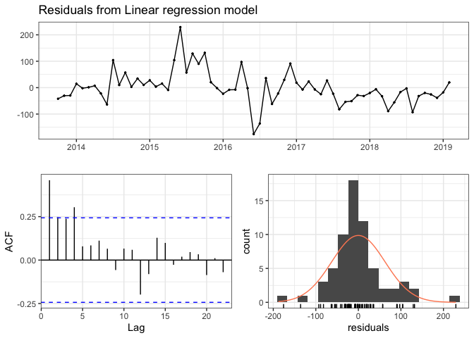

Regression Models for Cats
================

-   [Setup](#setup)
    -   [Load Packages](#load-packages)
    -   [Load Data & Create Time Series for Cats](#load-data-create-time-series-for-cats)
    -   [Partition Data](#partition-data)
-   [Benchmark - Seasonal Naive Forecast](#benchmark---seasonal-naive-forecast)
-   [Regression Models](#regression-models)
    -   [Model Seasonality](#model-seasonality)
    -   [Model Linear Trend](#model-linear-trend)
    -   [Model Polynomial](#model-polynomial)
    -   [Model Seasonality + ARIMA Error Correction](#model-seasonality-arima-error-correction)
    -   [ARIMA](#arima)

Setup
=====

Load Packages
-------------

``` r
library(tidyverse)
```

    ## ── Attaching packages ───────────────────────────────────────────────────────────────────────────────────────────── tidyverse 1.3.0 ──

    ## ✓ ggplot2 3.3.2     ✓ purrr   0.3.4
    ## ✓ tibble  3.0.1     ✓ dplyr   1.0.0
    ## ✓ tidyr   1.0.2     ✓ stringr 1.4.0
    ## ✓ readr   1.3.1     ✓ forcats 0.4.0

    ## ── Conflicts ──────────────────────────────────────────────────────────────────────────────────────────────── tidyverse_conflicts() ──
    ## x dplyr::filter() masks stats::filter()
    ## x dplyr::lag()    masks stats::lag()

``` r
library(ggplot2)
library(forecast)
```

    ## Registered S3 method overwritten by 'quantmod':
    ##   method            from
    ##   as.zoo.data.frame zoo

``` r
theme_set(theme_bw())
```

Load Data & Create Time Series for Cats
---------------------------------------

-   Original data ranged from Oct 2013 to Aug 2020
-   Subset data to drop months after Feb 2020 (impacted by COVID-19 lockdowns). This leaves 77 months (or 6 years and 5 months) of animal intake from Oct 2013 to Feb 2020
-   Create time-series object with data for only the intake of cats

``` r
DATA_ORIGINAL <- read.csv("data/Austin_AC_Monthly_Strays.csv", stringsAsFactors = FALSE)
# str(DATA_ORIGINAL)

DATA_SUBSET <- subset(DATA_ORIGINAL, IN_YRMO <= "2020-02")

TIME_SERIES <- ts(data      = DATA_SUBSET[,c("Cat")],    # only include Cats 
                  start     = c(2013, 10), 
                  end       = c(2020,  2), 
                  frequency = 12)
```

Plot the intake of stray cats

``` r
label_title = "Cat Stray Intake Oct 2013 - Feb 2020"
label_xaxis = "Months"
label_yaxis = "Monthly Cat Intake"

autoplot(TIME_SERIES) +
  ggtitle(label_title) +
  xlab(label_xaxis) + ylab(label_yaxis) +
  theme(legend.position = "bottom") +
  guides(colour=guide_legend(title=""))
```


Partition Data
--------------

-   Training - 65 months or 5 years and 5 months (Oct 2013 to Feb 2019)
-   Test - last 12 months (Mar 2019 to Feb 2020)

``` r
TS_TRNG_SET <- window(TIME_SERIES, 
                      start=c(2013, 10), 
                      end  =c(2019,  2))

TS_TEST_SET <- window(TIME_SERIES,
                      start=c(2019,  3),
                      end  =c(2020,  2))

N_TEST_SET <- length(TS_TEST_SET)

TS_TEST_SET
```

    ##      Jan Feb Mar Apr May Jun Jul Aug Sep Oct Nov Dec
    ## 2019         310 504 970 840 731 654 636 502 393 214
    ## 2020 167 162

Benchmark - Seasonal Naive Forecast
===================================

A seasonal naive forecast projects the last full season of the training data forward as the forecast.

``` r
FC_SEASONAL_NAIVE <- snaive(TS_TRNG_SET, h=N_TEST_SET)

# snaive() returns an object of class forecast.  Element "mean" is the point forecast
FC_SEASONAL_NAIVE$mean
```

    ##      Jan Feb Mar Apr May Jun Jul Aug Sep Oct Nov Dec
    ## 2019         205 364 725 716 588 430 494 441 317 202
    ## 2020 183 206

To confirm ... display last full season (12 months) of training data

``` r
subset(TS_TRNG_SET, start=length(TS_TRNG_SET)-(N_TEST_SET-1))
```

    ##      Jan Feb Mar Apr May Jun Jul Aug Sep Oct Nov Dec
    ## 2018         205 364 725 716 588 430 494 441 317 202
    ## 2019 183 206

Plot

-   the full time series of cat intake (includes both the training and test data)
-   the fitted values (basically shifts time series forward 1 season (=year in this case))
-   the forecast for the next 12 months

``` r
autoplot(TIME_SERIES, color="darkgray") +
#  ggtitle(label_title) +
  ggtitle("Cat: Seasonal Naive") +  
  xlab(label_xaxis) + ylab(label_yaxis) +
  theme(legend.position = "bottom") +
  guides(colour=guide_legend(title="")) +
  
  # fitted values
  autolayer(fitted(FC_SEASONAL_NAIVE), series="Seasonal Naive", lwd=0.5) +
  
  # forecasted values
  autolayer(FC_SEASONAL_NAIVE,         series="Seasonal Naive", PI=FALSE, lwd=1, lty=1)
```

    ## Warning: Removed 12 row(s) containing missing values (geom_path).


**Residual Diagnostics** (from <https://otexts.com/fpp2/residuals.html>)

The “residuals” in a time series model are what is left over after fitting a model.

Residuals are useful in checking whether a model has adequately captured the information in the data. A good forecasting method will yield residuals with the following properties:

1.  The residuals are uncorrelated. If there are correlations between residuals, then there is information left in the residuals which should be used in computing forecasts.
2.  The residuals have zero mean. If the residuals have a mean other than zero, then the forecasts are biased.

Checking these properties is important in order to see whether a method is using all of the available information, but it is not a good way to select a forecasting method.

In addition to these essential properties, it is useful (but not necessary) for the residuals to also have the following two properties.

1.  The residuals have constant variance.
2.  The residuals are normally distributed.

All of these methods for checking residuals are conveniently packaged into one R function `checkresiduals()`, which will produce a time plot, ACF plot and histogram of the residuals (with an overlaid normal distribution for comparison), and do a Ljung-Box test with the correct degrees of freedom.

``` r
checkresiduals(FC_SEASONAL_NAIVE)
```


    ## 
    ##  Ljung-Box test
    ## 
    ## data:  Residuals from Seasonal naive method
    ## Q* = 43.741, df = 13, p-value = 3.387e-05
    ## 
    ## Model df: 0.   Total lags used: 13

``` r
summary(residuals(FC_SEASONAL_NAIVE))
```

    ##     Min.  1st Qu.   Median     Mean  3rd Qu.     Max.     NA's 
    ## -405.000  -47.000    1.000   -7.717   31.000  293.000       12

**Residual Diagnostics on Seasonal Naive**

1.  Residuals are correlated. Spikes beyond significance line at lag 1, 12, 13. Significant p-value from Ljung-Box test (residuals are distinguishable from a white noise series)
2.  Mean is close to zero (-7.7). From histogram generally normal distribution but couple of outliers (-400, +300) and peak just above 0 (slight positive bias)

Conclusion: There is more information in time series than seasonal naive is extracting for a forecast. Not surprising for a simple benchmark.

**Assess Accuracy of Model**

`forecast::accuracy()` calculates various metrics on both training and test data sets. Interested in "Test set" results

``` r
accuracy(FC_SEASONAL_NAIVE, TS_TEST_SET)
```

    ##                      ME     RMSE       MAE      MPE     MAPE    MASE      ACF1
    ## Training set  -7.716981 102.2617  67.86792 -3.71238 15.29475 1.00000 0.3929336
    ## Test set     101.000000 131.8610 111.00000 14.84703 20.97059 1.63553 0.5707825
    ##              Theil's U
    ## Training set        NA
    ## Test set     0.6690461

Using RMSE, on average forecast off by 132 cats per month (or 21% MAPE)

Manually calculate desired metrics

``` r
ACTUAL    <- as.numeric(TS_TEST_SET)
PREDICTED <- as.numeric(FC_SEASONAL_NAIVE$mean)

MODEL_ACCURACY <- data.frame(
  Model    = "Seasonal Naive",
  RMSE     = Metrics::rmse(ACTUAL, PREDICTED),
  MAE      = Metrics::mae( ACTUAL, PREDICTED),
  MAPE     = Metrics::mape(ACTUAL, PREDICTED),
  AdjRsqrd = NA
)

MODEL_COMPARISON <- MODEL_ACCURACY
MODEL_COMPARISON
```

    ##            Model    RMSE MAE      MAPE AdjRsqrd
    ## 1 Seasonal Naive 131.861 111 0.2097059       NA

Regression Models
=================

Model Seasonality
-----------------

Just have seasonality (months) as predictors.

**Fit Model**

``` r
MODEL_SEASONALITY <- tslm(formula = TS_TRNG_SET ~ season,
                          data    = TS_TRNG_SET)

summary(MODEL_SEASONALITY)
```

    ## 
    ## Call:
    ## tslm(formula = TS_TRNG_SET ~ season, data = TS_TRNG_SET)
    ## 
    ## Residuals:
    ##     Min      1Q  Median      3Q     Max 
    ## -175.80  -29.67   -6.80   20.50  229.20 
    ## 
    ## Coefficients:
    ##             Estimate Std. Error t value Pr(>|t|)    
    ## (Intercept)   201.17      28.11   7.157 2.52e-09 ***
    ## season2       -15.00      39.75  -0.377 0.707414    
    ## season3        36.43      41.69   0.874 0.386111    
    ## season4       251.63      41.69   6.036 1.59e-07 ***
    ## season5       579.63      41.69  13.903  < 2e-16 ***
    ## season6       531.63      41.69  12.752  < 2e-16 ***
    ## season7       389.63      41.69   9.346 8.48e-13 ***
    ## season8       321.83      41.69   7.720 3.14e-10 ***
    ## season9       324.63      41.69   7.787 2.45e-10 ***
    ## season10      259.83      39.75   6.537 2.51e-08 ***
    ## season11      141.33      39.75   3.556 0.000803 ***
    ## season12       39.50      39.75   0.994 0.324879    
    ## ---
    ## Signif. codes:  0 '***' 0.001 '**' 0.01 '*' 0.05 '.' 0.1 ' ' 1
    ## 
    ## Residual standard error: 68.85 on 53 degrees of freedom
    ## Multiple R-squared:  0.9059, Adjusted R-squared:  0.8863 
    ## F-statistic: 46.36 on 11 and 53 DF,  p-value: < 2.2e-16

Adjusted R-squared: 0.8863 - model explains 88.6% of variance in data!

**Forecast/Predict Values for Test Set**

``` r
FC_SEASONALITY <- forecast(MODEL_SEASONALITY, h=N_TEST_SET)
FC_SEASONALITY$mean
```

    ##           Jan      Feb      Mar      Apr      May      Jun      Jul      Aug
    ## 2019                   237.6000 452.8000 780.8000 732.8000 590.8000 523.0000
    ## 2020 201.1667 186.1667                                                      
    ##           Sep      Oct      Nov      Dec
    ## 2019 525.8000 461.0000 342.5000 240.6667
    ## 2020

Plot

-   the full time series of cat intake (includes both the training and test data)
-   the fitted values
-   the forecast for the next 12 months

``` r
autoplot(TIME_SERIES, color="darkgray") +
#  ggtitle(label_title) +
  ggtitle("Cat: Regression on Seasonality") + 
  xlab(label_xaxis) + ylab(label_yaxis) +
  theme(legend.position = "bottom") +
  guides(colour=guide_legend(title="")) +

  # fitted values  
  autolayer(fitted(MODEL_SEASONALITY), series=" Seasonality", lwd=0.5) +

  # forecasted values
  autolayer(FC_SEASONALITY,            series=" Seasonality", PI=FALSE, lwd=1, lty=1)
```


For comparison, add Seasonal Naive forecast to plot

``` r
autoplot(TIME_SERIES, color="darkgray") +
#  ggtitle(label_title) +
  ggtitle("Cat: Regression on Seasonality vs. Seasonal Naive") +
  xlab(label_xaxis) + ylab(label_yaxis) +
  theme(legend.position = "bottom") +
  guides(colour=guide_legend(title="")) +

  autolayer(fitted(MODEL_SEASONALITY), series="Regression on Seasonality", lwd=0.5) +
  autolayer(FC_SEASONALITY,            series="Regression on Seasonality", PI=FALSE, lwd=1, lty=1) +

  autolayer(FC_SEASONAL_NAIVE,         series="Seasonal Naive", PI=FALSE, lwd=.75, lty=1)
```


``` r
# ggsave(filename = "figures/02_MOD_Cat_SeasonReg_vs_Naive.png",
#        height=4, width=6, units="in")
```

``` r
summary(residuals(MODEL_SEASONALITY))
```

    ##    Min. 1st Qu.  Median    Mean 3rd Qu.    Max. 
    ## -175.80  -29.67   -6.80    0.00   20.50  229.20

``` r
checkresiduals(MODEL_SEASONALITY)
```



    ## 
    ##  Breusch-Godfrey test for serial correlation of order up to 15
    ## 
    ## data:  Residuals from Linear regression model
    ## LM test = 27.272, df = 15, p-value = 0.0266

> Another useful test of autocorrelation in the residuals designed to take account for the regression model is the Breusch-Godfrey test, also referred to as the LM (Lagrange Multiplier) test for serial correlation. It is used to test the joint hypothesis that there is no autocorrelation in the residuals up to a certain specified order. **A small p-value indicates there is significant autocorrelation remaining in the residuals.**
>
> The Breusch-Godfrey test is similar to the Ljung-Box test, but it is specifically designed for use with regression models.

**Residual Diagnostics on Regression with Seasonality**

1.  Residuals are correlated. Spikes beyond significance line at lag 1, 4. Significant p-value (0.02 at an alpha of 0.05) from Breusch-Godfrey test (residuals are distinguishable from a white noise series)
2.  Mean is zero. From histogram generally normal distribution but couple of outliers (-175, +230) and peak just below 0 (slight negative bias)

Conclusion: Better than seasonal naive but there is more information in time series the model is not extracting for a forecast.

**Assess Accuracy of Model**

``` r
accuracy(FC_SEASONALITY, TS_TEST_SET)
```

    ##                         ME     RMSE      MAE       MPE      MAPE      MASE
    ## Training set -4.366112e-15 62.16971 42.93333 -1.517895  9.730805 0.6326012
    ## Test set      6.732500e+01 96.09306 81.49167  7.958069 15.931042 1.2007390
    ##                   ACF1 Theil's U
    ## Training set 0.4593405        NA
    ## Test set     0.5815799 0.4511682

``` r
ACTUAL    <- as.numeric(TS_TEST_SET)
PREDICTED <- as.numeric(FC_SEASONALITY$mean)

MODEL_ACCURACY <- data.frame(
  Model    = "Seasonality",
  RMSE     = Metrics::rmse(ACTUAL, PREDICTED),
  MAE      = Metrics::mae( ACTUAL, PREDICTED),
  MAPE     = Metrics::mape(ACTUAL, PREDICTED),
  AdjRsqrd = 0.8863
)

MODEL_COMPARISON <- rbind(MODEL_COMPARISON, MODEL_ACCURACY)
MODEL_COMPARISON
```

    ##            Model      RMSE       MAE      MAPE AdjRsqrd
    ## 1 Seasonal Naive 131.86104 111.00000 0.2097059       NA
    ## 2    Seasonality  96.09306  81.49167 0.1593104   0.8863

Improvement over Seasonal Naive

Model Linear Trend
------------------

**Fit Model**

``` r
MODEL_SEASON_LIN_TREND <- tslm(formula = TS_TRNG_SET ~ season + trend,
                               data    = TS_TRNG_SET)

summary(MODEL_SEASON_LIN_TREND)
```

    ## 
    ## Call:
    ## tslm(formula = TS_TRNG_SET ~ season + trend, data = TS_TRNG_SET)
    ## 
    ## Residuals:
    ##     Min      1Q  Median      3Q     Max 
    ## -175.80  -22.73   -7.70   21.33  217.13 
    ## 
    ## Coefficients:
    ##             Estimate Std. Error t value Pr(>|t|)    
    ## (Intercept)  235.356     30.911   7.614 5.21e-10 ***
    ## season2      -13.994     38.258  -0.366 0.716001    
    ## season3       32.411     40.161   0.807 0.423322    
    ## season4      248.617     40.144   6.193 9.53e-08 ***
    ## season5      577.622     40.132  14.393  < 2e-16 ***
    ## season6      530.628     40.125  13.225  < 2e-16 ***
    ## season7      389.633     40.122   9.711 2.83e-13 ***
    ## season8      322.839     40.125   8.046 1.08e-10 ***
    ## season9      326.644     40.132   8.139 7.67e-11 ***
    ## season10     256.817     38.278   6.709 1.44e-08 ***
    ## season11     139.322     38.265   3.641 0.000626 ***
    ## season12      38.494     38.258   1.006 0.318982    
    ## trend         -1.006      0.440  -2.285 0.026391 *  
    ## ---
    ## Signif. codes:  0 '***' 0.001 '**' 0.01 '*' 0.05 '.' 0.1 ' ' 1
    ## 
    ## Residual standard error: 66.26 on 52 degrees of freedom
    ## Multiple R-squared:  0.9144, Adjusted R-squared:  0.8947 
    ## F-statistic: 46.32 on 12 and 52 DF,  p-value: < 2.2e-16

Adjusted R-squared: 0.8947 (vs 0.8863) - model explains 89.4%. A slight improvement.

**Forecast/Predict Values for Test Set**

``` r
FC_SEASON_LIN_TREND <- forecast(MODEL_SEASON_LIN_TREND, h=N_TEST_SET)
FC_SEASON_LIN_TREND$mean
```

    ##           Jan      Feb      Mar      Apr      May      Jun      Jul      Aug
    ## 2019                   201.4000 416.6000 744.6000 696.6000 554.6000 486.8000
    ## 2020 158.9333 143.9333                                                      
    ##           Sep      Oct      Nov      Dec
    ## 2019 489.6000 418.7667 300.2667 198.4333
    ## 2020

``` r
autoplot(TIME_SERIES, color="darkgray") +
#  ggtitle(label_title) +
  ggtitle("Cat: Regression on Seasonality+Linear Trend") +  
  xlab(label_xaxis) + ylab(label_yaxis) +
  theme(legend.position = "bottom") +
  guides(colour=guide_legend(title="")) +

  # fitted values      
  autolayer(fitted(MODEL_SEASON_LIN_TREND), series="Season+Linear Trend", lwd=0.5) +
    
  # forecasted values    
  autolayer(FC_SEASON_LIN_TREND,            series="Season+Linear Trend", PI=FALSE, lwd=1, lty=1)
```


For comparison, plot regression on just seasonality

``` r
autoplot(TIME_SERIES, color="darkgray") +
#  ggtitle(label_title) +
  ggtitle("Cat: Regression on Seasonality+Linear Trend vs. Seasonality") +  
  xlab(label_xaxis) + ylab(label_yaxis) +
  theme(legend.position = "bottom") +
  guides(colour=guide_legend(title="")) +

  # fitted values      
  autolayer(fitted(MODEL_SEASON_LIN_TREND), series="Season+Linear Trend", lwd=0.5) +
    
  # forecasted values    
  autolayer(FC_SEASON_LIN_TREND,            series="Season+Linear Trend", PI=FALSE, lwd=1, lty=1) +

  # compare with forecast on just seasonality
  autolayer(FC_SEASONALITY,                 series="Seasonality",         PI=FALSE, lwd=.75, lty=1)
```


There's a tiny negative trend coefficient which would forecast/predict (1 fewer cats) for each future month than its prior month. And the coefficient for each month are a bit lower as well. That shifts/pulls the forecast down slightly, but in the test data the actual intake went up. So the error of the forecast will increase by including a trend term in the model.

``` r
summary(residuals(MODEL_SEASON_LIN_TREND))
```

    ##    Min. 1st Qu.  Median    Mean 3rd Qu.    Max. 
    ## -175.80  -22.73   -7.70    0.00   21.33  217.13

``` r
checkresiduals(MODEL_SEASON_LIN_TREND)
```


    ## 
    ##  Breusch-Godfrey test for serial correlation of order up to 16
    ## 
    ## data:  Residuals from Linear regression model
    ## LM test = 24.198, df = 16, p-value = 0.08526

**Residual Diagnostics on Regression with Seasonality+Linear Trend**

1.  Residuals correlated?? Spikes beyond significance line at lag 1, 12. p-value is not significant (0.085 at an alpha of 0.05) from Breusch-Godfrey test (indicates residuals are *NOT* distinguishable from a white noise series)
2.  Mean is zero. From histogram generally normal distribution but couple of outliers (-175, +220) and peak just below 0 (slight negative bias)

Conclusion: Seems to fit the training data a litte better than model with just seasonality.

``` r
accuracy(FC_SEASON_LIN_TREND, TS_TEST_SET)
```

    ##                        ME      RMSE       MAE       MPE      MAPE      MASE
    ## Training set 8.713116e-16  59.26434  40.64308 -1.318297  9.411313 0.5988555
    ## Test set     1.060389e+02 124.98942 106.03889 19.069281 19.069281 1.5624301
    ##                   ACF1 Theil's U
    ## Training set 0.3904426        NA
    ## Test set     0.5644941 0.5595158

``` r
ACTUAL    <- as.numeric(TS_TEST_SET)
PREDICTED <- as.numeric(FC_SEASON_LIN_TREND$mean)

MODEL_ACCURACY <- data.frame(
  Model = "Season+Linear Trend",
  RMSE     = Metrics::rmse(ACTUAL, PREDICTED),
  MAE      = Metrics::mae( ACTUAL, PREDICTED),
  MAPE     = Metrics::mape(ACTUAL, PREDICTED),
  AdjRsqrd = 0.8947
)

MODEL_COMPARISON <- rbind(MODEL_COMPARISON, MODEL_ACCURACY)
MODEL_COMPARISON
```

    ##                 Model      RMSE       MAE      MAPE AdjRsqrd
    ## 1      Seasonal Naive 131.86104 111.00000 0.2097059       NA
    ## 2         Seasonality  96.09306  81.49167 0.1593104   0.8863
    ## 3 Season+Linear Trend 124.98942 106.03889 0.1906928   0.8947

Higher error as expected on test data given the forecast is shift down a bit over the just seasonality model.

Model Polynomial
----------------

The trend-cycle of cat intake had a slight 3rd order polynomial look to it.

``` r
MODEL_SEASON_POLY_TREND <- tslm(formula = TS_TRNG_SET ~ season + trend + I(trend^2) + I(trend^3),
                                data    = TS_TRNG_SET)

summary(MODEL_SEASON_POLY_TREND)
```

    ## 
    ## Call:
    ## tslm(formula = TS_TRNG_SET ~ season + trend + I(trend^2) + I(trend^3), 
    ##     data = TS_TRNG_SET)
    ## 
    ## Residuals:
    ##      Min       1Q   Median       3Q      Max 
    ## -187.669  -28.451    1.913   26.754  186.496 
    ## 
    ## Coefficients:
    ##               Estimate Std. Error t value Pr(>|t|)    
    ## (Intercept) 141.070324  40.356444   3.496 0.001001 ** 
    ## season2     -16.566356  35.335000  -0.469 0.641224    
    ## season3      33.053829  37.259436   0.887 0.379258    
    ## season4     247.983408  37.235967   6.660 2.04e-08 ***
    ## season5     575.846210  37.217342  15.473  < 2e-16 ***
    ## season6     527.816835  37.202542  14.188  < 2e-16 ***
    ## season7     385.869882  37.191084  10.375 4.59e-14 ***
    ## season8     318.179951  37.183013   8.557 2.32e-11 ***
    ## season9     321.121642  37.178914   8.637 1.75e-11 ***
    ## season10    264.976135  35.452340   7.474 1.09e-09 ***
    ## season11    144.662512  35.378561   4.089 0.000157 ***
    ## season12     41.123378  35.334696   1.164 0.250019    
    ## trend        12.876722   4.242431   3.035 0.003809 ** 
    ## I(trend^2)   -0.460318   0.148389  -3.102 0.003157 ** 
    ## I(trend^3)    0.004233   0.001478   2.864 0.006097 ** 
    ## ---
    ## Signif. codes:  0 '***' 0.001 '**' 0.01 '*' 0.05 '.' 0.1 ' ' 1
    ## 
    ## Residual standard error: 61.18 on 50 degrees of freedom
    ## Multiple R-squared:  0.9299, Adjusted R-squared:  0.9102 
    ## F-statistic: 47.36 on 14 and 50 DF,  p-value: < 2.2e-16

Adjusted R-squared: 0.9102 better (vs .895, .886)

``` r
FC_SEASON_POLY_TREND <- forecast(MODEL_SEASON_POLY_TREND, h=N_TEST_SET)
FC_SEASON_POLY_TREND$mean
```

    ##           Jan      Feb      Mar      Apr      May      Jun      Jul      Aug
    ## 2019                   235.9295 458.6781 795.1410 756.5184 624.8102 568.2164
    ## 2020 319.2671 319.4746                                                      
    ##           Sep      Oct      Nov      Dec
    ## 2019 583.1370 539.8787 433.3858 344.6263
    ## 2020

``` r
autoplot(TIME_SERIES, color="darkgray") +
#  ggtitle(label_title) +
  ggtitle("Cat: Regression on Seasonality+Polynomial Trend") +  
  xlab(label_xaxis) + ylab(label_yaxis) +
  theme(legend.position = "bottom") +
  guides(colour=guide_legend(title="")) +

  autolayer(fitted(MODEL_SEASON_POLY_TREND), series="Season+Poly Trend", lwd=0.5) +
  autolayer(FC_SEASON_POLY_TREND,            series="Season+Poly Trend", PI=FALSE, lwd=1, lty=1) 
```


``` r
checkresiduals(MODEL_SEASON_POLY_TREND)
```


    ## 
    ##  Breusch-Godfrey test for serial correlation of order up to 18
    ## 
    ## data:  Residuals from Linear regression model
    ## LM test = 26.626, df = 18, p-value = 0.08629

``` r
accuracy(FC_SEASON_POLY_TREND, TS_TEST_SET)
```

    ##                        ME      RMSE      MAE        MPE     MAPE      MASE
    ## Training set 4.373131e-15  53.65501 37.47779  -1.016019  9.37234 0.5522166
    ## Test set     8.661409e+00 105.91958 95.10014 -14.203355 30.33774 1.4012531
    ##                   ACF1 Theil's U
    ## Training set 0.2825141        NA
    ## Test set     0.7131077  1.018139

``` r
ACTUAL    <- as.numeric(TS_TEST_SET)
PREDICTED <- as.numeric(FC_SEASON_POLY_TREND$mean)

MODEL_ACCURACY <- data.frame(
  Model    = "Season+Poly Trend",
  RMSE     = Metrics::rmse(ACTUAL, PREDICTED),
  MAE      = Metrics::mae( ACTUAL, PREDICTED),
  MAPE     = Metrics::mape(ACTUAL, PREDICTED),
  AdjRsqrd = 0.9102
)

MODEL_COMPARISON <- rbind(MODEL_COMPARISON, MODEL_ACCURACY)
MODEL_COMPARISON
```

    ##                 Model      RMSE       MAE      MAPE AdjRsqrd
    ## 1      Seasonal Naive 131.86104 111.00000 0.2097059       NA
    ## 2         Seasonality  96.09306  81.49167 0.1593104   0.8863
    ## 3 Season+Linear Trend 124.98942 106.03889 0.1906928   0.8947
    ## 4   Season+Poly Trend 105.91958  95.10014 0.3033774   0.9102

All the accuracy metrics are bit worse than the Seasonality model - likely overfitting the training data.

Model Seasonality + ARIMA Error Correction
------------------------------------------

I also attempted to use ARIMA as an error correction technique.

There were some autocorrelations in the residuals of the seasonal regression model (e.g., 0.45 at lag 1).

``` r
#checkresiduals(MODEL_SEASONALITY)

STG_1_RESIDUALS <- residuals(MODEL_SEASONALITY)

ggAcf(STG_1_RESIDUALS)
```


``` r
ACF <- Acf(STG_1_RESIDUALS) 
```


``` r
ACF[1:12]
```

    ## 
    ## Autocorrelations of series 'STG_1_RESIDUALS', by lag
    ## 
    ##      1      2      3      4      5      6      7      8      9     10     11 
    ##  0.459  0.247  0.238  0.304  0.079  0.084  0.112  0.065 -0.057  0.066  0.059 
    ##     12 
    ## -0.198

Create an ARIMA model on residuals

``` r
MODEL_STG2_ARIMA <- auto.arima(STG_1_RESIDUALS, seasonal=FALSE)
#MODEL_STG2_ARIMA <- Arima(STG_1_RESIDUALS, order = c(1,0,0))

summary(MODEL_STG2_ARIMA)
```

    ## Series: STG_1_RESIDUALS 
    ## ARIMA(1,1,1) 
    ## 
    ## Coefficients:
    ##          ar1      ma1
    ##       0.3734  -0.9075
    ## s.e.  0.1788   0.1155
    ## 
    ## sigma^2 estimated as 3255:  log likelihood=-349.14
    ## AIC=704.29   AICc=704.69   BIC=710.76
    ## 
    ## Training set error measures:
    ##                      ME     RMSE     MAE     MPE     MAPE     MASE         ACF1
    ## Training set -0.1235568 55.72452 39.4825 135.052 242.7667 0.581755 -0.002457791

I allowed the forecast’s package auto.arima() function to select the best ARIMA order which resulted in an ARIMA(1,1,1) model. This is, the residuals are first differenced to make the residual time series stationary, then it factors in the value at the prior point in time (the AR(1) component) and a prior error component (MA(1)).

The forecast for the residual correction started at about -6 and ended about -21.

``` r
FC_STG2_ARIMA <- forecast(MODEL_STG2_ARIMA, h=N_TEST_SET)
round(FC_STG2_ARIMA$mean,3)
```

    ##          Jan     Feb     Mar     Apr     May     Jun     Jul     Aug     Sep
    ## 2019                  -6.020 -15.675 -19.280 -20.626 -21.129 -21.317 -21.387
    ## 2020 -21.428 -21.428                                                        
    ##          Oct     Nov     Dec
    ## 2019 -21.413 -21.423 -21.426
    ## 2020

``` r
label_series <- "ARIMA(1,1,1)"
autoplot(STG_1_RESIDUALS, color="darkgray") +
  ggtitle("Stage 1 Residuals") +
  xlab("Months") + ylab("Residuals") +

  theme(legend.position = "bottom") +
  guides(colour=guide_legend(title="")) +
  
  autolayer(fitted(FC_STG2_ARIMA),    series=label_series, lwd=.5) +
  autolayer(FC_STG2_ARIMA,            series=label_series, lwd=.75, lty=2, PI=FALSE) 
```


Combining the ARIMA error correction forecast end up lowering the original seasonal regression forecast.

Looking at the regression forecast, it is already under forecasting the actual values, so lowering the forecasted cat intake only increase the error (RMSE) and did not help in this case.

``` r
FC_SEASONALITY_ARIMA <- FC_SEASONALITY$mean + FC_STG2_ARIMA$mean

autoplot(TIME_SERIES, color="darkgray") +
#  ggtitle(label_title) +
  ggtitle("Cat: Regression on Seasonality+ARIMA Error Correction") +  
  xlab(label_xaxis) + ylab(label_yaxis) +
  theme(legend.position = "bottom") +
  guides(colour=guide_legend(title="")) +
  
  #autolayer(fitted(MODEL_SEASONALITY), series="Seasonality", lwd=1) +
  autolayer(FC_SEASONALITY_ARIMA,      series="Seasonality+ARIMA",     lwd=1,   lty=1) +
  autolayer(FC_SEASONALITY,            series="Seasonality", PI=FALSE, lwd=.5,  lty=2) 
```


``` r
ACTUAL    <- as.numeric(TS_TEST_SET)
PREDICTED <- as.numeric(FC_SEASONALITY_ARIMA)

MODEL_ACCURACY <- data.frame(
  Model    = "Seasonality+ARIMA",
  RMSE     = Metrics::rmse(ACTUAL, PREDICTED),
  MAE      = Metrics::mae( ACTUAL, PREDICTED),
  MAPE     = Metrics::mape(ACTUAL, PREDICTED),
  AdjRsqrd = NA
)

#MODEL_ACCURACY

MODEL_COMPARISON <- rbind(MODEL_COMPARISON, MODEL_ACCURACY)
MODEL_COMPARISON
```

    ##                 Model      RMSE       MAE      MAPE AdjRsqrd
    ## 1      Seasonal Naive 131.86104 111.00000 0.2097059       NA
    ## 2         Seasonality  96.09306  81.49167 0.1593104   0.8863
    ## 3 Season+Linear Trend 124.98942 106.03889 0.1906928   0.8947
    ## 4   Season+Poly Trend 105.91958  95.10014 0.3033774   0.9102
    ## 5   Seasonality+ARIMA 110.39065  90.15718 0.1531885       NA

ARIMA
-----

In class, we did not cover ARIMA models in depth. It is a substantial topic in its own right.

Here, I'm am just throwing in example of walking through the steps.

``` r
MODEL_ARIMA <- auto.arima(TS_TRNG_SET)

summary(MODEL_ARIMA)
```

    ## Series: TS_TRNG_SET 
    ## ARIMA(1,0,0)(1,1,0)[12] 
    ## 
    ## Coefficients:
    ##          ar1     sar1
    ##       0.3949  -0.5198
    ## s.e.  0.1268   0.1122
    ## 
    ## sigma^2 estimated as 6340:  log likelihood=-308.16
    ## AIC=622.31   AICc=622.8   BIC=628.22
    ## 
    ## Training set error measures:
    ##                     ME     RMSE      MAE       MPE     MAPE      MASE
    ## Training set -5.789521 70.52849 45.81859 -2.596803 10.45204 0.6751141
    ##                     ACF1
    ## Training set -0.01175112

``` r
FC_ARIMA <- forecast(MODEL_ARIMA, h=N_TEST_SET)
#FC_ARIMA
```

``` r
label_series <- "ARIMA(1,0,0)(1,1,0)[12]"

autoplot(TIME_SERIES, color="darkgray") +
  ggtitle(label_title) +
  xlab(label_xaxis) + ylab(label_yaxis) +
  theme(legend.position = "bottom") +
  guides(colour=guide_legend(title="")) +

  autolayer(fitted(MODEL_ARIMA), series=label_series, lwd=.75) +
  autolayer(FC_ARIMA,            series=label_series, PI=FALSE, lwd=1, lty=1) +
  
  #autolayer(fitted(MODEL_SEASONALITY), series="Seasonality", lwd=1) +
  autolayer(FC_SEASONALITY,            series="Seasonality", PI=FALSE, lwd=.75, lty=1) 
```


``` r
checkresiduals(MODEL_ARIMA)
```


    ## 
    ##  Ljung-Box test
    ## 
    ## data:  Residuals from ARIMA(1,0,0)(1,1,0)[12]
    ## Q* = 17.475, df = 11, p-value = 0.0946
    ## 
    ## Model df: 2.   Total lags used: 13

``` r
ACTUAL    <- as.numeric(TS_TEST_SET)
PREDICTED <- as.numeric(FC_ARIMA$mean)

MODEL_ACCURACY <- data.frame(
  Model    = "ARIMA",
  RMSE     = Metrics::rmse(ACTUAL, PREDICTED),
  MAE      = Metrics::mae( ACTUAL, PREDICTED),
  MAPE     = Metrics::mape(ACTUAL, PREDICTED),
  AdjRsqrd = NA
)

MODEL_COMPARISON <- rbind(MODEL_COMPARISON, MODEL_ACCURACY)
MODEL_COMPARISON
```

    ##                 Model      RMSE       MAE      MAPE AdjRsqrd
    ## 1      Seasonal Naive 131.86104 111.00000 0.2097059       NA
    ## 2         Seasonality  96.09306  81.49167 0.1593104   0.8863
    ## 3 Season+Linear Trend 124.98942 106.03889 0.1906928   0.8947
    ## 4   Season+Poly Trend 105.91958  95.10014 0.3033774   0.9102
    ## 5   Seasonality+ARIMA 110.39065  90.15718 0.1531885       NA
    ## 6               ARIMA 123.31540 101.63031 0.1834964       NA

``` r
#write_csv(MODEL_COMPARISON, "data/results_cat_regresssion.csv")
```
