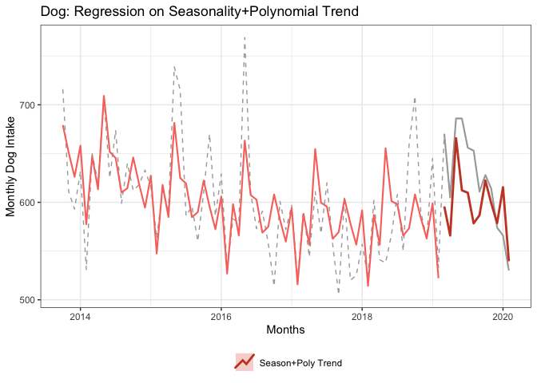
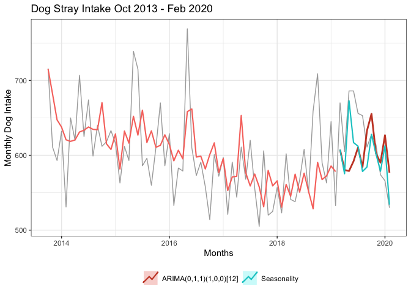

Regression Models for Dogs
================

-   [Setup](#setup)
    -   [Load Packages](#load-packages)
    -   [Load Data & Create Time Series](#load-data-create-time-series)
    -   [Partition Data](#partition-data)
-   [Benchmark - Seasonal Naive Forecast](#benchmark---seasonal-naive-forecast)
-   [Regression Models](#regression-models)
    -   [Model Seasonality](#model-seasonality)
    -   [Model Linear Trend](#model-linear-trend)
    -   [Model Polynomial](#model-polynomial)
    -   [Model Seasonality + ARIMA Error Correction](#model-seasonality-arima-error-correction)
    -   [ARIMA](#arima)

Setup
=====

Load Packages
-------------

``` r
library(tidyverse)
```

    ## ── Attaching packages ───────────────────────────────────────────────────────────────────────────────────────────── tidyverse 1.3.0 ──

    ## ✓ ggplot2 3.3.2     ✓ purrr   0.3.4
    ## ✓ tibble  3.0.1     ✓ dplyr   1.0.0
    ## ✓ tidyr   1.0.2     ✓ stringr 1.4.0
    ## ✓ readr   1.3.1     ✓ forcats 0.4.0

    ## ── Conflicts ──────────────────────────────────────────────────────────────────────────────────────────────── tidyverse_conflicts() ──
    ## x dplyr::filter() masks stats::filter()
    ## x dplyr::lag()    masks stats::lag()

``` r
library(ggplot2)
library(forecast)
```

    ## Registered S3 method overwritten by 'quantmod':
    ##   method            from
    ##   as.zoo.data.frame zoo

``` r
theme_set(theme_bw())
```

Load Data & Create Time Series
------------------------------

-   Original data ranged from Oct 2013 to Aug 2020
-   Subset data to drop months after Feb 2020 (impacted by COVID-19 lockdowns). This leaves 77 months (or 6 years and 5 months) of animal intake from Oct 2013 to Feb 2020
-   Create time-series object with data for only the intake of **dogs**

``` r
DATA_ORIGINAL <- read.csv("data/Austin_AC_Monthly_Strays.csv", stringsAsFactors = FALSE)
# str(DATA_ORIGINAL)

DATA_SUBSET <- subset(DATA_ORIGINAL, IN_YRMO <= "2020-02")

TIME_SERIES <- ts(data      = DATA_SUBSET[,c("Dog")],    # only include Dogs 
                  start     = c(2013, 10), 
                  end       = c(2020,  2), 
                  frequency = 12)
```

Plot the intake of stray dogs

``` r
label_title = "Dog Stray Intake Oct 2013 - Feb 2020"
label_xaxis = "Months"
label_yaxis = "Monthly Dog Intake"

autoplot(TIME_SERIES) +
  ggtitle(label_title) +
  xlab(label_xaxis) + ylab(label_yaxis) +
  theme(legend.position = "bottom") +
  guides(colour=guide_legend(title=""))
```


Partition Data
--------------

-   Training - 65 months or 5 years and 5 months (Oct 2013 to Feb 2019)
-   Test - last 12 months (Mar 2019 to Feb 2020)

``` r
TS_TRNG_SET <- window(TIME_SERIES, 
                      start=c(2013, 10), 
                      end  =c(2019,  2))

TS_TEST_SET <- window(TIME_SERIES,
                      start=c(2019,  3),
                      end  =c(2020,  2))

N_TEST_SET <- length(TS_TEST_SET)

TS_TEST_SET
```

    ##      Jan Feb Mar Apr May Jun Jul Aug Sep Oct Nov Dec
    ## 2019         670 605 686 686 656 653 611 628 614 574
    ## 2020 566 530

Benchmark - Seasonal Naive Forecast
===================================

A seasonal naive forecast projects the last full season of the training data forward as the forecast.

``` r
FC_SEASONAL_NAIVE <- snaive(TS_TRNG_SET, h=N_TEST_SET)

# snaive() returns an object of class forecast.  Element "mean" is the point forecast
FC_SEASONAL_NAIVE$mean
```

    ##      Jan Feb Mar Apr May Jun Jul Aug Sep Oct Nov Dec
    ## 2019         602 541 538 567 608 550 659 709 590 563
    ## 2020 645 533

To confirm ... display last full season (12 months) of training data

``` r
subset(TS_TRNG_SET, start=length(TS_TRNG_SET)-(N_TEST_SET-1))
```

    ##      Jan Feb Mar Apr May Jun Jul Aug Sep Oct Nov Dec
    ## 2018         602 541 538 567 608 550 659 709 590 563
    ## 2019 645 533

Plot

-   the full time series of dog intake (includes both the training and test data)
-   the fitted values (basically shifts time series forward 1 season (=year in this case))
-   the forecast for the next 12 months

``` r
autoplot(TIME_SERIES, color="darkgray") +
#  ggtitle(label_title) +
  ggtitle("Dog: Seasonal Naive") +  
  xlab(label_xaxis) + ylab(label_yaxis) +
  theme(legend.position = "bottom") +
  guides(colour=guide_legend(title="")) +
  
  # fitted values
  autolayer(fitted(FC_SEASONAL_NAIVE), series="Seasonal Naive", lwd=0.5) +
  
  # forecasted values
  autolayer(FC_SEASONAL_NAIVE,         series="Seasonal Naive", PI=FALSE, lwd=1, lty=1)
```

    ## Warning: Removed 12 row(s) containing missing values (geom_path).


Residual Diagnostics see discussion in <https://otexts.com/fpp2/residuals.html>

``` r
checkresiduals(FC_SEASONAL_NAIVE)
```


    ## 
    ##  Ljung-Box test
    ## 
    ## data:  Residuals from Seasonal naive method
    ## Q* = 11.26, df = 13, p-value = 0.5891
    ## 
    ## Model df: 0.   Total lags used: 13

**Residual Diagnostics on Seasonal Naive**

Yes, residual look like white noise. (Good) There's a high/non-significant p-value in Ljung-Box test. No significat autocorrelations. Residuals approximately normally distributed.

**Assess Accuracy of Model**

`forecast::accuracy()` calculates various metrics on both training and test data sets. Interested in “Test set” results.

``` r
accuracy(FC_SEASONAL_NAIVE, TS_TEST_SET)
```

    ##                     ME     RMSE      MAE       MPE      MAPE     MASE      ACF1
    ## Training set -9.301887 58.42799 43.98113 -1.998081  7.361764 1.000000 0.1479186
    ## Test set     31.166667 78.26770 66.33333  4.440579 10.320195 1.508223 0.4546560
    ##              Theil's U
    ## Training set        NA
    ## Test set      1.998199

Using RMSE, on average forecast off by 78 dogs per month (or 10% MAPE)

Manually calculate desired metrics

``` r
ACTUAL    <- as.numeric(TS_TEST_SET)
PREDICTED <- as.numeric(FC_SEASONAL_NAIVE$mean)

MODEL_ACCURACY <- data.frame(
  Model    = "Seasonal Naive",
  RMSE     = Metrics::rmse(ACTUAL, PREDICTED),
  MAE      = Metrics::mae( ACTUAL, PREDICTED),
  MAPE     = Metrics::mape(ACTUAL, PREDICTED),
  AdjRsqrd = NA
)

MODEL_COMPARISON <- MODEL_ACCURACY
MODEL_COMPARISON
```

    ##            Model    RMSE      MAE     MAPE AdjRsqrd
    ## 1 Seasonal Naive 78.2677 66.33333 0.103202       NA

Regression Models
=================

Model Seasonality
-----------------

**Fit Model**

Just have seasonality (months) as predictors.

``` r
MODEL_SEASONALITY <- tslm(formula = TS_TRNG_SET ~ season,
                          data    = TS_TRNG_SET)

summary(MODEL_SEASONALITY)
```

    ## 
    ## Call:
    ## tslm(formula = TS_TRNG_SET ~ season, data = TS_TRNG_SET)
    ## 
    ## Residuals:
    ##     Min      1Q  Median      3Q     Max 
    ## -134.80  -24.40   -1.00   19.33   98.00 
    ## 
    ## Coefficients:
    ##             Estimate Std. Error t value Pr(>|t|)    
    ## (Intercept) 612.6667    20.6772  29.630  < 2e-16 ***
    ## season2     -78.6667    29.2419  -2.690  0.00953 ** 
    ## season3      -5.0667    30.6692  -0.165  0.86941    
    ## season4     -37.2667    30.6692  -1.215  0.22971    
    ## season5      60.1333    30.6692   1.961  0.05518 .  
    ## season6       4.3333    30.6692   0.141  0.88817    
    ## season7      -0.4667    30.6692  -0.015  0.98792    
    ## season8     -34.2667    30.6692  -1.117  0.26891    
    ## season9     -28.2667    30.6692  -0.922  0.36088    
    ## season10     15.1667    29.2419   0.519  0.60616    
    ## season11    -11.0000    29.2419  -0.376  0.70829    
    ## season12    -34.0000    29.2419  -1.163  0.25015    
    ## ---
    ## Signif. codes:  0 '***' 0.001 '**' 0.01 '*' 0.05 '.' 0.1 ' ' 1
    ## 
    ## Residual standard error: 50.65 on 53 degrees of freedom
    ## Multiple R-squared:   0.34,  Adjusted R-squared:  0.203 
    ## F-statistic: 2.482 on 11 and 53 DF,  p-value: 0.01365

-   Adjusted R-squared: 0.203 - model explains just 20.3% of variance in data - not very good.
-   Not many predictors are significant

**Forecast/Predict Values for Test Set**

``` r
FC_SEASONALITY <- forecast(MODEL_SEASONALITY, h=N_TEST_SET)
FC_SEASONALITY$mean
```

    ##           Jan      Feb      Mar      Apr      May      Jun      Jul      Aug
    ## 2019                   607.6000 575.4000 672.8000 617.0000 612.2000 578.4000
    ## 2020 612.6667 534.0000                                                      
    ##           Sep      Oct      Nov      Dec
    ## 2019 584.4000 627.8333 601.6667 578.6667
    ## 2020

Plot

-   the full time series of dog intake (includes both the training and test data)
-   the fitted values
-   the forecast for the next 12 months

``` r
autoplot(TIME_SERIES, color="darkgray") +
#  ggtitle(label_title) +
  ggtitle("Dog: Regression on Seasonality") +  
  xlab(label_xaxis) + ylab(label_yaxis) +
  theme(legend.position = "bottom") +
  guides(colour=guide_legend(title="")) +
  
  # fitted values  
  autolayer(fitted(MODEL_SEASONALITY), series=" Seasonality", lwd=0.5) +

  # forecasted values
  autolayer(FC_SEASONALITY,            series=" Seasonality", PI=FALSE, lwd=1, lty=1)  
```


Fitted values a little under actual values on first half of training data and a little over actual intake on second half.

For comparison, add Seasonal Naive forecast to plot.

For me, the dash line for time series help separate it and the fitted values.

``` r
autoplot(TIME_SERIES, color="darkgray", lty=2) +
#  ggtitle(label_title) +
  ggtitle("Dog: Regression on Seasonality vs. Seasonal Naive") +
  xlab(label_xaxis) + ylab(label_yaxis) +
  theme(legend.position = "bottom") +
  guides(colour=guide_legend(title="")) +
  
  # test set (next 12 months)
  autolayer(TS_TEST_SET, color="darkgray", lwd=1.5, lty=1) +
  
  # fitted values 
  autolayer(fitted(MODEL_SEASONALITY), series="Regression on Seasonality", lwd=0.75) +
  
  # forecasted values
  autolayer(FC_SEASONALITY,            series="Regression on Seasonality", PI=FALSE, lwd=1, lty=1) +

  # Seasonal Naive
  autolayer(FC_SEASONAL_NAIVE,         series="Seasonal Naive", PI=FALSE, lwd=.75, lty=1)
```


``` r
# ggsave(filename = "figures/02_MOD_Dog_SeasonReg_vs_Naive.png",
#        height=4, width=6, units="in")
```

``` r
summary(residuals(MODEL_SEASONALITY))
```

    ##    Min. 1st Qu.  Median    Mean 3rd Qu.    Max. 
    ## -134.80  -24.40   -1.00    0.00   19.33   98.00

``` r
checkresiduals(MODEL_SEASONALITY)
```


    ## 
    ##  Breusch-Godfrey test for serial correlation of order up to 15
    ## 
    ## data:  Residuals from Linear regression model
    ## LM test = 28.605, df = 15, p-value = 0.01807

**Residual Diagnostics on Regression with Seasonality**

1.  Residuals are correlated. Spikes beyond significance line at lag 1, 3, 6. Significant p-value (0.018 at an alpha of 0.05) from Breusch-Godfrey test (residuals are distinguishable from a white noise series)
2.  Mean is zero. Multimodal? A bit left of zero and maybe at 50.

Conclusion: There is more information in time series the model is not extracting for a forecast.

**Assess Accuracy of Model**

``` r
accuracy(FC_SEASONALITY, TS_TEST_SET)
```

    ##                        ME     RMSE      MAE        MPE     MAPE      MASE
    ## Training set 1.573378e-14 45.73489 34.01436 -0.5572271 5.634759 0.7733853
    ## Test set     2.303056e+01 41.09340 32.25278  3.4054627 5.040916 0.7333321
    ##                   ACF1 Theil's U
    ## Training set 0.3484084        NA
    ## Test set     0.4479183 0.9421929

``` r
ACTUAL    <- as.numeric(TS_TEST_SET)
PREDICTED <- as.numeric(FC_SEASONALITY$mean)

MODEL_ACCURACY <- data.frame(
  Model    = "Seasonality",
  RMSE     = Metrics::rmse(ACTUAL, PREDICTED),
  MAE      = Metrics::mae( ACTUAL, PREDICTED),
  MAPE     = Metrics::mape(ACTUAL, PREDICTED),
  AdjRsqrd = summary(MODEL_SEASONALITY)$adj.r.squared
)

MODEL_COMPARISON <- rbind(MODEL_COMPARISON, MODEL_ACCURACY)
MODEL_COMPARISON
```

    ##            Model    RMSE      MAE       MAPE  AdjRsqrd
    ## 1 Seasonal Naive 78.2677 66.33333 0.10320195        NA
    ## 2    Seasonality 41.0934 32.25278 0.05040916 0.2029856

Improvement over Seasonal Naive - cut errors in about half. On average forecast would be off by 41 dogs per month or about 5%.

Model Linear Trend
------------------

**Fit Model**

``` r
MODEL_SEASON_LIN_TREND <- tslm(formula = TS_TRNG_SET ~ season + trend,
                               data    = TS_TRNG_SET)

summary(MODEL_SEASON_LIN_TREND)
```

    ## 
    ## Call:
    ## tslm(formula = TS_TRNG_SET ~ season + trend, data = TS_TRNG_SET)
    ## 
    ## Residuals:
    ##      Min       1Q   Median       3Q      Max 
    ## -109.511  -24.156   -3.111   19.311  112.778 
    ## 
    ## Coefficients:
    ##             Estimate Std. Error t value Pr(>|t|)    
    ## (Intercept) 648.4926    21.5323  30.117  < 2e-16 ***
    ## season2     -77.6130    26.6497  -2.912  0.00527 ** 
    ## season3      -9.2815    27.9755  -0.332  0.74140    
    ## season4     -40.4278    27.9637  -1.446  0.15426    
    ## season5      58.0259    27.9553   2.076  0.04289 *  
    ## season6       3.2796    27.9503   0.117  0.90704    
    ## season7      -0.4667    27.9486  -0.017  0.98674    
    ## season8     -33.2130    27.9503  -1.188  0.24012    
    ## season9     -26.1593    27.9553  -0.936  0.35373    
    ## season10     12.0056    26.6638   0.450  0.65440    
    ## season11    -13.1074    26.6550  -0.492  0.62497    
    ## season12    -35.0537    26.6497  -1.315  0.19416    
    ## trend        -1.0537     0.3065  -3.438  0.00116 ** 
    ## ---
    ## Signif. codes:  0 '***' 0.001 '**' 0.01 '*' 0.05 '.' 0.1 ' ' 1
    ## 
    ## Residual standard error: 46.16 on 52 degrees of freedom
    ## Multiple R-squared:  0.4622, Adjusted R-squared:  0.3381 
    ## F-statistic: 3.724 on 12 and 52 DF,  p-value: 0.0004458

-   Adjusted R-squared: 0.3381 (vs 0.203) - model explains 33.8%. Improving but still not very good.
-   The trend predictor is significant

**Forecast/Predict Values for Test Set**

``` r
FC_SEASON_LIN_TREND <- forecast(MODEL_SEASON_LIN_TREND, h=N_TEST_SET)
FC_SEASON_LIN_TREND$mean
```

    ##           Jan      Feb      Mar      Apr      May      Jun      Jul      Aug
    ## 2019                   569.6667 537.4667 634.8667 579.0667 574.2667 540.4667
    ## 2020 568.4111 489.7444                                                      
    ##           Sep      Oct      Nov      Dec
    ## 2019 546.4667 583.5778 557.4111 534.4111
    ## 2020

``` r
autoplot(TIME_SERIES, color="darkgray", lty=2) +
#  ggtitle(label_title) +
  ggtitle("Dog: Regression on Seasonality+Linear Trend") +  
  xlab(label_xaxis) + ylab(label_yaxis) +
  theme(legend.position = "bottom") +
  guides(colour=guide_legend(title="")) +
  
  # test set (next 12 months)
  autolayer(TS_TEST_SET, color="darkgray", lwd=.75, lty=1) +

  # fitted values
  autolayer(fitted(MODEL_SEASON_LIN_TREND), series="Season+Linear Trend", lwd=0.75) +
  
  # forecasted values
  autolayer(FC_SEASON_LIN_TREND,            series="Season+Linear Trend", PI=FALSE, lwd=1, lty=1) 
```


The linear trend predictor (coefficient -1.05) causes the fitted & forecasted values to shift down slightly over time (AKA a slight linear trend).

``` r
summary(residuals(MODEL_SEASON_LIN_TREND))
```

    ##     Min.  1st Qu.   Median     Mean  3rd Qu.     Max. 
    ## -109.511  -24.156   -3.111    0.000   19.311  112.778

``` r
checkresiduals(MODEL_SEASON_LIN_TREND)
```


    ## 
    ##  Breusch-Godfrey test for serial correlation of order up to 16
    ## 
    ## data:  Residuals from Linear regression model
    ## LM test = 26.627, df = 16, p-value = 0.04582

**Residual Diagnostics on Regression with Seasonality+Linear Trend**

1.  Residuals are NOT correlated. No spikes beyond significance line. Border line significant p-value (0.0458 at an alpha of 0.05) from Breusch-Godfrey test (residuals are NOT strongly distinguishable from a white noise series)
2.  Mean is zero. Histogram - kind of a normal distribution strong concentration in the center and then some values out in the tails

Conclusion: There may be some information in time series the model is not extracting for a forecast, but not a ton via residual analysis.

**Assess Accuracy of Model**

``` r
accuracy(FC_SEASON_LIN_TREND, TS_TEST_SET)
```

    ##                        ME     RMSE      MAE        MPE      MAPE      MASE
    ## Training set 8.740871e-16 41.28286 29.73299 -0.4482721  4.909767 0.6760397
    ## Test set     6.359815e+01 71.03682 64.00000  9.9825374 10.053536 1.4551695
    ##                   ACF1 Theil's U
    ## Training set 0.2200007        NA
    ## Test set     0.3898189  1.650852

``` r
ACTUAL    <- as.numeric(TS_TEST_SET)
PREDICTED <- as.numeric(FC_SEASON_LIN_TREND$mean)

MODEL_ACCURACY <- data.frame(
  Model = "Season+Linear Trend",
  RMSE     = Metrics::rmse(ACTUAL, PREDICTED),
  MAE      = Metrics::mae( ACTUAL, PREDICTED),
  MAPE     = Metrics::mape(ACTUAL, PREDICTED),
  AdjRsqrd = summary(MODEL_SEASON_LIN_TREND)$adj.r.squared  
)

MODEL_COMPARISON <- rbind(MODEL_COMPARISON, MODEL_ACCURACY)
MODEL_COMPARISON
```

    ##                 Model     RMSE      MAE       MAPE  AdjRsqrd
    ## 1      Seasonal Naive 78.26770 66.33333 0.10320195        NA
    ## 2         Seasonality 41.09340 32.25278 0.05040916 0.2029856
    ## 3 Season+Linear Trend 71.03682 64.00000 0.10053536 0.3381146

The trend predictor makes the model less accurate - back on par with the seasonal naive. The time series is not linearly trending down. Reviewing decomposition, dog intake "trend-cycle" was declining through 2017, then trending up again in 2018 and starting to decline again in 2019.

Model Polynomial
----------------

Try a polynomial trend

``` r
MODEL_SEASON_POLY_TREND <- tslm(formula = TS_TRNG_SET ~ season + trend + I(trend^2), #+ I(trend^3),
                                data    = TS_TRNG_SET)

summary(MODEL_SEASON_POLY_TREND)
```

    ## 
    ## Call:
    ## tslm(formula = TS_TRNG_SET ~ season + trend + I(trend^2), data = TS_TRNG_SET)
    ## 
    ## Residuals:
    ##      Min       1Q   Median       3Q      Max 
    ## -117.418  -26.777    2.668   14.945  105.689 
    ## 
    ## Coefficients:
    ##              Estimate Std. Error t value Pr(>|t|)    
    ## (Intercept) 670.50077   24.32895  27.560  < 2e-16 ***
    ## season2     -77.71180   26.08436  -2.979  0.00442 ** 
    ## season3      -5.19613   27.47473  -0.189  0.85075    
    ## season4     -36.17770   27.47089  -1.317  0.19374    
    ## season5      62.37485   27.46742   2.271  0.02741 *  
    ## season6       7.66150   27.46410   0.279  0.78140    
    ## season7       3.88225   27.46086   0.141  0.88813    
    ## season8     -28.96288   27.45778  -1.055  0.29648    
    ## season9     -22.07391   27.45507  -0.804  0.42513    
    ## season10     11.90672   26.09815   0.456  0.65016    
    ## season11    -13.10741   26.08948  -0.502  0.61755    
    ## season12    -35.02076   26.08431  -1.343  0.18535    
    ## trend        -3.22816    1.23776  -2.608  0.01191 *  
    ## I(trend^2)    0.03295    0.01819   1.811  0.07607 .  
    ## ---
    ## Signif. codes:  0 '***' 0.001 '**' 0.01 '*' 0.05 '.' 0.1 ' ' 1
    ## 
    ## Residual standard error: 45.18 on 51 degrees of freedom
    ## Multiple R-squared:  0.4947, Adjusted R-squared:  0.3659 
    ## F-statistic: 3.841 on 13 and 51 DF,  p-value: 0.0002611

-   Adjusted R-squared: 0.3659 (vs 0.3381 with linear trend) - model explains 36.6%. Improving, but still not very great.
-   The trend predictors are slightly significant

``` r
FC_SEASON_POLY_TREND <- forecast(MODEL_SEASON_POLY_TREND, h=N_TEST_SET)
FC_SEASON_POLY_TREND$mean
```

    ##           Jan      Feb      Mar      Apr      May      Jun      Jul      Aug
    ## 2019                   595.7602 565.9323 665.7045 612.2766 609.8487 578.4209
    ## 2020 615.4585 539.5594                                                      
    ##           Sep      Oct      Nov      Dec
    ## 2019 586.7930 622.3227 598.9235 578.6910
    ## 2020

``` r
autoplot(TIME_SERIES, color="darkgray", lty=2) +
#  ggtitle(label_title) +
  ggtitle("Dog: Regression on Seasonality+Polynomial Trend") +  
  xlab(label_xaxis) + ylab(label_yaxis) +
  theme(legend.position = "bottom") +
  guides(colour=guide_legend(title="")) +

  # test set (next 12 months)
  autolayer(TS_TEST_SET, color="darkgray", lwd=.75, lty=1) +

  # fitted values    
  autolayer(fitted(MODEL_SEASON_POLY_TREND), series="Season+Poly Trend", lwd=0.75) +

  # forecasted values  
  autolayer(FC_SEASON_POLY_TREND,            series="Season+Poly Trend", PI=FALSE, lwd=1, lty=1) 
```



``` r
summary(residuals(MODEL_SEASON_POLY_TREND))
```

    ##     Min.  1st Qu.   Median     Mean  3rd Qu.     Max. 
    ## -117.418  -26.777    2.668    0.000   14.945  105.689

``` r
checkresiduals(MODEL_SEASON_POLY_TREND)
```


    ## 
    ##  Breusch-Godfrey test for serial correlation of order up to 17
    ## 
    ## data:  Residuals from Linear regression model
    ## LM test = 31.433, df = 17, p-value = 0.01768

**Residual Diagnostics on Regression with Seasonality+Poly Trend**

1.  Residuals correlated to a degree. One spike beyond significance line (lag 16). Significant p-value (0.0177 at an alpha of 0.05) from Breusch-Godfrey test (residuals are distinguishable from a white noise series)
2.  Mean is zero. Histogram - peak in bar just above zero, but wider on negative side. A bump just under 100.

Conclusion: There may be some information in time series the model is not extracting for a forecast.

**Assess Accuracy of Model**

``` r
accuracy(FC_SEASON_POLY_TREND, TS_TEST_SET)
```

    ##                        ME     RMSE      MAE        MPE     MAPE      MASE
    ## Training set 1.749455e-15 40.01654 28.76688 -0.4201565 4.749742 0.6540732
    ## Test set     2.577572e+01 44.70450 36.39387  3.8051537 5.698347 0.8274882
    ##                   ACF1 Theil's U
    ## Training set 0.1867500        NA
    ## Test set     0.4826248  1.001951

``` r
ACTUAL    <- as.numeric(TS_TEST_SET)
PREDICTED <- as.numeric(FC_SEASON_POLY_TREND$mean)

MODEL_ACCURACY <- data.frame(
  Model    = "Season+Poly Trend",
  RMSE     = Metrics::rmse(ACTUAL, PREDICTED),
  MAE      = Metrics::mae( ACTUAL, PREDICTED),
  MAPE     = Metrics::mape(ACTUAL, PREDICTED),
  AdjRsqrd = summary(MODEL_SEASON_POLY_TREND)$adj.r.squared 
)

MODEL_COMPARISON <- rbind(MODEL_COMPARISON, MODEL_ACCURACY)
MODEL_COMPARISON
```

    ##                 Model     RMSE      MAE       MAPE  AdjRsqrd
    ## 1      Seasonal Naive 78.26770 66.33333 0.10320195        NA
    ## 2         Seasonality 41.09340 32.25278 0.05040916 0.2029856
    ## 3 Season+Linear Trend 71.03682 64.00000 0.10053536 0.3381146
    ## 4   Season+Poly Trend 44.70450 36.39387 0.05698347 0.3659032

The trend in the time series is more polynomial in nature than linear. This model is back on par with the seasonal model, although slightly less accurate. There is not strong justification to keep the added complexity of the poly trend, better to go with simplier model (just seasonality).

Model Seasonality + ARIMA Error Correction
------------------------------------------

There is some autocorrelation in residuals in Seasonal Regression model above.

``` r
#checkresiduals(MODEL_SEASONALITY)

STG_1_RESIDUALS <- residuals(MODEL_SEASONALITY)

ggAcf(STG_1_RESIDUALS) + 
  ggtitle("ACF on Residuals from Regression on Seasonality")
```


``` r
# ggsave(filename = "figures/02_MOD_Dog_ACF.png",
#        height=4, width=6, units="in")
```

Create a second stage ARIMA model on residuals

``` r
#MODEL_STG2_ARIMA <- auto.arima(STG_1_RESIDUALS, seasonal=FALSE)
MODEL_STG2_ARIMA <- Arima(STG_1_RESIDUALS, order = c(1,0,0)) 

summary(MODEL_STG2_ARIMA)
```

    ## Series: STG_1_RESIDUALS 
    ## ARIMA(1,0,0) with non-zero mean 
    ## 
    ## Coefficients:
    ##          ar1   mean
    ##       0.3639  0.754
    ## s.e.  0.1180  8.260
    ## 
    ## sigma^2 estimated as 1880:  log likelihood=-336.31
    ## AIC=678.61   AICc=679   BIC=685.13
    ## 
    ## Training set error measures:
    ##                      ME     RMSE      MAE      MPE     MAPE      MASE
    ## Training set -0.5816168 42.68728 33.28142 13.71769 250.6171 0.7567204
    ##                     ACF1
    ## Training set -0.03580553

``` r
FC_STG2_ARIMA <- forecast(MODEL_STG2_ARIMA, h=N_TEST_SET)

label_series <- "ARIMA(0,1,1)"
autoplot(STG_1_RESIDUALS, color="darkgray") +
  ggtitle("Stage 1 Residuals") +
  xlab("Months") + ylab("Residuals") +

  theme(legend.position = "bottom") +
  guides(colour=guide_legend(title="")) +
  
  autolayer(fitted(FC_STG2_ARIMA),    series=label_series, lwd=.5) +
  autolayer(FC_STG2_ARIMA,            series=label_series, lwd=.75, lty=2, PI=FALSE) 
```


``` r
FC_STG2_ARIMA$mean
```

    ##            Jan       Feb       Mar       Apr       May       Jun       Jul
    ## 2019                     0.1156961 0.5216967 0.6694399 0.7232034 0.7427679
    ## 2020 0.7539343 0.7539509                                                  
    ##            Aug       Sep       Oct       Nov       Dec
    ## 2019 0.7498874 0.7524782 0.7534210 0.7537641 0.7538889
    ## 2020

The residual correction is not very big, won't have much impact on accuracy of combined model.

``` r
FC_SEASONALITY_ARIMA <- FC_SEASONALITY$mean + FC_STG2_ARIMA$mean

autoplot(TIME_SERIES, color="darkgray") +
#  ggtitle(label_title) +
  ggtitle("Dog: Regression on Seasonality+ARIMA Error Correction") +  
  xlab(label_xaxis) + ylab(label_yaxis) +
  theme(legend.position = "bottom") +
  guides(colour=guide_legend(title="")) +
  
  #autolayer(fitted(MODEL_SEASONALITY), series="Seasonality", lwd=1) +
  autolayer(FC_SEASONALITY_ARIMA,      series="Seasonality+ARIMA",     lwd=1,   lty=1) +
  autolayer(FC_SEASONALITY,            series="Seasonality", PI=FALSE, lwd=.5,  lty=2) 
```


``` r
ACTUAL    <- as.numeric(TS_TEST_SET)
PREDICTED <- as.numeric(FC_SEASONALITY_ARIMA)

MODEL_ACCURACY <- data.frame(
  Model    = "Seasonality+ARIMA",
  RMSE     = Metrics::rmse(ACTUAL, PREDICTED),
  MAE      = Metrics::mae( ACTUAL, PREDICTED),
  MAPE     = Metrics::mape(ACTUAL, PREDICTED),
  AdjRsqrd = NA
)

MODEL_COMPARISON <- rbind(MODEL_COMPARISON, MODEL_ACCURACY)
MODEL_COMPARISON
```

    ##                 Model     RMSE      MAE       MAPE  AdjRsqrd
    ## 1      Seasonal Naive 78.26770 66.33333 0.10320195        NA
    ## 2         Seasonality 41.09340 32.25278 0.05040916 0.2029856
    ## 3 Season+Linear Trend 71.03682 64.00000 0.10053536 0.3381146
    ## 4   Season+Poly Trend 44.70450 36.39387 0.05698347 0.3659032
    ## 5   Seasonality+ARIMA 40.77847 32.05719 0.05015349        NA

A tiny bit more accurate - on average, forecast will reduce error by one dog per month (40 vs 41). That level of improvement is not worth the complexity of a two stage model.

ARIMA
-----

In class, we did not cover ARIMA models in depth. It is a substantial topic in its own right.

Here, I'm am just throwing in example of walking through the steps.

``` r
MODEL_ARIMA <- auto.arima(TS_TRNG_SET)

summary(MODEL_ARIMA)
```

    ## Series: TS_TRNG_SET 
    ## ARIMA(0,1,1)(1,0,0)[12] 
    ## 
    ## Coefficients:
    ##           ma1    sar1
    ##       -0.8707  0.4466
    ## s.e.   0.0725  0.1197
    ## 
    ## sigma^2 estimated as 2483:  log likelihood=-341.9
    ## AIC=689.79   AICc=690.19   BIC=696.27
    ## 
    ## Training set error measures:
    ##                     ME     RMSE      MAE       MPE     MAPE      MASE
    ## Training set -3.127111 48.66166 37.31906 -1.051082 6.150855 0.8485244
    ##                    ACF1
    ## Training set 0.02945388

``` r
FC_ARIMA <- forecast(MODEL_ARIMA, h=N_TEST_SET)
#FC_ARIMA
```

``` r
label_series <- "ARIMA(0,1,1)(1,0,0)[12]"

autoplot(TIME_SERIES, color="darkgray") +
  ggtitle(label_title) +
  xlab(label_xaxis) + ylab(label_yaxis) +
  theme(legend.position = "bottom") +
  guides(colour=guide_legend(title="")) +

  autolayer(fitted(MODEL_ARIMA), series=label_series, lwd=.75) +
  autolayer(FC_ARIMA,            series=label_series, PI=FALSE, lwd=1, lty=1) +
  
  #autolayer(fitted(MODEL_SEASONALITY), series="Seasonality", lwd=1) +
  autolayer(FC_SEASONALITY,            series="Seasonality", PI=FALSE, lwd=.75, lty=1) 
```



``` r
checkresiduals(MODEL_ARIMA)
```


    ## 
    ##  Ljung-Box test
    ## 
    ## data:  Residuals from ARIMA(0,1,1)(1,0,0)[12]
    ## Q* = 7.443, df = 11, p-value = 0.7622
    ## 
    ## Model df: 2.   Total lags used: 13

``` r
ACTUAL    <- as.numeric(TS_TEST_SET)
PREDICTED <- as.numeric(FC_ARIMA$mean)

MODEL_ACCURACY <- data.frame(
  Model    = "ARIMA",
  RMSE     = Metrics::rmse(ACTUAL, PREDICTED),
  MAE      = Metrics::mae( ACTUAL, PREDICTED),
  MAPE     = Metrics::mape(ACTUAL, PREDICTED),
  AdjRsqrd = NA
)

MODEL_COMPARISON <- rbind(MODEL_COMPARISON, MODEL_ACCURACY)
MODEL_COMPARISON
```

    ##                 Model     RMSE      MAE       MAPE  AdjRsqrd
    ## 1      Seasonal Naive 78.26770 66.33333 0.10320195        NA
    ## 2         Seasonality 41.09340 32.25278 0.05040916 0.2029856
    ## 3 Season+Linear Trend 71.03682 64.00000 0.10053536 0.3381146
    ## 4   Season+Poly Trend 44.70450 36.39387 0.05698347 0.3659032
    ## 5   Seasonality+ARIMA 40.77847 32.05719 0.05015349        NA
    ## 6               ARIMA 57.08412 48.94494 0.07703221        NA

``` r
#write_csv(MODEL_COMPARISON, "data/results_dog_regresssion.csv")
```
