Smoothing Models for Cats
================

-   [Setup](#setup)
    -   [Load Packages](#load-packages)
    -   [Load Data & Create Time Series](#load-data-create-time-series)
    -   [Partition Data](#partition-data)
-   [Smoothing Models](#smoothing-models)
    -   [Simple Moving Average](#simple-moving-average)
    -   [Simple Exponential Smoothing (Level)](#simple-exponential-smoothing-level)
    -   [Holt Smoothing (Level & Trend)](#holt-smoothing-level-trend)
    -   [Holt Winters Smoothing (Level, Trend, Seasonality)](#holt-winters-smoothing-level-trend-seasonality)
    -   [(stat) Holt Winters Smoothing (Level, Trend, Seasonality)](#stat-holt-winters-smoothing-level-trend-seasonality)

Setup
=====

Load Packages
-------------

``` r
library(tidyverse)
```

    ## ── Attaching packages ───────────────────────────────────────────────────────────────────────────────────────────── tidyverse 1.3.0 ──

    ## ✓ ggplot2 3.3.2     ✓ purrr   0.3.4
    ## ✓ tibble  3.0.1     ✓ dplyr   1.0.0
    ## ✓ tidyr   1.0.2     ✓ stringr 1.4.0
    ## ✓ readr   1.3.1     ✓ forcats 0.4.0

    ## ── Conflicts ──────────────────────────────────────────────────────────────────────────────────────────────── tidyverse_conflicts() ──
    ## x dplyr::filter() masks stats::filter()
    ## x dplyr::lag()    masks stats::lag()

``` r
library(ggplot2)
library(forecast)
```

    ## Registered S3 method overwritten by 'quantmod':
    ##   method            from
    ##   as.zoo.data.frame zoo

``` r
library(smooth)
```

    ## Loading required package: greybox

    ## Package "greybox", v0.6.2 loaded.
    ## Did you know that you can use your own loss function in alm()? This is regulated with 'loss' parameter. See documentation for examples.

    ## 
    ## Attaching package: 'greybox'

    ## The following object is masked from 'package:tidyr':
    ## 
    ##     spread

    ## This is package "smooth", v2.6.0

``` r
theme_set(theme_bw())
```

Load Data & Create Time Series
------------------------------

-   Original data ranged from Oct 2013 to Aug 2020
-   Subset data to drop months after Feb 2020 (impacted by COVID-19 lockdowns). This leaves 77 months (or 6 years and 5 months) of animal intake from Oct 2013 to Feb 2020
-   Create time-series object with data for only the intake of **cats**

``` r
DATA_ORIGINAL <- read.csv("data/Austin_AC_Monthly_Strays.csv", stringsAsFactors = FALSE)
# str(DATA_ORIGINAL)

DATA_SUBSET <- subset(DATA_ORIGINAL, IN_YRMO <= "2020-02")

TIME_SERIES <- ts(data      = DATA_SUBSET[,c("Cat")],    # only include Cats 
                  start     = c(2013, 10), 
                  end       = c(2020,  2), 
                  frequency = 12)
```

Plot the intake of stray cats

``` r
label_title = "Cat Stray Intake Oct 2013 - Feb 2020"
label_xaxis = "Months"
label_yaxis = "Monthly Cat Intake"

autoplot(TIME_SERIES) +
  ggtitle(label_title) +
  xlab(label_xaxis) + ylab(label_yaxis) +
  theme(legend.position = "bottom") +
  guides(colour=guide_legend(title=""))
```

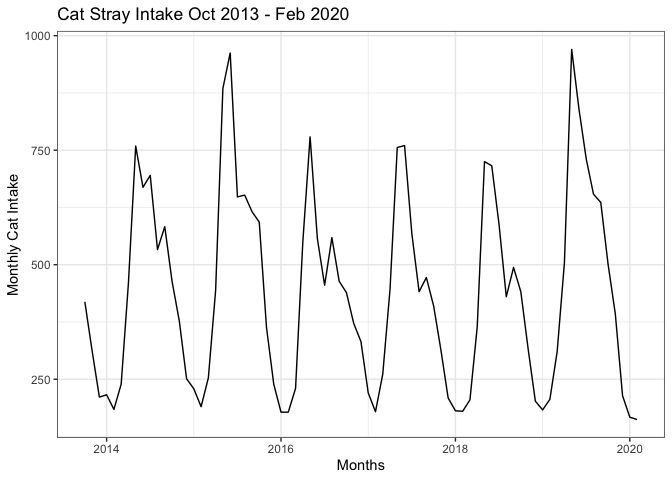

Partition Data
--------------

-   Training - 65 months or 5 years and 5 months (Oct 2013 to Feb 2019)
-   Test - last 12 months (Mar 2019 to Feb 2020)

``` r
TS_TRNG_SET <- window(TIME_SERIES, 
                      start=c(2013, 10), 
                      end  =c(2019,  2))

TS_TEST_SET <- window(TIME_SERIES,
                      start=c(2019,  3),
                      end  =c(2020,  2))

N_TEST_SET <- length(TS_TEST_SET)

TS_TEST_SET
```

    ##      Jan Feb Mar Apr May Jun Jul Aug Sep Oct Nov Dec
    ## 2019         310 504 970 840 731 654 636 502 393 214
    ## 2020 167 162

Smoothing Models
================

Simple Moving Average
---------------------

Use `smooth::sma()`

**Fit Model**

``` r
MODEL_SMA <- sma(TS_TRNG_SET, order=NULL, holdout=FALSE, silent="none")
```

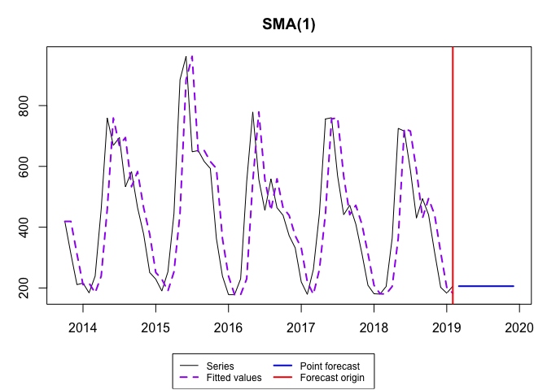

``` r
summary(MODEL_SMA)
```

    ## Time elapsed: 0.09 seconds
    ## Model estimated: SMA(1)
    ## Initial values were produced using backcasting.
    ## 
    ## Loss function type: MSE; Loss function value: 20959.1538
    ## Error standard deviation: 147.0528
    ## Sample size: 65
    ## Number of estimated parameters: 2
    ## Number of degrees of freedom: 63
    ## Information criteria:
    ##      AIC     AICc      BIC     BICc 
    ## 835.2335 835.4271 839.5823 839.9863

Optimal width/window is just the last 1 observation (as noted in title of chart output).

That is not much of a moving average - the fitted/forecasted value is just equal to the prior month.

**Forecast/Predict Values for Test Set**

``` r
FC_SMA <- forecast(MODEL_SMA, h=N_TEST_SET)
FC_SMA$mean
```

    ##      Jan Feb Mar Apr May Jun Jul Aug Sep Oct Nov Dec
    ## 2019         206 206 206 206 206 206 206 206 206 206
    ## 2020 206 206

The forecast is flat - just the last value in the training data set repeats since we are not pulling in any other data points from the training set (at just a moving average of 1 value).

Plot

-   the full time series of cat intake (includes both the training and test data)
-   the fitted values
-   the forecast for the next 12 months

``` r
autoplot(TIME_SERIES, color="darkgray") +
  ggtitle("Cage: Simple Moving Average (1)") +  
  xlab(label_xaxis) + ylab(label_yaxis) +
  theme(legend.position = "bottom") +
  guides(colour=guide_legend(title="")) +

  # fitted values    
  autolayer(fitted(MODEL_SMA), series="Simple Moving Average", lwd=0.5) +
  
  # forecasted values  
  autolayer(FC_SMA,            series="Simple Moving Average", PI=FALSE, lwd=1, lty=1)
```

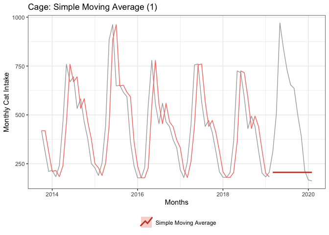

**Assess Accuracy of Model**

Manually Calculate

``` r
ACTUAL    <- as.numeric(TS_TEST_SET)
PREDICTED <- as.numeric(FC_SMA$forecast)

MODEL_ACCURACY <- data.frame(
  Model    = "Simple Moving Average",
  RMSE     = Metrics::rmse(ACTUAL, PREDICTED),
  MAE      = Metrics::mae( ACTUAL, PREDICTED),
  MAPE     = Metrics::mape(ACTUAL, PREDICTED),
  AdjRsqrd = NA
)

MODEL_COMPARISON <- MODEL_ACCURACY
MODEL_COMPARISON
```

    ##                   Model     RMSE    MAE     MAPE AdjRsqrd
    ## 1 Simple Moving Average 395.0324 314.75 0.513037       NA

Forecast not very good - happens to be a low value projected across all 12 months of the forecast period, so a lot of error.

Simple Exponential Smoothing (Level)
------------------------------------

This approach is inappropriate since the time series has trend and seasonality, but walk through the steps for experience.

Also, recall SES has a flat forecast beyond the one-step ahead.

Use `ses()` from `forecast` pacakge where ses, holt and hw are simply convenient wrapper functions for forecast(ets(...)).

**Fit Model & Forecast in One-Step**

``` r
FC_SES <- forecast::ses(TS_TRNG_SET, h=N_TEST_SET)
FC_SES$model
```

    ## Simple exponential smoothing 
    ## 
    ## Call:
    ##  forecast::ses(y = TS_TRNG_SET, h = N_TEST_SET) 
    ## 
    ##   Smoothing parameters:
    ##     alpha = 0.9999 
    ## 
    ##   Initial states:
    ##     l = 412.6038 
    ## 
    ##   sigma:  147.06
    ## 
    ##      AIC     AICc      BIC 
    ## 924.1130 924.5065 930.6362

``` r
autoplot(TIME_SERIES, color="darkgray") +
  ggtitle("Cat: Simple Expo Smoothing") + 
  xlab(label_xaxis) + ylab(label_yaxis) +
  theme(legend.position = "bottom") +
  guides(colour=guide_legend(title="")) +

  # fitted values
  autolayer(fitted(FC_SES),    series="Simple Expo Smoothing", lwd=0.5) +

  # forecasted values
  autolayer(FC_SES,            series="Simple Expo Smoothing", PI=FALSE, lwd=1, lty=1)
```

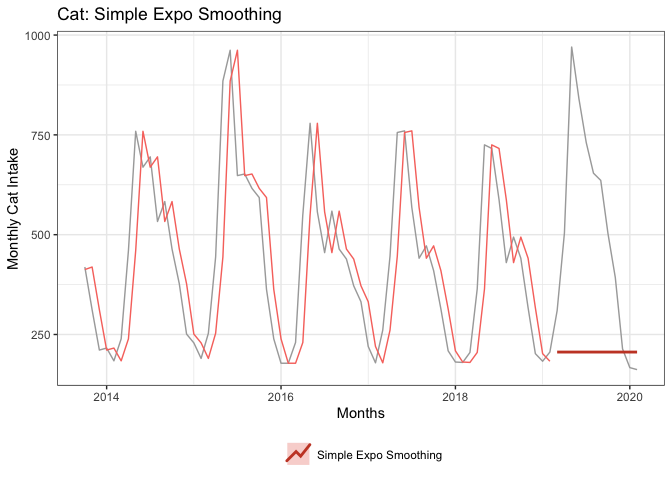

Actual forecasted values.

``` r
FC_SES$mean
```

    ##           Jan      Feb      Mar      Apr      May      Jun      Jul      Aug
    ## 2019                   205.9977 205.9977 205.9977 205.9977 205.9977 205.9977
    ## 2020 205.9977 205.9977                                                      
    ##           Sep      Oct      Nov      Dec
    ## 2019 205.9977 205.9977 205.9977 205.9977
    ## 2020

Nearly identical to SMA (forecasted a value of 206). The alpha smoothing parameter is nearly 1 (0.9999), which puts a ton of weight on the last value and almost no weight on prior values. So that is pretty close to the same effect as a simple moving average of the just the last value.

``` r
accuracy(FC_SES, TS_TEST_SET)
```

    ##                      ME     RMSE      MAE      MPE     MAPE     MASE      ACF1
    ## Training set  -3.178874 144.7798 107.4093 -6.04244 25.50572 1.582622 0.3376780
    ## Test set     300.918966 395.0341 314.7515 42.88537 51.30387 4.637707 0.6745015
    ##              Theil's U
    ## Training set        NA
    ## Test set      1.798021

Manually Calculate

``` r
ACTUAL    <- as.numeric(TS_TEST_SET)
PREDICTED <- as.numeric(FC_SES$mean)

MODEL_ACCURACY <- data.frame(
  Model    = "Simple Expo Smoothing",
  RMSE     = Metrics::rmse(ACTUAL, PREDICTED),
  MAE      = Metrics::mae( ACTUAL, PREDICTED),
  MAPE     = Metrics::mape(ACTUAL, PREDICTED),
  AdjRsqrd = NA
)

MODEL_COMPARISON <- rbind(MODEL_COMPARISON, MODEL_ACCURACY)
MODEL_COMPARISON
```

    ##                   Model     RMSE      MAE      MAPE AdjRsqrd
    ## 1 Simple Moving Average 395.0324 314.7500 0.5130370       NA
    ## 2 Simple Expo Smoothing 395.0341 314.7515 0.5130387       NA

Result - equally awful!

Holt Smoothing (Level & Trend)
------------------------------

Smooth level and trends. Again not the most appropriate given our data has some seasonality.

``` r
FC_HOLT <- forecast::holt(TS_TRNG_SET, h=N_TEST_SET, exponential = FALSE)

FC_HOLT$model
```

    ## Holt's method 
    ## 
    ## Call:
    ##  forecast::holt(y = TS_TRNG_SET, h = N_TEST_SET, exponential = FALSE) 
    ## 
    ##   Smoothing parameters:
    ##     alpha = 0.9999 
    ##     beta  = 2e-04 
    ## 
    ##   Initial states:
    ##     l = 113.5105 
    ##     b = 4.6572 
    ## 
    ##   sigma:  154.5274
    ## 
    ##      AIC     AICc      BIC 
    ## 932.4551 933.4720 943.3270

``` r
autoplot(TIME_SERIES, color="darkgray") +
  ggtitle("Cat: Holt Smoothing (Level & Trend)") + 
  xlab(label_xaxis) + ylab(label_yaxis) +
  theme(legend.position = "bottom") +
  guides(colour=guide_legend(title="")) +

  # fitted values  
  autolayer(fitted(FC_HOLT),    series="Holt Smoothing", lwd=0.5) +

  # forecasted values  
  autolayer(FC_HOLT,            series="Holt Smoothing", PI=FALSE, lwd=1, lty=1)
```

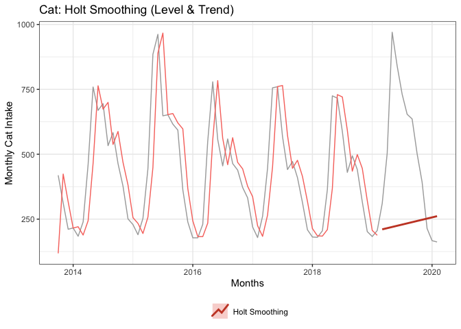

Forecasted Values

Trend up a bit rather than a flat forecast.

``` r
FC_HOLT$mean
```

    ##           Jan      Feb      Mar      Apr      May      Jun      Jul      Aug
    ## 2019                   210.6104 215.2227 219.8350 224.4473 229.0595 233.6718
    ## 2020 256.7332 261.3455                                                      
    ##           Sep      Oct      Nov      Dec
    ## 2019 238.2841 242.8964 247.5087 252.1209
    ## 2020

``` r
accuracy(FC_HOLT, TS_TEST_SET)
```

    ##                      ME     RMSE      MAE       MPE     MAPE     MASE     ACF1
    ## Training set  -3.268989 149.6972 113.0018 -6.332052 27.08360 1.665025 0.294668
    ## Test set     270.938704 379.6268 308.8053 32.600728 54.74579 4.550092 0.692355
    ##              Theil's U
    ## Training set        NA
    ## Test set       1.80248

Manually Calculate

``` r
ACTUAL    <- as.numeric(TS_TEST_SET)
PREDICTED <- as.numeric(FC_HOLT$mean)

MODEL_ACCURACY <- data.frame(
  Model    = "Holt Expo Smoothing",
  RMSE     = Metrics::rmse(ACTUAL, PREDICTED),
  MAE      = Metrics::mae( ACTUAL, PREDICTED),
  MAPE     = Metrics::mape(ACTUAL, PREDICTED),
  AdjRsqrd = NA
)

MODEL_COMPARISON <- rbind(MODEL_COMPARISON, MODEL_ACCURACY)
MODEL_COMPARISON
```

    ##                   Model     RMSE      MAE      MAPE AdjRsqrd
    ## 1 Simple Moving Average 395.0324 314.7500 0.5130370       NA
    ## 2 Simple Expo Smoothing 395.0341 314.7515 0.5130387       NA
    ## 3   Holt Expo Smoothing 379.6268 308.8053 0.5474579       NA

Still awful results!

Holt Winters Smoothing (Level, Trend, Seasonality)
--------------------------------------------------

``` r
FC_HW <- forecast::hw(TS_TRNG_SET, h=N_TEST_SET, 
                      exponential = FALSE,
                      seasonal    = "additive")
FC_HW$model
```

    ## Holt-Winters' additive method 
    ## 
    ## Call:
    ##  forecast::hw(y = TS_TRNG_SET, h = N_TEST_SET, seasonal = "additive",  
    ## 
    ##  Call:
    ##      exponential = FALSE) 
    ## 
    ##   Smoothing parameters:
    ##     alpha = 0.3618 
    ##     beta  = 2e-04 
    ##     gamma = 1e-04 
    ## 
    ##   Initial states:
    ##     l = 417.8914 
    ##     b = 2.1389 
    ##     s = 86.6457 73.0417 160.7774 292.4028 331.3452 18.5045
    ##            -209.4314 -250.0547 -240.3141 -186.623 -88.062 11.7681
    ## 
    ##   sigma:  67.1626
    ## 
    ##      AIC     AICc      BIC 
    ## 833.8934 846.9147 870.8580

``` r
autoplot(TIME_SERIES, color="darkgray", lty=2) +
  ggtitle("Cat: Holt-Winters Smoothing (Level, Trend & Seasonality)") +
  xlab(label_xaxis) + ylab(label_yaxis) +
  theme(legend.position = "bottom") +
  guides(colour=guide_legend(title="")) +

  # fitted values
  autolayer(fitted(FC_HW),      series="Holt-Winters Smoothing", lwd=0.5) +
  
  # forecasted values
  autolayer(FC_HW,              series="Holt-Winters Smoothing", PI=FALSE, lwd=1, lty=1)
```

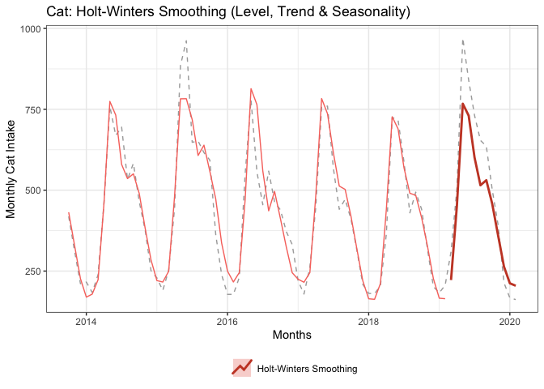

Much better fit/approach. The appropriate technique matters.

``` r
accuracy(FC_HW, TS_TEST_SET)
```

    ##                     ME      RMSE      MAE       MPE     MAPE     MASE
    ## Training set -5.361593  58.31344 41.27727 -2.589218 10.44351 0.608200
    ## Test set     63.733268 100.04620 86.68570  5.703122 18.48557 1.277271
    ##                    ACF1 Theil's U
    ## Training set 0.09482799        NA
    ## Test set     0.60053647 0.5078192

Manually Calculate

``` r
ACTUAL    <- as.numeric(TS_TEST_SET)
PREDICTED <- as.numeric(FC_HW$mean)

MODEL_ACCURACY <- data.frame(
  Model    = "Holt-Winters Smoothing",
  RMSE     = Metrics::rmse(ACTUAL, PREDICTED),
  MAE      = Metrics::mae( ACTUAL, PREDICTED),
  MAPE     = Metrics::mape(ACTUAL, PREDICTED),
  AdjRsqrd = NA
)

MODEL_COMPARISON <- rbind(MODEL_COMPARISON, MODEL_ACCURACY)
MODEL_COMPARISON
```

    ##                    Model     RMSE      MAE      MAPE AdjRsqrd
    ## 1  Simple Moving Average 395.0324 314.7500 0.5130370       NA
    ## 2  Simple Expo Smoothing 395.0341 314.7515 0.5130387       NA
    ## 3    Holt Expo Smoothing 379.6268 308.8053 0.5474579       NA
    ## 4 Holt-Winters Smoothing 100.0462  86.6857 0.1848557       NA

Better! On average, the Holt-Winters Smoothing model is off by 100 cats (about 18%) per month.

``` r
checkresiduals(FC_HW$model)
```

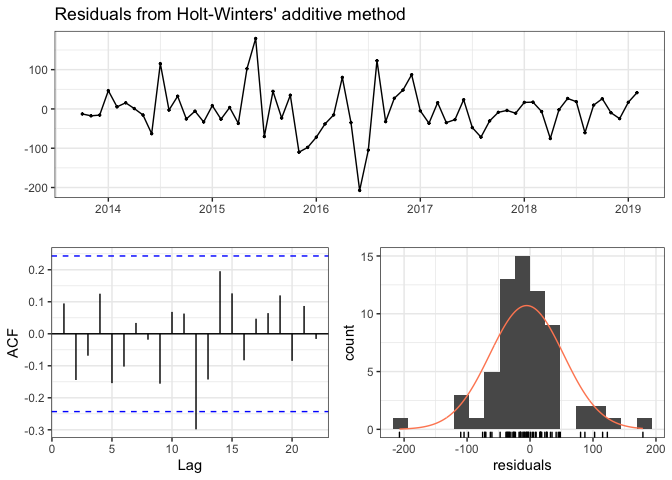

    ## 
    ##  Ljung-Box test
    ## 
    ## data:  Residuals from Holt-Winters' additive method
    ## Q* = 24.945, df = 3, p-value = 1.585e-05
    ## 
    ## Model df: 16.   Total lags used: 19

(stat) Holt Winters Smoothing (Level, Trend, Seasonality)
---------------------------------------------------------

Use `HoltWinters()` from the `stats` package rather than the equivalent function in the `forecast` package which uses `ets()` under the covers.

Notes on difference between stats::HoltWinters() and forecast::hw()

-   <https://stats.stackexchange.com/questions/312811/implementation-difference-between-holtwinters-and-hw-functions-of-rs-forecast-p>
-   <https://robjhyndman.com/hyndsight/estimation2/>

**Fit Model**

``` r
MODEL_HWstat <- stats::HoltWinters(TS_TRNG_SET)
MODEL_HWstat
```

    ## Holt-Winters exponential smoothing with trend and additive seasonal component.
    ## 
    ## Call:
    ## stats::HoltWinters(x = TS_TRNG_SET)
    ## 
    ## Smoothing parameters:
    ##  alpha: 0.3368118
    ##  beta : 0.009381388
    ##  gamma: 0.2960204
    ## 
    ## Coefficients:
    ##            [,1]
    ## a    443.634764
    ## b      2.968928
    ## s1  -233.828026
    ## s2    -6.943510
    ## s3   316.924457
    ## s4   256.236652
    ## s5   157.007450
    ## s6    69.427708
    ## s7    97.509926
    ## s8    29.887778
    ## s9   -83.733214
    ## s10 -199.737477
    ## s11 -247.263272
    ## s12 -269.632038

``` r
autoplot(MODEL_HWstat$x, series="Data", color="darkgray") +
  autolayer(MODEL_HWstat$fitted[,2], series="Level") +
  autolayer(MODEL_HWstat$fitted[,3], series="Slope") +
  autolayer(MODEL_HWstat$fitted[,4], series="Season") +

  ggtitle("Holt-Winter Smoothing Components") +
  xlab(label_xaxis) + ylab(label_yaxis) +
  theme(legend.position = "bottom") +
  guides(colour=guide_legend(title=""))
```

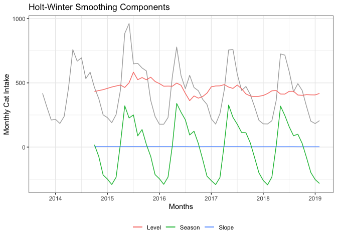

``` r
# ggsave(filename = "figures/02_MOD_Cat_HoltWinters_Smoothing.png",
#        height=4, width=6, units="in")
```

``` r
# autoplot(MODEL_HWstat$fitted, facets = FALSE)

autoplot(MODEL_HWstat$fitted[,1], series="Fitted", lwd=1.5) +
  autolayer(MODEL_HWstat$fitted[,2], series="Level",  lty=2, lwd=.5) +
  autolayer(MODEL_HWstat$fitted[,3], series="Slope",  lty=3, lwd=.5) +
  autolayer(MODEL_HWstat$fitted[,4], series="Season", lty=2, lwd=.5) +

  ggtitle("Holt-Winter: Fitted Values from Components") +
  xlab(label_xaxis) + ylab(label_yaxis) +
  theme(legend.position = "bottom") +
  guides(colour=guide_legend(title=""))
```

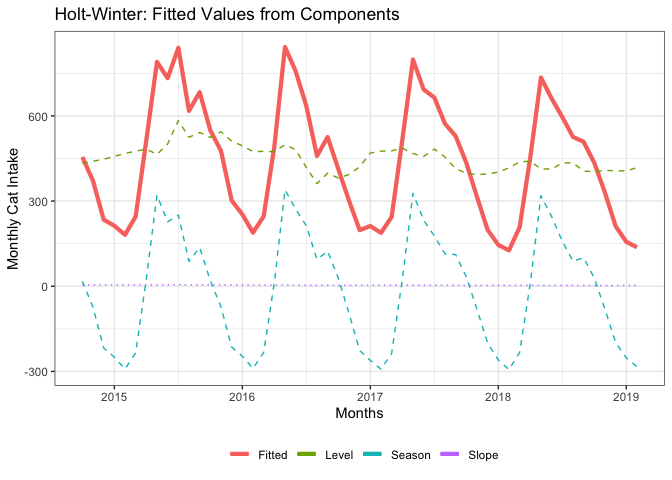

``` r
# ggsave(filename = "figures/02_MOD_Cat_HoltWinters_Components.png",
#         height=4, width=6, units="in")
```

Illustrates the smoothed components (level, slope & season) are combined to produce the Holt-Winters model's fitted value.

-   The fitted value (thick red line) is simply the sum of the components.
-   There is no perceptible change in the Slope component.
-   The Level component is essentially pushing up or pulling down the Seasonally smoothed component.

``` r
FC_HWstat <- predict(MODEL_HWstat, n.ahead = N_TEST_SET)
FC_HWstat
```

    ##           Jan      Feb      Mar      Apr      May      Jun      Jul      Aug
    ## 2019                   212.7757 442.6291 769.4660 711.7471 615.4869 530.8760
    ## 2020 229.0297 209.6299                                                      
    ##           Sep      Oct      Nov      Dec
    ## 2019 561.9272 497.2740 386.6219 273.5866
    ## 2020

``` r
autoplot(TIME_SERIES, color="darkgray", lty=2) +
  ggtitle("Cat: (stat) Holt-Winters Smoothing (Level, Trend & Seasonality)") +
  xlab(label_xaxis) + ylab(label_yaxis) +
  theme(legend.position = "bottom") +
  guides(colour=guide_legend(title="")) +

  # fitted values  
  autolayer(fitted(MODEL_HWstat)[,c("xhat")], series="stat::Holt-Winters", lwd=0.5) +
  
  # forecasted values
  autolayer(FC_HWstat,                        series="stat::Holt-Winters", lwd=1, lty=1) 
```

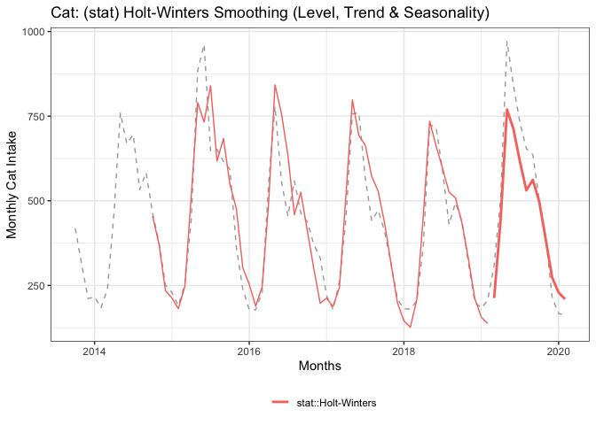

Plot comparison with Benchmark (Seasonal Naive)

``` r
# create seasonal naive forecast for comparison
FC_SEASONAL_NAIVE <- snaive(TS_TRNG_SET, h=N_TEST_SET)

autoplot(TIME_SERIES, color="darkgray") +
  ggtitle("Cat: Holt-Winters vs. Seasonal Naive") +
  xlab(label_xaxis) + ylab(label_yaxis) +
  theme(legend.position = "bottom") +
  guides(colour=guide_legend(title="")) +

  # fitted values
  autolayer(fitted(MODEL_HWstat)[,c("xhat")], series="Holt-Winters", lwd=0.75) +
  
  # forecasted values
  autolayer(FC_HWstat,                        series="Holt-Winters", lwd=1, lty=1) +

  # seasonal naive forecast
  autolayer(FC_SEASONAL_NAIVE,         series="Seasonal Naive", PI=FALSE, lwd=.75, lty=1)
```

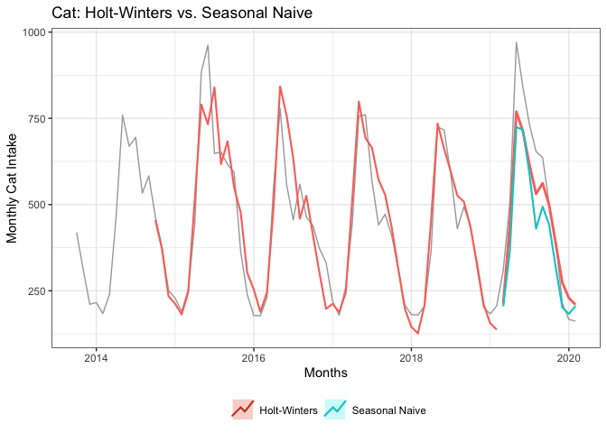

``` r
# ggsave(filename = "figures/02_MOD_Cat_HoltWinters_vs_Naive.png",
#          height=4, width=6, units="in")
```

``` r
checkresiduals(MODEL_HWstat)
```

    ## Warning in modeldf.default(object): Could not find appropriate degrees of
    ## freedom for this model.

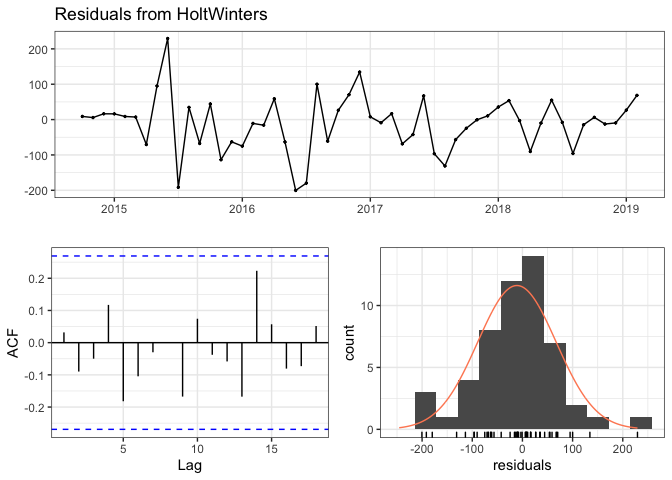

-   Does not look like any autocorrelation.
-   Histogram mostly normal distribution - peak slight above zero, a few large negative errors (-200)

**Assess Accuracy**

``` r
ACTUAL    <- as.numeric(TS_TEST_SET)
PREDICTED <- as.numeric(FC_HWstat)

MODEL_ACCURACY <- data.frame(
  Model    = "stat::Holt-Winters",
  RMSE     = Metrics::rmse(ACTUAL, PREDICTED),
  MAE      = Metrics::mae( ACTUAL, PREDICTED),
  MAPE     = Metrics::mape(ACTUAL, PREDICTED),
  AdjRsqrd = NA
)

MODEL_COMPARISON <- rbind(MODEL_COMPARISON, MODEL_ACCURACY)
MODEL_COMPARISON
```

    ##                    Model      RMSE       MAE      MAPE AdjRsqrd
    ## 1  Simple Moving Average 395.03238 314.75000 0.5130370       NA
    ## 2  Simple Expo Smoothing 395.03413 314.75153 0.5130387       NA
    ## 3    Holt Expo Smoothing 379.62684 308.80531 0.5474579       NA
    ## 4 Holt-Winters Smoothing 100.04620  86.68570 0.1848557       NA
    ## 5     stat::Holt-Winters  97.29726  81.70352 0.1855913       NA

Similar accuracy as forecast's implementation of Holt-Winters Smoothing

``` r
#write_csv(MODEL_COMPARISON, "data/results_cat_smoothing.csv")
```
