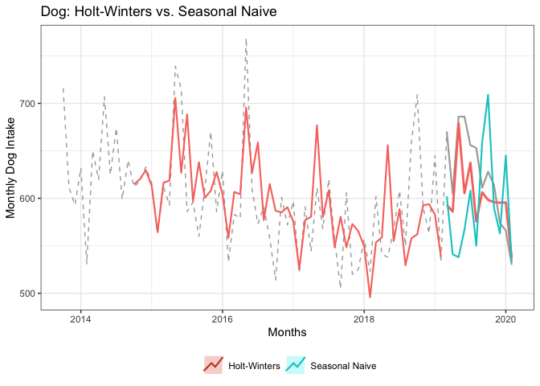

Smoothing Models for Dogs
================

-   [Setup](#setup)
    -   [Load Packages](#load-packages)
    -   [Load Data & Create Time Series](#load-data-create-time-series)
    -   [Partition Data](#partition-data)
-   [Smoothing Models](#smoothing-models)
    -   [Simple Moving Average](#simple-moving-average)
    -   [Simple Exponential Smoothing (Level)](#simple-exponential-smoothing-level)
    -   [Holt Smoothing (Level & Trend)](#holt-smoothing-level-trend)
    -   [Holt Winters Smoothing (Level, Trend, Seasonality)](#holt-winters-smoothing-level-trend-seasonality)
    -   [(stat) Holt Winters Smoothing (Level, Trend, Seasonality)](#stat-holt-winters-smoothing-level-trend-seasonality)

Setup
=====

Load Packages
-------------

``` r
library(tidyverse)
```

    ## ── Attaching packages ───────────────────────────────────────────────────────────────────────────────────────────── tidyverse 1.3.0 ──

    ## ✓ ggplot2 3.3.2     ✓ purrr   0.3.4
    ## ✓ tibble  3.0.1     ✓ dplyr   1.0.0
    ## ✓ tidyr   1.0.2     ✓ stringr 1.4.0
    ## ✓ readr   1.3.1     ✓ forcats 0.4.0

    ## ── Conflicts ──────────────────────────────────────────────────────────────────────────────────────────────── tidyverse_conflicts() ──
    ## x dplyr::filter() masks stats::filter()
    ## x dplyr::lag()    masks stats::lag()

``` r
library(ggplot2)
library(forecast)
```

    ## Registered S3 method overwritten by 'quantmod':
    ##   method            from
    ##   as.zoo.data.frame zoo

``` r
library(smooth)
```

    ## Loading required package: greybox

    ## Package "greybox", v0.6.2 loaded.

    ## 
    ## Attaching package: 'greybox'

    ## The following object is masked from 'package:tidyr':
    ## 
    ##     spread

    ## This is package "smooth", v2.6.0

``` r
theme_set(theme_bw())
```

Load Data & Create Time Series
------------------------------

-   Original data ranged from Oct 2013 to Aug 2020
-   Subset data to drop months after Feb 2020 (impacted by COVID-19 lockdowns). This leaves 77 months (or 6 years and 5 months) of animal intake from Oct 2013 to Feb 2020
-   Create time-series object with data for only the intake of **dogs**

``` r
DATA_ORIGINAL <- read.csv("data/Austin_AC_Monthly_Strays.csv", stringsAsFactors = FALSE)
# str(DATA_ORIGINAL)

DATA_SUBSET <- subset(DATA_ORIGINAL, IN_YRMO <= "2020-02")

TIME_SERIES <- ts(data      = DATA_SUBSET[,c("Dog")],    # only include Dogs 
                  start     = c(2013, 10), 
                  end       = c(2020,  2), 
                  frequency = 12)
```

Plot the intake of stray dogs

``` r
label_title = "Dog Stray Intake Oct 2013 - Feb 2020"
label_xaxis = "Months"
label_yaxis = "Monthly Dog Intake"

autoplot(TIME_SERIES) +
  ggtitle(label_title) +
  xlab(label_xaxis) + ylab(label_yaxis) +
  theme(legend.position = "bottom") +
  guides(colour=guide_legend(title=""))
```


Partition Data
--------------

-   Training - 65 months or 5 years and 5 months (Oct 2013 to Feb 2019)
-   Test - last 12 months (Mar 2019 to Feb 2020)

``` r
TS_TRNG_SET <- window(TIME_SERIES, 
                      start=c(2013, 10), 
                      end  =c(2019,  2))

TS_TEST_SET <- window(TIME_SERIES,
                      start=c(2019,  3),
                      end  =c(2020,  2))

N_TEST_SET <- length(TS_TEST_SET)

TS_TEST_SET
```

    ##      Jan Feb Mar Apr May Jun Jul Aug Sep Oct Nov Dec
    ## 2019         670 605 686 686 656 653 611 628 614 574
    ## 2020 566 530

Smoothing Models
================

Simple Moving Average
---------------------

Use `smooth::sma()`

**Fit Model**

``` r
# order = NULL to select optimal window for moving average.

MODEL_SMA <- sma(TS_TRNG_SET, order=NULL, holdout=FALSE, silent="none")
```


``` r
summary(MODEL_SMA)
```

    ## Time elapsed: 0.08 seconds
    ## Model estimated: SMA(14)
    ## Initial values were produced using backcasting.
    ## 
    ## Loss function type: MSE; Loss function value: 2821.1635
    ## Error standard deviation: 53.9511
    ## Sample size: 65
    ## Number of estimated parameters: 2
    ## Number of degrees of freedom: 63
    ## Information criteria:
    ##      AIC     AICc      BIC     BICc 
    ## 704.8808 705.0744 709.2296 709.6336

Optimal width/window is last 14 observations (as noted in title of chart output).

**Forecast/Predict Values for Test Set**

``` r
FC_SMA <- forecast(MODEL_SMA, h=N_TEST_SET)
FC_SMA$mean
```

    ##           Jan      Feb      Mar      Apr      May      Jun      Jul      Aug
    ## 2019                   584.6429 586.6173 591.1614 590.3873 593.9149 597.9088
    ## 2020 591.2497 591.3389                                                      
    ##           Sep      Oct      Nov      Dec
    ## 2019 600.1166 599.5535 603.0931 599.0997
    ## 2020

Plot

-   the full time series of dog intake (includes both the training and test data)
-   the fitted values
-   the forecast for the next 12 months

``` r
autoplot(TIME_SERIES, color="darkgray") +
  ggtitle("Dog: Simple Moving Average (14)") +  
  xlab(label_xaxis) + ylab(label_yaxis) +
  theme(legend.position = "bottom") +
  guides(colour=guide_legend(title="")) +

  # fitted values    
  autolayer(fitted(MODEL_SMA), series="Simple Moving Average", lwd=0.5) +
  
  # forecasted values  
  autolayer(FC_SMA,            series="Simple Moving Average", PI=FALSE, lwd=1, lty=1)
```


**Assess Accuracy of Model**

Manually Calculate

``` r
ACTUAL    <- as.numeric(TS_TEST_SET)
PREDICTED <- as.numeric(FC_SMA$forecast)

MODEL_ACCURACY <- data.frame(
  Model    = "Simple Moving Average",
  RMSE     = Metrics::rmse(ACTUAL, PREDICTED),
  MAE      = Metrics::mae( ACTUAL, PREDICTED),
  MAPE     = Metrics::mape(ACTUAL, PREDICTED),
  AdjRsqrd = NA
)

MODEL_COMPARISON <- MODEL_ACCURACY
MODEL_COMPARISON
```

    ##                   Model     RMSE      MAE       MAPE AdjRsqrd
    ## 1 Simple Moving Average 56.80825 47.77437 0.07494688       NA

On average, forecast off by 57 dogs per month (or about 7.5%)

Simple Exponential Smoothing (Level)
------------------------------------

This approach is inappropriate since the time series has trend and seasonality, but walk through the steps for experience.

Also, recall SES has a flat forecast beyond the one-step ahead.

Use `ses()` from `forecast` pacakge where ses, holt and hw are simply convenient wrapper functions for forecast(ets(...)).

**Fit Model & Forecast in One-Step**

``` r
FC_SES <- forecast::ses(TS_TRNG_SET, h=N_TEST_SET)

FC_SES$model
```

    ## Simple exponential smoothing 
    ## 
    ## Call:
    ##  forecast::ses(y = TS_TRNG_SET, h = N_TEST_SET) 
    ## 
    ##   Smoothing parameters:
    ##     alpha = 0.1087 
    ## 
    ##   Initial states:
    ##     l = 628.9678 
    ## 
    ##   sigma:  55.0494
    ## 
    ##      AIC     AICc      BIC 
    ## 796.3738 796.7673 802.8970

``` r
autoplot(TIME_SERIES, color="darkgray") +
  ggtitle("Dog: Simple Expo Smoothing") + 
  xlab(label_xaxis) + ylab(label_yaxis) +
  theme(legend.position = "bottom") +
  guides(colour=guide_legend(title="")) +

  # fitted values
  autolayer(fitted(FC_SES),    series="Simple Expo Smoothing", lwd=0.5) +

  # forecasted values
  autolayer(FC_SES,            series="Simple Expo Smoothing", PI=FALSE, lwd=1, lty=1)
```


Forecasted Values

Again, SES has flat forecast estimates 1 step out and then carries that single value forward through the entire forecast period.

``` r
FC_SES$mean
```

    ##           Jan      Feb      Mar      Apr      May      Jun      Jul      Aug
    ## 2019                   586.4417 586.4417 586.4417 586.4417 586.4417 586.4417
    ## 2020 586.4417 586.4417                                                      
    ##           Sep      Oct      Nov      Dec
    ## 2019 586.4417 586.4417 586.4417 586.4417
    ## 2020

``` r
summary(residuals(FC_SES))
```

    ##    Min. 1st Qu.  Median    Mean 3rd Qu.    Max. 
    ## -99.960 -40.116 -13.938  -6.019   8.042 162.754

``` r
checkresiduals(FC_SES)
```


    ## 
    ##  Ljung-Box test
    ## 
    ## data:  Residuals from Simple exponential smoothing
    ## Q* = 19.026, df = 11, p-value = 0.06062
    ## 
    ## Model df: 2.   Total lags used: 13

-   Not much autocorrelation - lag 12 above significance line. Ljung-Box test not significant (p-value 0.061).
-   Mean of residuals not zero (-6.019). Histogram not normally distributed - peak on negative side. So some bias in the model.

``` r
accuracy(FC_SES, TS_TEST_SET)
```

    ##                     ME     RMSE      MAE       MPE     MAPE      MASE
    ## Training set -6.018883 54.19589 41.88115 -1.725869 6.945186 0.9522526
    ## Test set     36.808257 60.04611 51.69580  5.338113 8.076204 1.1754085
    ##                    ACF1 Theil's U
    ## Training set 0.01173248        NA
    ## Test set     0.48561782  1.436564

Manual Calculate

``` r
ACTUAL    <- as.numeric(TS_TEST_SET)
PREDICTED <- as.numeric(FC_SES$mean)

MODEL_ACCURACY <- data.frame(
  Model    = "Simple Expo Smoothing",
  RMSE     = Metrics::rmse(ACTUAL, PREDICTED),
  MAE      = Metrics::mae( ACTUAL, PREDICTED),
  MAPE     = Metrics::mape(ACTUAL, PREDICTED),
  AdjRsqrd = NA
)

MODEL_COMPARISON <- rbind(MODEL_COMPARISON, MODEL_ACCURACY)
MODEL_COMPARISON
```

    ##                   Model     RMSE      MAE       MAPE AdjRsqrd
    ## 1 Simple Moving Average 56.80825 47.77437 0.07494688       NA
    ## 2 Simple Expo Smoothing 60.04611 51.69580 0.08076204       NA

SES slightly worse than SMA. On average, forecast off by 60 dogs per month (or about 8%)

Holt Smoothing (Level & Trend)
------------------------------

Smooth level and trends. Again not the most appropriate given our data has some seasonality.

``` r
FC_HOLT <- forecast::holt(TS_TRNG_SET, h=N_TEST_SET, 
                          exponential = FALSE, 
                          damped      = TRUE)

FC_HOLT$model
```

    ## Damped Holt's method 
    ## 
    ## Call:
    ##  forecast::holt(y = TS_TRNG_SET, h = N_TEST_SET, damped = TRUE,  
    ## 
    ##  Call:
    ##      exponential = FALSE) 
    ## 
    ##   Smoothing parameters:
    ##     alpha = 0.0473 
    ##     beta  = 1e-04 
    ##     phi   = 0.98 
    ## 
    ##   Initial states:
    ##     l = 635.0275 
    ##     b = -1.6211 
    ## 
    ##   sigma:  55.1769
    ## 
    ##      AIC     AICc      BIC 
    ## 799.5031 800.9513 812.5494

``` r
autoplot(TIME_SERIES, color="darkgray") +
  ggtitle("Dog: Holt Smoothing (Level & Trend)") + 
  xlab(label_xaxis) + ylab(label_yaxis) +
  theme(legend.position = "bottom") +
  guides(colour=guide_legend(title="")) +

  # fitted values  
  autolayer(fitted(FC_HOLT),    series="Holt Smoothing", lwd=0.5) +

  # forecasted values  
  autolayer(FC_HOLT,            series="Holt Smoothing", PI=FALSE, lwd=1, lty=1)
```


Forecasted Values

Slightly downward trend.

``` r
FC_HOLT$mean
```

    ##           Jan      Feb      Mar      Apr      May      Jun      Jul      Aug
    ## 2019                   575.3775 574.9584 574.5477 574.1452 573.7508 573.3643
    ## 2020 571.5445 571.2021                                                      
    ##           Sep      Oct      Nov      Dec
    ## 2019 572.9855 572.6142 572.2504 571.8939
    ## 2020

``` r
summary(residuals(FC_HOLT))
```

    ##     Min.  1st Qu.   Median     Mean  3rd Qu.     Max. 
    ## -97.3556 -30.1950  -8.6033  -0.3449  19.8543 168.1418

``` r
checkresiduals(FC_HOLT)
```


    ## 
    ##  Ljung-Box test
    ## 
    ## data:  Residuals from Damped Holt's method
    ## Q* = 17.56, df = 8, p-value = 0.02478
    ## 
    ## Model df: 5.   Total lags used: 13

-   Some autocorrelation? - lag 12 above significance line. Ljung-Box test is significant (p-value 0.025). There is still some information in the time series the model is not extracting.
-   Mean of residuals not zero (-0.3449). Histogram is more normally (than SES) but some peak on negative side, and small bump on right tail. Maybe some slight bias in the model.

``` r
accuracy(FC_HOLT, TS_TEST_SET)
```

    ##                      ME     RMSE      MAE        MPE     MAPE      MASE
    ## Training set -0.3449311 53.01221 39.07388 -0.7876061 6.432001 0.8884237
    ## Test set     50.0304592 68.24240 57.82155  7.4856460 8.944574 1.3146900
    ##                   ACF1 Theil's U
    ## Training set 0.0472535        NA
    ## Test set     0.4754796  1.618576

Manually Calculate

``` r
ACTUAL    <- as.numeric(TS_TEST_SET)
PREDICTED <- as.numeric(FC_HOLT$mean)

MODEL_ACCURACY <- data.frame(
  Model    = "Holt Smoothing",
  RMSE     = Metrics::rmse(ACTUAL, PREDICTED),
  MAE      = Metrics::mae( ACTUAL, PREDICTED),
  MAPE     = Metrics::mape(ACTUAL, PREDICTED),
  AdjRsqrd = NA
)

MODEL_COMPARISON <- rbind(MODEL_COMPARISON, MODEL_ACCURACY)
MODEL_COMPARISON
```

    ##                   Model     RMSE      MAE       MAPE AdjRsqrd
    ## 1 Simple Moving Average 56.80825 47.77437 0.07494688       NA
    ## 2 Simple Expo Smoothing 60.04611 51.69580 0.08076204       NA
    ## 3        Holt Smoothing 68.24240 57.82155 0.08944574       NA

Holt Smoothing (Level & Trend) accuracy is worse the SES. On average, model forecast off by 68 dogs per month (about 9%)

Holt Winters Smoothing (Level, Trend, Seasonality)
--------------------------------------------------

``` r
FC_HW <- forecast::hw(TS_TRNG_SET, h=N_TEST_SET, 
                      exponential = FALSE, damped = TRUE,
                      seasonal    = "additive")
#                      seasonal    = "multiplicative")

FC_HW$model
```

    ## Damped Holt-Winters' additive method 
    ## 
    ## Call:
    ##  forecast::hw(y = TS_TRNG_SET, h = N_TEST_SET, seasonal = "additive",  
    ## 
    ##  Call:
    ##      damped = TRUE, exponential = FALSE) 
    ## 
    ##   Smoothing parameters:
    ##     alpha = 0.1679 
    ##     beta  = 0.0042 
    ##     gamma = 3e-04 
    ##     phi   = 0.8003 
    ## 
    ##   Initial states:
    ##     l = 642.6748 
    ##     b = -3.0443 
    ##     s = -24.5486 -19.143 19.04 19.7404 77.4848 -21.6911
    ##            9.4155 -57.3569 12.8827 -18.157 1.3248 1.0084
    ## 
    ##   sigma:  49.459
    ## 
    ##      AIC     AICc      BIC 
    ## 794.7768 809.6464 833.9158

``` r
autoplot(TIME_SERIES, color="darkgray", lty=2) +
  ggtitle("Dog: Holt-Winters Smoothing (Level, Trend & Seasonality)") +
  xlab(label_xaxis) + ylab(label_yaxis) +
  theme(legend.position = "bottom") +
  guides(colour=guide_legend(title="")) +

  # fitted values
  autolayer(fitted(FC_HW),      series="Holt-Winters Smoothing", lwd=0.5) +
  
  # forecasted values
  autolayer(FC_HW,              series="Holt-Winters Smoothing", PI=FALSE, lwd=1, lty=1)
```


Looks like a better fit.

``` r
summary(residuals(FC_HW))
```

    ##     Min.  1st Qu.   Median     Mean  3rd Qu.     Max. 
    ## -104.960  -23.264   -8.662   -2.330   16.855  129.670

``` r
checkresiduals(FC_HW)
```


    ## 
    ##  Ljung-Box test
    ## 
    ## data:  Residuals from Damped Holt-Winters' additive method
    ## Q* = 25.006, df = 3, p-value = 1.539e-05
    ## 
    ## Model df: 17.   Total lags used: 20

-   Autocorrelation? - no lags above significance line. Ljung-Box test is strongly significant (p-value 1.539e-05). Indicating the residuals don't appear to be white noise - so perhaps some more information can be extracted to forecast the time-series.
-   Mean of residuals not zero (-2.330). Histogram kind of normally distribute, but peak on negative side, and bump on right tail/outliers. Maybe some bias in the model.

``` r
accuracy(FC_HW, TS_TEST_SET)
```

    ##                     ME     RMSE      MAE       MPE     MAPE      MASE
    ## Training set -2.329564 42.50199 31.49211 -0.814601 5.187709 0.7160367
    ## Test set     21.229454 39.85275 33.63260  3.102933 5.320167 0.7647051
    ##                    ACF1 Theil's U
    ## Training set 0.09308936        NA
    ## Test set     0.47160025 0.9284378

Manually Calculate

``` r
ACTUAL    <- as.numeric(TS_TEST_SET)
PREDICTED <- as.numeric(FC_HW$mean)

MODEL_ACCURACY <- data.frame(
  Model    = "Holt-Winters Smoothing",
  RMSE     = Metrics::rmse(ACTUAL, PREDICTED),
  MAE      = Metrics::mae( ACTUAL, PREDICTED),
  MAPE     = Metrics::mape(ACTUAL, PREDICTED),
  AdjRsqrd = NA
)

MODEL_COMPARISON <- rbind(MODEL_COMPARISON, MODEL_ACCURACY)
MODEL_COMPARISON
```

    ##                    Model     RMSE      MAE       MAPE AdjRsqrd
    ## 1  Simple Moving Average 56.80825 47.77437 0.07494688       NA
    ## 2  Simple Expo Smoothing 60.04611 51.69580 0.08076204       NA
    ## 3         Holt Smoothing 68.24240 57.82155 0.08944574       NA
    ## 4 Holt-Winters Smoothing 39.85275 33.63260 0.05320167       NA

Much better results when using appropriate technique (factor in seasonality). On average forecast off by 40 dogs per month (5%).

(stat) Holt Winters Smoothing (Level, Trend, Seasonality)
---------------------------------------------------------

Use `HoltWinters()` from the `stats` package rather than the equivalent function in the `forecast` package which uses `ets()` under the covers.

Notes on difference between stats::HoltWinters() and forecast::hw()

-   <https://stats.stackexchange.com/questions/312811/implementation-difference-between-holtwinters-and-hw-functions-of-rs-forecast-p>
-   <https://robjhyndman.com/hyndsight/estimation2/>

**Fit Model**

``` r
MODEL_HWstat <- stats::HoltWinters(TS_TRNG_SET)
MODEL_HWstat
```

    ## Holt-Winters exponential smoothing with trend and additive seasonal component.
    ## 
    ## Call:
    ## stats::HoltWinters(x = TS_TRNG_SET)
    ## 
    ## Smoothing parameters:
    ##  alpha: 0.1538457
    ##  beta : 0
    ##  gamma: 0.08231473
    ## 
    ## Coefficients:
    ##             [,1]
    ## a   601.50146373
    ## b    -0.01704545
    ## s1   -8.46823080
    ## s2  -15.40151394
    ## s3   77.59403858
    ## s4    3.95262833
    ## s5   36.06608128
    ## s6  -25.80408233
    ## s7    4.96622167
    ## s8   -3.06950870
    ## s9   -5.49747044
    ## s10  -5.92420939
    ## s11  -5.77068092
    ## s12 -63.98093732

Plot the resulting smoothed components

``` r
autoplot(MODEL_HWstat$x, series="Data", color="darkgray") +
  autolayer(MODEL_HWstat$fitted[,2], series="Level") +
  autolayer(MODEL_HWstat$fitted[,3], series="Slope") +
  autolayer(MODEL_HWstat$fitted[,4], series="Season") +

  ggtitle("Holt-Winter Smoothing Components") +
  xlab(label_xaxis) + ylab(label_yaxis) +
  theme(legend.position = "bottom") +
  guides(colour=guide_legend(title=""))
```


``` r
# ggsave(filename = "figures/02_MOD_Dog_HoltWinters_Smoothing.png",
#        height=4, width=6, units="in")
```

**Forecast/Predict Values for Test Set**

``` r
FC_HWstat <- predict(MODEL_HWstat, n.ahead = N_TEST_SET)
FC_HWstat
```

    ##           Jan      Feb      Mar      Apr      May      Jun      Jul      Aug
    ## 2019                   593.0162 586.0659 679.0444 605.3859 637.4823 575.5951
    ## 2020 595.5433 537.3160                                                      
    ##           Sep      Oct      Nov      Dec
    ## 2019 606.3484 598.2956 595.8506 595.4068
    ## 2020

``` r
autoplot(TIME_SERIES, color="darkgray", lty=2) +
  ggtitle("Dog: (stat) Holt-Winters Smoothing (Level, Trend & Seasonality)") +
  xlab(label_xaxis) + ylab(label_yaxis) +
  theme(legend.position = "bottom") +
  guides(colour=guide_legend(title="")) +

  # fitted values  
  autolayer(fitted(MODEL_HWstat)[,c("xhat")], series="stat::Holt-Winters", lwd=0.5) +
  
  # forecasted values
  autolayer(FC_HWstat,                        series="stat::Holt-Winters", lwd=1, lty=1) 
```


Plot comparison with Benchmark (Seasonal Naive)

``` r
# create seasonal naive forecast for comparison
FC_SEASONAL_NAIVE <- snaive(TS_TRNG_SET, h=N_TEST_SET)

autoplot(TIME_SERIES, color="darkgray", lty=2) +
  ggtitle("Dog: Holt-Winters vs. Seasonal Naive") +
  xlab(label_xaxis) + ylab(label_yaxis) +
  theme(legend.position = "bottom") +
  guides(colour=guide_legend(title="")) +

  # test set
  autolayer(TS_TEST_SET, color="darkgray", lwd=.75, lty=1) +

  # fitted values
  autolayer(fitted(MODEL_HWstat)[,c("xhat")], series="Holt-Winters", lwd=0.75) +
  
  # forecasted values
  autolayer(FC_HWstat,                        series="Holt-Winters", lwd=1, lty=1) +

  # seasonal naive forecast
  autolayer(FC_SEASONAL_NAIVE,         series="Seasonal Naive", PI=FALSE, lwd=.75, lty=1)
```



``` r
# ggsave(filename = "figures/02_MOD_Dog_HoltWinters_vs_Naive.png",
#           height=4, width=6, units="in")
```

``` r
summary(residuals(MODEL_HWstat))
```

    ##     Min.  1st Qu.   Median     Mean  3rd Qu.     Max. 
    ## -117.947  -25.575   -2.081   -3.071   19.503  146.846

``` r
checkresiduals(MODEL_HWstat)
```

    ## Warning in modeldf.default(object): Could not find appropriate degrees of
    ## freedom for this model.


-   Does not look like any autocorrelation.
-   Looks a little bias - tends to under estimate.

**Assess Accuracy**

``` r
ACTUAL    <- as.numeric(TS_TEST_SET)
PREDICTED <- as.numeric(FC_HWstat)

MODEL_ACCURACY <- data.frame(
  Model    = "stat::Holt-Winters",
  RMSE     = Metrics::rmse(ACTUAL, PREDICTED),
  MAE      = Metrics::mae( ACTUAL, PREDICTED),
  MAPE     = Metrics::mape(ACTUAL, PREDICTED),
  AdjRsqrd = NA
)

MODEL_COMPARISON <- rbind(MODEL_COMPARISON, MODEL_ACCURACY)
MODEL_COMPARISON
```

    ##                    Model     RMSE      MAE       MAPE AdjRsqrd
    ## 1  Simple Moving Average 56.80825 47.77437 0.07494688       NA
    ## 2  Simple Expo Smoothing 60.04611 51.69580 0.08076204       NA
    ## 3         Holt Smoothing 68.24240 57.82155 0.08944574       NA
    ## 4 Holt-Winters Smoothing 39.85275 33.63260 0.05320167       NA
    ## 5     stat::Holt-Winters 42.60713 32.51515 0.05069853       NA

Similar accuracy as forecast's implementation of Holt-Winters Smoothing

``` r
#write_csv(MODEL_COMPARISON, "data/results_dog_smoothing.csv")
```
